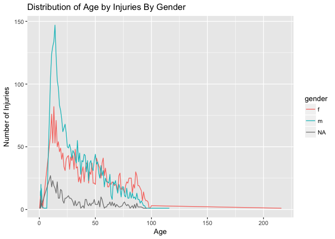

Working with Strings
============================

### 1. Words in Ulysses

For our first exercise, we will analyze a major work by James Joyce entitled 
"Ulysses". Follow the code below to download the book from project Gutenberg 
and transform the lines of the book into a words dataframe.


#### a) Words with `z`

Select all words that contain at least one `z`.


```r
library(stringr)
z_words <- str_subset(words$word,
                          "z")

head(z_words)
```

```
## [1] "razor"      "razorblade" "razor"      "razorblade" "gazing"    
## [6] "gazed"
```

Among the z-words, tabulate how many `z`'s the words contain (i.e. how many words 
contain one `z`, two `z`'s etc.). 


```r
z_words_tbl <- str_count(z_words,
                         "z")

table(z_words_tbl)
```

```
## z_words_tbl
##   1   2   3 
## 909  81   1
```

Find the z-word(s) with z's that are as far apart as possible (i.e. we are 
interested in the distance between two z's in the word. That means the word 
could contain more than two z's.).
 

```r
zz_words <- z_words[z_words_tbl == 2]
zz_words
```

```
##  [1] "puzzled"       "nuzzling"      "zmellz"        "gizzards"     
##  [5] "puzzle"        "sizzling"      "sizzling"      "mazzoth"      
##  [9] "buzz"          "embezzling"    "muzzle"        "puzzling"     
## [13] "quizzing"      "zigzagging"    "blizzard"      "lizzie"       
## [17] "lizzie"        "puzzle"        "fizz"          "buzzed"       
## [21] "buzzed"        "buzz"          "buzz"          "puzzled"      
## [25] "mezzo"         "lizzie"        "quizzer"       "grizzled"     
## [29] "buzzing"       "whizzed"       "gizzards"      "buzz"         
## [33] "intermezzo"    "razzle"        "puzzle"        "dazzling"     
## [37] "muzzling"      "fizz"          "puzzle"        "buzz"         
## [41] "pizzle"        "drizzling"     "huzzah"        "piazzetta"    
## [45] "guzzling"      "winefizzling"  "ginsizzling"   "booseguzzling"
## [49] "muzzle"        "nozzle"        "nozzle"        "quizzing"     
## [53] "quizzing"      "mazzoth"       "buzz"          "azazel"       
## [57] "buzz"          "gizzard"       "buzz"          "buzz"         
## [61] "nozzle"        "zigzag"        "drizzle"       "fizzing"      
## [65] "buzzard"       "drizzle"       "zigzags"       "zigzag"       
## [69] "fizz"          "dizzily"       "mezzo"         "mezzo"        
## [73] "puzzled"       "nozzle"        "grizzled"      "puzzling"     
## [77] "gizzard"       "piazzi"        "mezzanine"     "gizzard"      
## [81] "embezzlement"
```

```r
zz_distance <- str_locate_all(zz_words,
                              "z")

zz_distance2 <- as.data.frame(zz_distance)

zz_distance2[ , 1:4]
```

```
##   start end start.1 end.1
## 1     3   3       3     3
## 2     4   4       4     4
```

```r
zz_words3 <- z_words[z_words_tbl == 3]
zz_words3
```

```
## [1] "százharminczbrojúgulyás"
```

```r
zz_distance3 <- str_locate_all(zz_words3,
                               "z")

zz_distance3 
```

```
## [[1]]
##      start end
## [1,]     2   2
## [2,]     4   4
## [3,]    12  12
```

```r
zz_distance4 <- as.data.frame(zz_distance3)

zz_distance2[1, 163] <- 2
zz_distance2[2, 163] <- 4

colnames(zz_distance2)[163] <- "start.81"

zz_distance2[1, 164] <- 4
zz_distance2[2, 164] <- 12
colnames(zz_distance2)[164] <- "end.81"

zz_distance2[3, ] <- zz_distance2[2, ] - zz_distance2[1, ]

zz_lengths <- sort(
  unique(
    zz_distance2[3, ]
    ),
  decreasing = TRUE
  )

#zz_lengths

col_num <- which(zz_lengths > 1)

zz_lengths[ , col_num]
```

```
##   end.81 start.2 end.2 start.13 end.13 start.61 end.61 start.66 end.66
## 3      8       5     5        3      3        3      3        3      3
##   start.67 end.67 start.55 end.55 start.81
## 3        3      3        2      2        2
```

Words with more than 1 space between the `z`'s in descending order:


```r
zz_words3 ## `end.81` is actaully `zz_words3` because it was added later on
```

```
## [1] "százharminczbrojúgulyás"
```

```r
zz_words[3] 
```

```
## [1] "zmellz"
```

```r
zz_words[14] 
```

```
## [1] "zigzagging"
```

```r
zz_words[62] 
```

```
## [1] "zigzag"
```

```r
zz_words[67] 
```

```
## [1] "zigzags"
```

```r
zz_words[68] 
```

```
## [1] "zigzag"
```

```r
zz_words[56] 
```

```
## [1] "azazel"
```

```r
zz_words3 ## `start.81` is actaully `zz_words3` because it was added later on
```

```
## [1] "százharminczbrojúgulyás"
```

All other "z" words have one space between the `z`'s.

#### b) Vowels

How many words start and end with a vowel? 


```r
vowels_st_end <- str_subset(words$word,
                   pattern = "^[aeiouAEIOU]+.[aeiouAEIOU]$")

length(vowels_st_end)
```

```
## [1] 1698
```

Are there words that start with two or more vowels? 


```r
vowels_2_st <- str_subset(words$word,
                          pattern = "^[aeiouAEiou]{2,}")

head(vowels_2_st)
```

```
## [1] "air"  "out"  "air"  "oak"  "ouns" "aunt"
```

```r
length(vowels_2_st)
```

```
## [1] 2581
```

Find and display the word(s) with the most consecutive vowels. 

  * Top 6 words with the most consecutive vowels:


```r
str_subset(words$word,
             pattern = "[aeiouAEIOU]{10,}")
```

```
## [1] "steeeeeeeeeeeephen"           "iiiiiiiiiaaaaaaach"          
## [3] "dooooooooooog"                "goooooooooood"               
## [5] "frseeeeeeeeeeeeeeeeeeeefrong" "sooooooooooong"
```

#### c) English spelling

Empirically verify the rule [“i before e except after c”](https://en.wikipedia.org/wiki/I_before_E_except_after_C).


```r
new_string <- tolower(words$word)
```

Words that comply with the rule:


```r
comply <- str_subset(new_string, 
         "(cei|[^c]ie)") ## "cei" or "ie" not preceded by "c"

head(comply)
```

```
## [1] "cried"    "quietly"  "friendly" "cried"    "quietly"  "cried"
```

Words that do not comply with the rule:


```r
non_compliance <- str_subset(new_string, 
                             "(cie|[^c]ei)") ## "cie" or "ei" not preceded by "c"

head(non_compliance)
```

```
## [1] "dei"     "ancient" "seized"  "seeing"  "their"   "veiling"
```

### 2. Emergency Hospital Injuries 

The file `emergency.csv` contains a random sample of 10,000 narratives of 
injuries treated in U.S. emergency departments. We will try to extract some 
structured data from these narratives.

#### a) Length of Narratives

Read in the data (use `read_csv` from the `readr` package).


```r
data_import <- "/Users/StephanieLangeland/Desktop/Columbia/Modern Data Structures/Langeland_Stephanie/hw06/emergency.csv"

library(readr)
data1 <- read_csv(data_import,
                  col_types = cols(
                    col_character()
                  ),
                  col_names = FALSE)

colnames(data1)[1] <- "description"

data1$nchar <- str_length(data1$description)
```

Find and display the longest and shortest description.

  * The longest description has 143 characters, there are 66 descriptions of that
length:


```r
longest <- max(data1$nchar)

longest_position <- which(data1$nchar == longest)

length(longest_position)
```

```
## [1] 66
```

```r
table(
  data1[longest_position, ]
)
```

```
##                                                                                                                                                  nchar
## description                                                                                                                                       143
##   ^64YOM LIFTING A CAR BATTERY OUT OF HIS CAR AND TWISTED AWKWARDLY AND N OW HAVING SEVERE PAIN DOWN LOWER BACK ADMIT FOR INTRACTABLE LUMBAR PAIN   1
##   10 YOM WAS PLAYING BASEBALL, WITH A FRIEND, & GOT HIT IN THE MOUTH BY A BASEBALL- TEETH ARE LOOSE, GUM BLEEDING.DX; DENTAL TRAUMA, LIP HEMATOMA   1
##   10YOM; PT WAS GETTING DRESSED IN FRONT OF THE HEATER WHEN HE BEGAN TO G ET A HEADACHE AND FELT SICK & PASSED OUT.  D: CARBON MONOXIDE POISONING   1
##   11 YOF WAS JUMPING ON THE BED, AT HOME, & FELL ONTO A PAIR OF SCISSORS, THEY WENT INTO HER CHEST.  DX: HEMOTHORAX SECONDARY TO PENETRAT. TRAUMA   1
##   116 YOM-@ SCHOOL PLAYING BASKETBALL-KNOCKED DOWN-FELL ON R SHOULDER & A NOTHER PLAYER STEPPED ON L CLAVICLE       DX  CONTUSION L SHOULDER POSS   1
##   12YOF FELL OFF OF A BENCH WHILE AT SCHOOL, THE BENCH FELL AND HIT HER L LEG AND THEN SHE FELL ONTO LEG PT HAS PAIN, DX CONTUSION TO L LOWER LEG   1
##   13YOM DID OUTDOOR WORKOUT X1 1/2 HRS, DEVELOEPD HEADACHE, TUNNEL VISION , THEN PLAYED FOOTBALL, WATCHING TV AFTER W/HEADACHE; MIGRAINE HEADACHE   1
##   14YOF PT DIABETIC, HAVING INTENSIVE VOLLEYBALL TRY OUTS LAST COUPLE WEE KS, STARTED VOMITNG, ELEVATED BLOOD SUGAR LAST NIGHT; VOMITING, HIGH BS   1
##   15YF ON BUS TO SOCCER GAME&NOTICED "FUNNY SMELL", AFTER BEING OFF BUS&P LACING SOCCER FOR 30-45MIN SHE&FELLOW RIDERS BECAME LTHARGIC/HA>CO EXPO   1
##   16YOF IN FRIEND'S CAR WHEN PUT ON LATEX GLOVES, REMOVED GLOVE & PUT THU MB IN MOUTH, DEVELOPED TONGUE NUMBNESS, LIP SWELLING; ALLERGIC REACTION   1
##   16YOM  PT'S L SHOULDER POPPED OUT FOR A MOMENT WHILE SWINGING BAT PLAYI NG BASEBALL YEST.  VERY SORE TODAY.  DX. DISLOCATED L INTERIOR SHOULDER   1
##   17 YO F SLIPPED AT POOL WHEN FEET WENT OUT IN FRONT OF HER LANDING ON B UTTOCKS. HIT HEAD ON POOL DECK. DX: CHI, NECK STRAIN, LOWER BACK STRAIN   1
##   17MOBM  MOM STATES CHILD WAS IN THE FLOOR AND SHE NOTED STRANGE SMELL T O BREATH, SMELLED OF FINGERNAIL POLISH REMOVER.  DX. INGESTION NON-ACET   1
##   17YOM WITH FINGER FX LAST WEEK, HAD SPLINT PLACED IN ED, DECIDED TO PLA Y FOOTBALL GAME REINJURING SAME FINGER, TRAINER PUT BACK IN PLACE;REINJ   1
##   19MOWF  PARENTS HOLDING PT.  DAD STATES SHE WAS SLIDING DOWN SLIDE, WEA RING SHOES & LEG GOT CAUGHT ON THE SLIDE AT PARK.  DX. FX L PROX TIBIA.   1
##   19YO HISP MALE AT HOME WAS SHOT IN R EYE WITH PAINTBALL GUN, MILD BLURR Y VISION & PAIN, DX EYE CONTUSION,MONOCULAR VISION LOSS TRAUMATIC HYPHE   1
##   1MOF COUGH/WHEEZE X2W OR SINCE BIRTH, POSS INHALED SMOKE 1.5WA WHEN ELE CTRIC STOVE CAUGHT FIRE @ HOME, FIRE ISOLATED 2 STOVE, FD?;COUGH/WHEEZE   1
##   20 YO M, RUNNING FROM POLICE AFTER AN ALLEGED HOME INVASION, JUMPED OVE R FENCES & FELL OFF ROOF DURING CHASE. DX:CHI, AC SEPARATION, ANKLE SPR   1
##   21 YOM LACERATION TO LT HAND REPORTS WAS OPENING UP A BOTTLE OF CHAMPAG NE W/A CORK OPENER WHEN THE CORK FLEW & BOTTLE BROKE.+LAC TO LT FINGER%   1
##   21MOF IN LIVING ROOM,FOUND W/BURN THUMB,OTTOMAN ON FIRE NEXT TO GAS FIR EPLACE NOT LIT,THINKS PUT CHRISTMAS TREE TWIG IN PILOT LIGHT;BURN NO FD   1
##   22YOM WAS LIGHTING PROPANE PIZZA OVEN ON FRI. WHEN HE WAS BURNED ON FAC E, CHEST, HAND. HAS BEEN TREATING AT HOME. ?FDA. NO DETAILS.  DX:BURNS.   1
##   24YOM  R HAND/R WRIST PAIN AFTER HITTING A WALL TODAY.  PER PT, WAS SHA DOW BOXING TODAY & ACCIDENTALLY HIT WALL.  DX. FX R 5TH METACARPAL BASE   1
##   26 YO F, C/O TENDER GROWTH ON HEAD,HAS HAD IT SINCE CHILDHOOD,BUT WAS A T HAIRDRESSER TODAY,ACCIDENTALLY SCRAPED W/ HAIRBRUSHADX SCALP ABRASION   1
##   26 YO M INJECTING MORPHINE INTO R ARM, DEVELOPED SWELLING AND USED RAZO R BLADE TO CUT OPEN AREA AND DRAIN, NOW PAINFUL DX R FOREARM CELLULITIS   1
##   26YO WHITE MALE STS TRIED PUTTING OUT FIRE AT APT COMPLEX ?UNK FD,INHAL DED SMOKE,C/O CHEST TIGHTNESS,TWISTED R FOOT/ANKLE,DX FOOT SPRAIN,WHEEZ   1
##   26YOF  PT C/O R FOOT PAIN W/BRUISING AND SWELLING, STATES LAST NIGHT SH E WENT TO KICK A BALL TO HER DOG AND KICKED HER DRESSER. DX. FX R 5TH M   1
##   2YOF DX: CONTUSION,FACE(EXCEPT EYES). PT PLAYING W/ SIBLING & FELL INTO CORNER OF TABLE IN LIVING RM FROM STANDING POSITION, MARK BELOW RT EYE*   1
##   30YOWF  PT WAS ASSEMBLING A BIRTHDAY PRESENT FOR HER SON & WAS TRYING T O CUT THE TIE STRIPS OFF WITH A KNIFE & CUT L HAND. DX. LAC L HAND/PALM   1
##   37YOM  PT STATES HE HAD A NAIL STUCK IN HIS L FOOT 2 WKS. AGO.  DOG HAS STEPPED ON HIS FOOT TWICE & FOOT HAS SWELLING.  DX.  PW L FOOT, CELLULI   1
##   3MOF IN GRANDMAS ARMS, WENT TO SIT DOWN ON COUCH, HIT EDGE AND SLID ONT O FLOOR, PT FELL ONTO FLOOR ON HER BACK. FUSSY SINCE. DX BACK CONTUSION   1
##   40 YO M WITH SYNCOPE AND DIZZINESS. RECENT SCUBA DIVING EXPERIENCE 4 DA YS AGO WHERE HE DID 2 DIVES 2X A DAY UP TO 80FT. DX; SYNCOPE, HEADACHE.   1
##   40YOM-C/O FOOT/HEEL PAIN RUNNIJNG BACKWARDS FELT TEARING SENSATION IN F OOT AFTER WARM UP EXERCISES FOR SOCCER  DX PLANTER FASCITIS ACUTE FLARE   1
##   43YOM WAS USING A CIRCULAR SAW LAST PM CUTTING WOOD WHILE DRINKING ETOH &IT SLIPPED C/O LEFT RING FINGER PAIN.DX:LEFT RING FINGER AMPUTATION,+E   1
##   44YOF  PT HAVING SEVERE R ARM PAIN THAT IS RADIATING INTO NECK, BEGAN Y ESTEREDAY.  PLAYED TENNIS ON MONDAY, DESCRIBES AS THROBBING. DX. R SHOU   1
##   44YOWM  PT C/O L HAND LAC AFTER CUTTING IT AT HIS HOME WITH A KNIFE WHI LE TRYING TO PRY APART FROZEN MEAT.  DX. LAC PALM OF HAND 1 1/2 IN LONG   1
##   45YOWM  TONIGHT PT WAS TRYING TO MOVE HIS FATHER FROM WHEELCHAIR TO REL CINER AFTER DINNER AND AGGREVATED SCIATICA L BUTTOCKS DOWN L LEG. DX.SC   1
##   51YOM W/BURNS TO PERINEUM,FLANK,UPPER EXT,THUMB & LOWER EXT (~15-20%TBS A) 2/2 SPILLING HOT WATER ON HIMSELF 5 DAYS AGO.WENT TO URGENT CARE CTR   1
##   55YOF  PT WAS WORKING ON TILLER AT HOME AND WHEN FIRED IT UP, IT HIT ME .  THE FENDER OF TILLER SLICED L LEG TO BONE. DX. L LOWER LEG LAC, LEFT   1
##   55YOF PT DROPPED CHAMPAIGN BOTTLE AT HOME WHICH HIT BACK OF HER LEG THE N PT STEPPED ON GLASS.  DX.  LAC R HEEL & LAC L GREAT TOE, ACHILLE TEND   1
##   57 YO F WAS POURING KEROSENE OVER AN OPEN FLAME TO LIGHT GRILL WHEN FLA ME CAUGHT ON HAND. FAMILY MEMBER PUT OUT FLAME. NOT FDA. DX:1ST DG BURN   1
##   58YO F ON BICYCLE WHEN HER HUSBAND, ALSO ON BICYCLE, CRASHED IN FRONT O F HER CAUSING HER TO HIT HIS BIKE. WEARING HELMET. DX:HIP/THIGH CONTUS.   1
##   61 YOM, WOKE UP, DIZZY,HAND FELL THRU WINDOW, CUT FINGER, DAUGHTER CLEA NED FINGER,PT'S EYES ROLLED BACK,UNRESPONSIVE DX: TIA VS SYNCOPE VS SEI   1
##   68YOF  PT WITH DECREASE ROM TO R ELBOW X 2-3 DAYS.  MAY HAVE INJURED EL BOW ROLLING OUT OF BED AT HOME.  DX. PAIN R ELBOW, R LATERAL EPICONDYLI   1
##   69YOF  PT C/O TRIPPING AND FALLING WHILE AT BEAUTY SALON.  STATES SHE F ELL DOWN STAIRS.  DX. BLUNT HEAD INJ, FX CLAVICLE, CONT HEAD/L SHOULDER   1
##   72YOM AT HOME IN THE GARAGE STANDING ON A WOODEN SHELVE & IT BROKE CAUS ED PT TO FALL DX LIP LACERATION, RIB FRACTURE, SKIN TEAR, MECHANICAL FA   1
##   75YOM  PT IN BATHROOM AT NH, TURNED TO GO TO BED AND HIT HEAD ON DOOR F RAME & THEN FELL DOWN AND HIT BACK.  DX.  HEAD INJURY, LUMBOSACRAL STRA   1
##   79 YO F, C/O RT SHOULDER, FACIAL PAIN, WAS WALKING DOWN 3 STEPS, KNEE G AVE OUT,SHE FELL,STRIKING RT SHOULDER,FACE,DX UPPER ARM FX,FOREHEAD ABR   1
##   7YOM PT TRIPPED AND FELL HITTING HIS HEAD ON A METAL FENCE. NO LOC. ACT ING FINE THEN BEGAN HAVING SEIZURE ACT. POST ICTAL. DX CONCUSSION W/ SZ   1
##   8 YOM-PT WAS HIT FR BEHIND BY ANOTHER PLAYER @ FOOTBALL PRACTICE TONIGH T-C/O MID BP & WORSE WHEN PT TRIED TO SIT UPDX ACUTE PARA THORACIS SPRA   1
##   89YOWF  RESIDENT OF NH FOUND ON FLOOR.  C/O L LHIP PAIN, CHRONIC R SHOU LDER PAIN, CONT TO L FH.  HAD FALLEN FROM CHAIR.  DX.  L FH HEMATOMA, L   1
##   8MOF; PT WAS GAGGING AND MOM SWIPED A PIECE OF TAPE OUT OF BABYS THROAT ; PT WAS SEEN PLAYING WITH A SNOWFLAKE THAT HAD TAPE ON BACK.  D: CHOKI   1
##   9 YO M PT WAS CLIMBING ON A FISH TANK AND FELL THROUGH CUTTING BOTH THI GHS ON SOME STAPLES HOLDING TANK TOGETHER.DX 5CM LACERATION BOTH THIGHS   1
##   91YOWM  PT BROUGHT FROM INDEP LIVING, ON HOSPICE CARE, WAS USING A CHAI R TO BALANCE HIMSELF & FELL OFF CHAIR & HIT BACK OF HEAD. DX. LAC SCALP   1
##   AT  HOUSE- FELL ONTO BACK OF HIS HEAD, WHILE  ROLLERSKATING,THEN PASSED OUT, HIT HIS FACE ON THE FLOOR-LOC FOR 1 MIN. WEARING GLASSES. DX: CHI,   1
##   CHI W/SCALP LAC.& FOREHEAD CONT.:20MOM DAD SHUT REFRIGERATOR DOOR,GLASS CAKE PAN FELL FROM FRIDGE,HIT STOVE,BROKE,HIT PT IN HEAD, LG CONT, LAC.   1
##   DX CARPAL TUNNEL SYNDROME/TRAPEZIUS SPASM/FASICULATIONS MUSCLE: 35YOM C /O R GLUTEAL NUMBNESS AFTER SITTING IN CHAIR PLAY'G POKER +SQUATS W WTS   1
##   DX CONTU ABD WALL/CONTU HIP: 46YOF MISSTEPED ON TOP STEP AND "BUMPED" R UQ AFTER FALLING DOWN 5 WOODEN STAIRS; PN OVER COCYX AND PN OVER R RIBS   1
##   DX NASAL CONTU AND ABRASION: 5YOM PLAYING ON COUCH, FELL OFF STRUCK NOS E AND FACE, NASAL SWELLING AND ABRASIONS. FELL HITTING TABLE FACIAL INJ   1
##   DX PNEUMOMEDIASTINUM: 19YOM WT-LIFT' (BENCH PRESS & SQUATS) @ GYM TODAY , TAK' NAP ~3HRS LATER & WOKE UP W CHEST & NECK PN DESCRIBED AS PRESSUR   1
##   DX SYNCOPE/LAC FACE/TOOTH FX: 25YOF STOOD F TOILET, FELT DIZZY, SYNCOPA L, 1CM LAC TO CHIN, + CHIP' 3 TEETH TO L UPPER, PN TO CHIN, WOKE ON FLR   1
##   DX SYNCOPE/PROLONGED QT/CHEST PN: 49YOF COMPETING AT SPECIAL OLYMPICS T ODAY (SOCCER THIS A.M. AND INDIVIDUAL SKILLS THIS P.M. HAND SYNCOPAL EP   1
##   HELMETED 41YOM RIDING W/A GROUP OF CYCLISTS@UNK SPEED WHEN PT WAS CLIPP ED BY ANOTHER CYCLIST GOING OVER HANDLES C/O BACK PAIN.DX:T8 FX S/P BCC   1
##   PT FELL AND STRUCK BACK OF HEAD ON A CONCRETE FLOOR DURING A COMPETITIV E DANCE COMP 2 DAYS AGO. NO LOC. NAUSEA, HEADACHES SINCE. DX CONCUSSION   1
##   PT.INJ.NOSE,HAND,WRIST,ELBOW WHEN RIDING BIKE DOWN HILL,LOST CONTROL FE LW OVER HANDLEBARS INTO A CHAIN LINK FENCE. DX; LAC.NOSE,L.ELBOW,F.X. H   1
##   TRAUAMTIC ARM PAIN CHOPPING WOOD WITH AN AXE, AXE HEAD FLEW OFF HIT PT. DX-NAIL  IN UPPER ARM. DX-FOREIGN BODY UPPER ARM, PUNCTURE WOUND WRIST.   1
##   UNHELMETED PT RIDING MOTOR SCOOTER WHEN HE WAS GOING TOO FAST DOWN A HI LL & WAS GRAZED BY A CAR @ UNK SPEED.DX:KNEE FRACTURE,KNEE SPRAIN,CONTU   1
```

  * The shortest description has 16 characters, there are 2 descriptions of that length:


```r
shortest <- min(data1$nchar)

shortest_position <- which(data1$nchar == shortest)

length(shortest_position)
```

```
## [1] 2
```

```r
data1[shortest_position, 1]
```

```
## # A tibble: 2 x 1
##   description     
##   <chr>           
## 1 ABR HIP ON FLOOR
## 2 INGESTION OF ***
```

#### b) Fractures

Find all narratives related to "fractures". Try to include singular/plural/verb
forms in your search. 


```r
fractures_display <- str_subset(data1$description, 
         pattern = "(fracture|fractured|fractures|fracturing|FRACTURE|FRACTURED|FRACTURES|FRACTURING)")

head(fractures_display)
```

```
## [1] "10 MO F FELL OUT OF SHOPPING CART;DX FRACTURED SKULL"                                                  
## [2] "8YOF FRACTURED FINGER FELL OFF HER BIKE"                                                               
## [3] "41YO HISP MALE POKED R INDEX FINGER WITH A SCREWDRIVER DX CLOSED FRACTURE OF HAND, FELON"              
## [4] "5 YR M FELL OFF FENCE;DX FRACTURED ELBOW"                                                              
## [5] "FELL AND INJURED R ANKLE AT SKATE RINK   FRACTURE R ANKLE 30YOM"                                       
## [6] "13YOM FOUND DOWN WHILE SNOWBOARDING, UNWITNESSED TRAUMA, PT AMNESTIC, D X HEAD INJURY, PELVIC FRACTURE"
```

How many fracture narratives can you find?


```r
data1$fractures <- str_count(data1$description, 
         pattern = "(fracture|fractured|fractures|fracturing|FRACTURE|FRACTURED|FRACTURES|FRACTURING)")

frac_narr_position <- which(data1$fractures > 0)

length(frac_narr_position)
```

```
## [1] 524
```

  * There are 524 fracture-related narratives. 

#### c) Body Parts

Among the fracture narratives, try to identify the body parts that are 
fractured (_Note_: Don't go overboard. A selection of parts is sufficient.). 

The selection/sample of body parts to be used for this exercise is noted below:


```r
fracture_data <- subset(data1, 
                        subset = fractures > 0)

fracture_data$description <- tolower(fracture_data$description)

fracture_data$all_parts <- str_extract_all(fracture_data$description,
         "arm|arms|leg|legs|knee|knees|ankle|ankles|wrist|wrists|head|face|elbow|elbows|shoulder|shoulders|hand|hands|toe|toes|finger|fingers|hip|hips|foot|feet|nose|clavicle|neck|rib|ribs|thumb|thumbs")

fracture_data$all_parts <- str_replace_all(fracture_data$all_parts,
                                           '"',
                                           "")

fracture_data$all_parts <- str_replace_all(fracture_data$all_parts,
                                           "^c\\(",
                                           "")

fracture_data$all_parts <- str_replace_all(fracture_data$all_parts,
                                           "\\)",
                                           "")
                                           
fracture_data$all_parts <- str_replace_all(fracture_data$all_parts,
                                           "character\\(0",
                                           "")

ncol(fracture_data)
```

```
## [1] 4
```

```r
fracture_data[ ,5:8] <- str_split(fracture_data$all_parts,
                                  ",",
                                  simplify = TRUE)

fracture_data$n_parts <- str_count(fracture_data$all_parts,
                                       ",") ## number of body parts in narrative

colnames(fracture_data)[5] <- "part1"
colnames(fracture_data)[6] <- "part2"
colnames(fracture_data)[7] <- "part3"
colnames(fracture_data)[8] <- "part4"
```

Make a histogram of fractured body parts (but make sure plural and singular 
are combined.)


```r
## The only plural result was "feet", so replace it with "foot":
fracture_data$part1 <- ifelse(fracture_data$part1 == "feet",
                                      "foot",
                                      fracture_data$part1)

fracture_data$part2 <- ifelse(fracture_data$part2 == "feet",
                                      "foot",
                                      fracture_data$part2)

fracture_data$part3 <- ifelse(fracture_data$part3 == "feet",
                                      "foot",
                                      fracture_data$part3)

fracture_data$part4 <- ifelse(fracture_data$part4 == "feet",
                                      "foot",
                                      fracture_data$part4)

## Tabulate data for histogram:
library(QMSS)
tbl1 <- as.data.frame(Tab(fracture_data$part1))
tbl1$parts <- rownames(tbl1)

tbl2 <- as.data.frame(Tab(fracture_data$part2))
tbl2$parts <- rownames(tbl2)

tbl3 <- as.data.frame(Tab(fracture_data$part3))
tbl3$parts <- rownames(tbl3)

tbl4 <- as.data.frame(Tab(fracture_data$part4))
tbl4$parts <- rownames(tbl4)

tbl_parts <- cbind(tbl1,
                   tbl2)

tbl_parts$num <- tbl_parts[ , 1] + tbl_parts[ , 5]

tbl_parts <- tbl_parts[ , -c(1:7)]

tbl_parts <- tbl_parts[-1, ]

tbl_parts <- merge(tbl_parts, 
                    tbl3,
                    all.x = TRUE)

tbl_parts$Count <- ifelse(is.na(tbl_parts$Count),
                          0,
                          tbl_parts$Count)

tbl_parts$num <- tbl_parts$num + tbl_parts$Count

tbl_parts <- tbl_parts[, -c(3:5)]

tbl_parts <- merge(tbl_parts, 
                    tbl4,
                    all.x = TRUE)

tbl_parts$Count <- ifelse(is.na(tbl_parts$Count),
                          0,
                          tbl_parts$Count)

tbl_parts$num <- tbl_parts$num + tbl_parts$Count

tbl_parts <- tbl_parts[, -c(3:5)]


library(ggplot2)

ggplot(data = tbl_parts,
       aes(x = parts,
           y = num)) +
  geom_bar(stat = "identity") +
  theme(
    axis.text.x = element_text(angle = 45, hjust = 1)
    ) +
  xlab("Body Parts") +
  ylab("Count") +
  ggtitle("Sample of Fractured Body Parts")
```

<!-- -->

#### d) Age and Gender

Let's try to extract age and gender. In a number of narratives you may have noticed a pattern:

  * "**75 YOM**, FELL DOWN STAIRS, FRACTURE LEG": A 75 year old male.
  * "**21MOF** FINGER SHUT IN WINDOW AT HOME;NAILBED INJURY: A 21 month-old female child.
  * "DX:AVULSION OF SKIN-**50YOF**-CUT THUMB WITH SCISSORS TONIGHT-OPENING A BOX": A 50 year old female.
  * "LEFT ELBOW CONTUSION,RT SHIN LAC.PT WAS ICE SKATING AND FELL.": No information about age or gender.
  
  You are generally looking for a pattern with a number (_age_), something to indicate the _units_, e.g. YO or YR for years old, or MO for months old, and a character that identifies the _gender_. So, I suggest to think of a pattern that combines these three parts. 
  
Create variables for age and gender (make sure to convert months to years when necessary).

   * There are also people who are days old.


```r
data1$description2 <- tolower(data1$description)

data1$description2 <- str_replace_all(data1$description2, 
                                      " ", 
                                      "") ## remove spaces

data1$description2 <- str_replace_all(data1$description2, 
                                      '[[:punct:] ]+', 
                                      "") ## remove punctuaton

data1$details1 <- str_extract(data1$description2,
                          "[0-9]?[0-9]?[0-9](y|yr|m|day|month|year)(old)(male|m|female|f)?") 

data1$details1a <- str_extract(data1$description2,
                              "[0-9]?[0-9]?[0-9](y|yr|m|day|month|year)(o)(male|m|female|f)?") 

data1$details1b <- str_extract(data1$description2,
                              "[0-9]?[0-9]?[0-9](y|yr|m|day|month|year)o?(male|m|female|f)?") 

data1$details1c <- str_extract(data1$description2,
                              "[0-9]?[0-9]?[0-9](y|yr|m|day|month|year)old?(male|m|female|f)?") 

data1$details1d <- str_extract(data1$description2,
                              "[0-9]?[0-9]?[0-9][yyr|mdaymonthyear][oold]?[malemfemalef]?") 

data1$gender <- str_extract(data1$details1d,
                            "f$|m$")


data1$age_digit <- str_extract(data1$details1b,
                              "[0-9]{2,3}")

data1$age_unit <- str_extract(data1$details1d,
                         "(m|mo|month|y|d)")

typeof(data1$age_digit)
```

```
## [1] "character"
```

```r
data1$age_digit <- as.numeric(data1$age_digit)

data1$age <- data1$age_digit

data1$age <- ifelse(data1$age_unit == "m",
                   data1$age_digit / 12,
                   data1$age_digit) ## month(s) old: age in years

data1$age <- ifelse(data1$age_unit == "d",
                   data1$age_digit / 365,
                   data1$age) ## day(s) old: age in years

data1 <- within(data1, rm("age_unit")) ## remove this column
data1 <- within(data1, rm("age_digit")) ## remove this column

#summary(is.na(data1$gender))
#summary(is.na(data1$age))

data1[1:5, c(1, 10:11)]
```

```
## # A tibble: 5 x 3
##   description                                              gender    age
##   <chr>                                                    <chr>   <dbl>
## 1 10 MO F FELL OUT OF SHOPPING CART;DX FRACTURED SKULL     f       0.833
## 2 75YOF WITH LAC TO FINGER FROM METAL CAN                  f      75.0  
## 3 8YOF FRACTURED FINGER FELL OFF HER BIKE                  f      NA    
## 4 9 YOM TACKLED DURING FOOTBALL PRACTICE.  DX: CONCUSSION. m      NA    
## 5 PT WAS HIT ON RT SIDE WHILE PLAYING FOOTBALL DX: CHI     <NA>   NA
```

How many men and women are in the data? 


```r
sum(data1$gender == "m", 
    na.rm = T) ## men
```

```
## [1] 4351
```

```r
sum(data1$gender == "f", 
    na.rm = T) ## women
```

```
## [1] 3397
```

  * There are 4,351 men and 3,397 women.

Provide a line graph of the number of injuries (y-axis) vs age (x-axis) disaggregated 
by gender.

  * Assuming that each narrative is an injury that prompted an emergency room visit:


```r
ggplot(data = data1,
       aes(x = age)) +
  geom_line(stat = 'count') +
  xlab("Age") +
  ylab("Number of Injuries") +
  ggtitle("Distribution of Age by Injuries - No Gender")
```

<!-- -->

```r
ggplot(data = data1,
       aes(x = age,
           col = gender)) +
  geom_line(stat = 'count') +
  xlab("Age") +
  ylab("Number of Injuries") +
  ggtitle("Distribution of Age by Injuries By Gender")
```

<!-- -->
  
