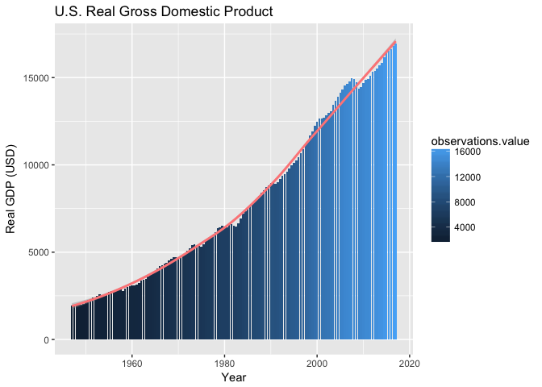

Writing a simple API client
============================

### Choose your API

To accommodate your different interests and data needs, this exercise asks you to choose a data API yourself. It is perfectly fine if the data collection from such an API is useful for another class, project, or your thesis. 

### Task

The task is to use the `httr` package (do not use possibly existing specific R packages for the API) to:  

  - interact with the API  
  - create a dataset with multiple records by requesting data from the API using the `httr` package  
  - write a simple API client, i.e. a function that would make downloading/interacting with the API simple for a R user who does not know `httr` 

#### 1. Choose an API

a) Choose an API and briefly describe the type of data you can obtain from it.

  * The Research Division of the Federal Reserve Bank of Saint Louis developed 
  FRED.  [FRED](https://research.stlouisfed.org/about.html) is a database that 
  offers regional and national financial and economic data and information to 
  enhance economic research.  FRED is constantly updated and accessible at all times.
  The FRED API allows users to retrieve economic data from FRED.  API requests can be 
  tailored to retrieve data source, release, category, series, and more.
  
b) Provide a link to the API documentation and  

  * https://research.stlouisfed.org/docs/api/fred/series_observations.html

c) the base URL of the API you intend to use.


```r
base_url <- "https://api.stlouisfed.org/fred/series/observations?"
```

#### 2. Authentication

a) Briefly explain how the API authenticates the user. 

  * The user adds a `series_id=` number, which denotes the type of data they want to
  retrieve plus their API key (`api_key=`) to the base url (`base_url`) noted above.

b) Apply for an API key if necessary and provide the information (with relevant 
URL) how that can be done.

  * Users must register for a FRED API Key [here](https://research.stlouisfed.org/docs/api/api_key.html).

#### 3. Send a Simple GET request

a) Execute a simple get request to obtain a small amount of data from the API. 
Describe a few query parameters and add them to the query. If you have a choice 
of the output the API returns (e.g. XML or JSON), I suggest to choose JSON 
because it easier to work with. Your output here should include the code for 
the `GET` request, including the query parameters.  

  * Query Real Gross Domestic Product data from 01/01/1947 - 01/01/2017.  The
  output format is json. 


```r
library(httr)

GDPC1_response <- GET(
  base_url,
  query = list(
    "series_id" = "GDPC1", ## GDPC1 id number
    "observation_start" = "1947-01-01", ## data start date
    "observation_end" = "2017-01-01", ## data end date
    "api_key" = Sys.getenv("FRED_API"), ## my api key 
    "frequency" = "sa", ## semi-annual frequency
    "file_type" = "json"
    )
  )
```

b) Check of the status of the request (using `http_status`).  


```r
http_status(GDPC1_response)
```

```
## $category
## [1] "Success"
## 
## $reason
## [1] "OK"
## 
## $message
## [1] "Success: (200) OK"
```

c) Check the type of the response (e.g. XML, JSON, csv using `http_type`).


```r
http_type(GDPC1_response)
```

```
## [1] "application/json"
```

#### 4. Parse the response and Create a dataset

a) Take the response returned by the API and turn it into a useful R object 
(e.g. a list, vector, or data frame). Show the code how this is done.


```r
GDPC1_import <- content(GDPC1_response, 
                          as = "text")

library(jsonlite)
GDPC1_data <- fromJSON(GDPC1_import, 
                         simplifyDataFrame = TRUE)

str(GDPC1_data)
```

```
## List of 13
##  $ realtime_start   : chr "2018-01-19"
##  $ realtime_end     : chr "2018-01-19"
##  $ observation_start: chr "1947-01-01"
##  $ observation_end  : chr "2017-01-01"
##  $ units            : chr "lin"
##  $ output_type      : int 1
##  $ file_type        : chr "json"
##  $ order_by         : chr "observation_date"
##  $ sort_order       : chr "asc"
##  $ count            : int 141
##  $ offset           : int 0
##  $ limit            : int 100000
##  $ observations     :'data.frame':	141 obs. of  4 variables:
##   ..$ realtime_start: chr [1:141] "2018-01-19" "2018-01-19" "2018-01-19" "2018-01-19" ...
##   ..$ realtime_end  : chr [1:141] "2018-01-19" "2018-01-19" "2018-01-19" "2018-01-19" ...
##   ..$ date          : chr [1:141] "1947-01-01" "1947-07-01" "1948-01-01" "1948-07-01" ...
##   ..$ value         : chr [1:141] "1933.376" "1945.510" "2005.693" "2034.242" ...
```

b) Using the API, create a dataset (in data frame format) for multiple records. 
I'd say a sample size greater than 100 is sufficient for the example but feel 
free to get more data if you feel ambitious and the API allows you to do that 
fairly easily. The dataset can include only a small subset of the returned data. 
Just choose some interesting features. There is no need to be inclusive here.


```r
GDPC1_df <- as.data.frame(GDPC1_data)
dim(GDPC1_df)
```

```
## [1] 141  16
```

c) Provide some summary statistics of the data.


```r
## Prepare Data for Summary Statistics:
str(GDPC1_df)
```

```
## 'data.frame':	141 obs. of  16 variables:
##  $ realtime_start             : Factor w/ 1 level "2018-01-19": 1 1 1 1 1 1 1 1 1 1 ...
##  $ realtime_end               : Factor w/ 1 level "2018-01-19": 1 1 1 1 1 1 1 1 1 1 ...
##  $ observation_start          : Factor w/ 1 level "1947-01-01": 1 1 1 1 1 1 1 1 1 1 ...
##  $ observation_end            : Factor w/ 1 level "2017-01-01": 1 1 1 1 1 1 1 1 1 1 ...
##  $ units                      : Factor w/ 1 level "lin": 1 1 1 1 1 1 1 1 1 1 ...
##  $ output_type                : int  1 1 1 1 1 1 1 1 1 1 ...
##  $ file_type                  : Factor w/ 1 level "json": 1 1 1 1 1 1 1 1 1 1 ...
##  $ order_by                   : Factor w/ 1 level "observation_date": 1 1 1 1 1 1 1 1 1 1 ...
##  $ sort_order                 : Factor w/ 1 level "asc": 1 1 1 1 1 1 1 1 1 1 ...
##  $ count                      : int  141 141 141 141 141 141 141 141 141 141 ...
##  $ offset                     : int  0 0 0 0 0 0 0 0 0 0 ...
##  $ limit                      : int  100000 100000 100000 100000 100000 100000 100000 100000 100000 100000 ...
##  $ observations.realtime_start: chr  "2018-01-19" "2018-01-19" "2018-01-19" "2018-01-19" ...
##  $ observations.realtime_end  : chr  "2018-01-19" "2018-01-19" "2018-01-19" "2018-01-19" ...
##  $ observations.date          : chr  "1947-01-01" "1947-07-01" "1948-01-01" "1948-07-01" ...
##  $ observations.value         : chr  "1933.376" "1945.510" "2005.693" "2034.242" ...
```

```r
GDPC1_df$realtime_start <- as.Date(GDPC1_df$realtime_start)
GDPC1_df$realtime_end <- as.Date(GDPC1_df$realtime_end)
GDPC1_df$observation_start <- as.Date(GDPC1_df$observation_start)
GDPC1_df$observation_end <- as.Date(GDPC1_df$observation_end)
GDPC1_df$observations.date <- as.Date(GDPC1_df$observations.date)
GDPC1_df$observations.value <- as.numeric(GDPC1_df$observations.value)
```

  * Summary Statistics of Real Gross Domestic Product:


```r
summary(GDPC1_df$observations.value)
```

```
##    Min. 1st Qu.  Median    Mean 3rd Qu.    Max. 
##    1933    3774    6611    7936   12218   16967
```

```r
library(ggplot2)

ggplot(data = GDPC1_df,
       aes(x = observations.date,
           y = observations.value,
           fill = observations.value)) +
  geom_bar(stat = "identity") +
  geom_smooth(color = "#FF8888") +
  ggtitle("U.S. Real Gross Domestic Product") +
  xlab("Year") +
  ylab("Real GDP (USD)")
```

<!-- -->

```r
GDPC1_df[ , c("observations.date", "observations.value")]
```

```
##     observations.date observations.value
## 1          1947-01-01           1933.376
## 2          1947-07-01           1945.510
## 3          1948-01-01           2005.693
## 4          1948-07-01           2034.242
## 5          1949-01-01           2004.155
## 6          1949-07-01           2013.726
## 7          1950-01-01           2116.076
## 8          1950-07-01           2251.899
## 9          1951-01-01           2324.530
## 10         1951-07-01           2395.457
## 11         1952-01-01           2425.987
## 12         1952-07-01           2486.220
## 13         1953-01-01           2583.414
## 14         1953-07-01           2559.354
## 15         1954-01-01           2529.366
## 16         1954-07-01           2584.335
## 17         1955-01-01           2705.609
## 18         1955-07-01           2772.445
## 19         1956-01-01           2781.452
## 20         1956-07-01           2813.413
## 21         1957-01-01           2851.352
## 22         1957-07-01           2861.187
## 23         1958-01-01           2781.801
## 24         1958-07-01           2888.868
## 25         1959-01-01           3012.820
## 26         1959-07-01           3049.122
## 27         1960-01-01           3117.236
## 28         1960-07-01           3100.179
## 29         1961-01-01           3131.085
## 30         1961-07-01           3245.162
## 31         1962-01-01           3354.730
## 32         1962-07-01           3411.440
## 33         1963-01-01           3478.607
## 34         1963-07-01           3582.217
## 35         1964-01-01           3694.545
## 36         1964-07-01           3773.541
## 37         1965-01-01           3899.929
## 38         1965-07-01           4053.392
## 39         1966-01-01           4210.494
## 40         1966-07-01           4267.367
## 41         1967-01-01           4326.823
## 42         1967-07-01           4383.661
## 43         1968-01-01           4528.526
## 44         1968-07-01           4609.568
## 45         1969-01-01           4699.161
## 46         1969-07-01           4725.806
## 47         1970-01-01           4711.277
## 48         1970-07-01           4732.747
## 49         1971-01-01           4848.144
## 50         1971-07-01           4907.106
## 51         1972-01-01           5060.357
## 52         1972-07-01           5208.337
## 53         1973-01-01           5411.003
## 54         1973-07-01           5437.166
## 55         1974-01-01           5424.145
## 56         1974-07-01           5367.923
## 57         1975-01-01           5312.832
## 58         1975-07-01           5457.902
## 59         1976-01-01           5639.746
## 60         1976-07-01           5711.109
## 61         1977-01-01           5856.069
## 62         1977-07-01           6017.902
## 63         1978-01-01           6156.561
## 64         1978-07-01           6377.803
## 65         1979-01-01           6436.938
## 66         1979-07-01           6495.477
## 67         1980-01-01           6458.745
## 68         1980-07-01           6442.038
## 69         1981-01-01           6611.498
## 70         1981-07-01           6623.993
## 71         1982-01-01           6492.610
## 72         1982-07-01           6489.964
## 73         1983-01-01           6653.231
## 74         1983-07-01           6930.756
## 75         1984-01-01           7203.304
## 76         1984-07-01           7366.756
## 77         1985-01-01           7503.737
## 78         1985-07-01           7683.910
## 79         1986-01-01           7801.976
## 80         1986-07-01           7919.003
## 81         1987-01-01           8039.838
## 82         1987-07-01           8225.361
## 83         1988-01-01           8394.417
## 84         1988-07-01           8554.566
## 85         1989-01-01           8731.908
## 86         1989-07-01           8840.887
## 87         1990-01-01           8964.428
## 88         1990-07-01           8945.654
## 89         1991-01-01           8899.965
## 90         1991-07-01           8996.848
## 91         1992-01-01           9173.248
## 92         1992-07-01           9359.868
## 93         1993-01-01           9452.086
## 94         1993-07-01           9589.923
## 95         1994-01-01           9814.770
## 96         1994-07-01           9996.087
## 97         1995-01-01          10104.500
## 98         1995-07-01          10245.009
## 99         1996-01-01          10439.035
## 100        1996-07-01          10682.918
## 101        1997-01-01          10902.529
## 102        1997-07-01          11167.171
## 103        1998-01-01          11376.146
## 104        1998-07-01          11675.637
## 105        1999-01-01          11913.600
## 106        1999-07-01          12218.206
## 107        2000-01-01          12475.813
## 108        2000-07-01          12643.507
## 109        2001-01-01          12676.793
## 110        2001-07-01          12687.688
## 111        2002-01-01          12857.630
## 112        2002-07-01          12959.893
## 113        2003-01-01          13091.629
## 114        2003-07-01          13450.534
## 115        2004-01-01          13656.378
## 116        2004-07-01          13890.602
## 117        2005-01-01          14135.888
## 118        2005-07-01          14332.598
## 119        2006-01-01          14567.852
## 120        2006-07-01          14659.782
## 121        2007-01-01          14782.343
## 122        2007-07-01          14965.126
## 123        2008-01-01          14926.404
## 124        2008-07-01          14734.314
## 125        2009-01-01          14365.288
## 126        2009-07-01          14472.189
## 127        2010-01-01          14675.389
## 128        2010-07-01          14892.230
## 129        2011-01-01          14935.428
## 130        2011-07-01          15105.702
## 131        2012-01-01          15326.725
## 132        2012-07-01          15382.528
## 133        2013-01-01          15506.719
## 134        2013-07-01          15717.632
## 135        2014-01-01          15846.698
## 136        2014-07-01          16179.868
## 137        2015-01-01          16405.430
## 138        2015-07-01          16537.603
## 139        2016-01-01          16617.545
## 140        2016-07-01          16814.784
## 141        2017-01-01          16967.163
```

Include the data frame in a .RDS file (using `saveRDS`) called `data.rds` 
with your submission for the grader.


```r
setwd("/Users/StephanieLangeland/Desktop/Columbia/Modern Data Structures/Langeland_Stephanie/hw08")

saveRDS(GDPC1_df,
        file = "data.RDS")
```

#### 5. API Client

Lastly, let's try to wrap the code from the previous sections into a simple API client. For example, in the `ZillowR` package, the command `GetSearchResults()` can be called with the following command

    GetSearchResults(address = '2114 Bigelow Ave', citystatezip = 'Seattle, WA')

For your API package, try to create a simple function that does the following things:

 - allows to user to specify some smallish set of query parameters (from Q.3a)  
 - run a GET request with these parameters  
 - check the status of the request the server returns and inform the user of any errors (from Q.3b)  
 - parse the response and return a R object to the user of the function. You can choose whether returning a list (from Q.4a) or a data frame (from Q.4b) is best.  

For the grader, please provide the following output.

a) Your full function to access the API functionality. Set some sensible default values for the query parameters. 

b) The object your function returns for the default values. Please save this output object to `api_client_output.RDS` and include it with your submission.

For this part of the question, I am not expecting a full-fledged API client. Rather, I want you to wrap some of the code from the previous questions into a function and generalize a bit. For guidance on how writing an API client with more bells and whistles would look like, see Wickham's ["Best practices for API packages"](https://cran.r-project.org/web/packages/httr/vignettes/api-packages.html
).

This function is to retrieve series observations in json format from FRED using 
a FRED API key:


```r
library(httr)
library(jsonlite)

get_series_obs <- function(series_id, 
                           observation_start = "1947-01-01", ## default value 
                           observation_end = "2017-11-06",  ## default value 
                           user_api, 
                           frequency = "sa", ## default value = semi annual
                           name_rds = "api_client_output.RDS"
                           ) {
  start_url <- "https://api.stlouisfed.org/fred/series/observations?"
  
  response <- GET(
    start_url,
    query = list(
      
      "series_id" = series_id,

      "observation_start" = observation_start,
     
      "observation_end" = observation_end,
      
      "api_key" = user_api,
      
      "frequency" = frequency,
    
      "file_type" = "json"
      )
    )
  
  output <- if(http_error(response) == TRUE){
    http_error(response)
    } else {
      content(response,
              as = "text")
      }

  dataset <- jsonlite::fromJSON(output, 
                                simplifyDataFrame = TRUE)
  
  save_rds <- saveRDS(dataset,
                      file = name_rds)
  
  dataset
}

## To demonstrate that the default values work:
get_series_obs(
  series_id = "GDPC1",
  user_api = Sys.getenv("FRED_API")
  )
```

```
## $realtime_start
## [1] "2018-01-19"
## 
## $realtime_end
## [1] "2018-01-19"
## 
## $observation_start
## [1] "1947-01-01"
## 
## $observation_end
## [1] "2017-11-06"
## 
## $units
## [1] "lin"
## 
## $output_type
## [1] 1
## 
## $file_type
## [1] "json"
## 
## $order_by
## [1] "observation_date"
## 
## $sort_order
## [1] "asc"
## 
## $count
## [1] 142
## 
## $offset
## [1] 0
## 
## $limit
## [1] 100000
## 
## $observations
##     realtime_start realtime_end       date     value
## 1       2018-01-19   2018-01-19 1947-01-01  1933.376
## 2       2018-01-19   2018-01-19 1947-07-01  1945.510
## 3       2018-01-19   2018-01-19 1948-01-01  2005.693
## 4       2018-01-19   2018-01-19 1948-07-01  2034.242
## 5       2018-01-19   2018-01-19 1949-01-01  2004.155
## 6       2018-01-19   2018-01-19 1949-07-01  2013.726
## 7       2018-01-19   2018-01-19 1950-01-01  2116.076
## 8       2018-01-19   2018-01-19 1950-07-01  2251.899
## 9       2018-01-19   2018-01-19 1951-01-01  2324.530
## 10      2018-01-19   2018-01-19 1951-07-01  2395.457
## 11      2018-01-19   2018-01-19 1952-01-01  2425.987
## 12      2018-01-19   2018-01-19 1952-07-01  2486.220
## 13      2018-01-19   2018-01-19 1953-01-01  2583.414
## 14      2018-01-19   2018-01-19 1953-07-01  2559.354
## 15      2018-01-19   2018-01-19 1954-01-01  2529.366
## 16      2018-01-19   2018-01-19 1954-07-01  2584.335
## 17      2018-01-19   2018-01-19 1955-01-01  2705.609
## 18      2018-01-19   2018-01-19 1955-07-01  2772.445
## 19      2018-01-19   2018-01-19 1956-01-01  2781.452
## 20      2018-01-19   2018-01-19 1956-07-01  2813.413
## 21      2018-01-19   2018-01-19 1957-01-01  2851.352
## 22      2018-01-19   2018-01-19 1957-07-01  2861.187
## 23      2018-01-19   2018-01-19 1958-01-01  2781.801
## 24      2018-01-19   2018-01-19 1958-07-01  2888.868
## 25      2018-01-19   2018-01-19 1959-01-01  3012.820
## 26      2018-01-19   2018-01-19 1959-07-01  3049.122
## 27      2018-01-19   2018-01-19 1960-01-01  3117.236
## 28      2018-01-19   2018-01-19 1960-07-01  3100.179
## 29      2018-01-19   2018-01-19 1961-01-01  3131.085
## 30      2018-01-19   2018-01-19 1961-07-01  3245.162
## 31      2018-01-19   2018-01-19 1962-01-01  3354.730
## 32      2018-01-19   2018-01-19 1962-07-01  3411.440
## 33      2018-01-19   2018-01-19 1963-01-01  3478.607
## 34      2018-01-19   2018-01-19 1963-07-01  3582.217
## 35      2018-01-19   2018-01-19 1964-01-01  3694.545
## 36      2018-01-19   2018-01-19 1964-07-01  3773.541
## 37      2018-01-19   2018-01-19 1965-01-01  3899.929
## 38      2018-01-19   2018-01-19 1965-07-01  4053.392
## 39      2018-01-19   2018-01-19 1966-01-01  4210.494
## 40      2018-01-19   2018-01-19 1966-07-01  4267.367
## 41      2018-01-19   2018-01-19 1967-01-01  4326.823
## 42      2018-01-19   2018-01-19 1967-07-01  4383.661
## 43      2018-01-19   2018-01-19 1968-01-01  4528.526
## 44      2018-01-19   2018-01-19 1968-07-01  4609.568
## 45      2018-01-19   2018-01-19 1969-01-01  4699.161
## 46      2018-01-19   2018-01-19 1969-07-01  4725.806
## 47      2018-01-19   2018-01-19 1970-01-01  4711.277
## 48      2018-01-19   2018-01-19 1970-07-01  4732.747
## 49      2018-01-19   2018-01-19 1971-01-01  4848.144
## 50      2018-01-19   2018-01-19 1971-07-01  4907.106
## 51      2018-01-19   2018-01-19 1972-01-01  5060.357
## 52      2018-01-19   2018-01-19 1972-07-01  5208.337
## 53      2018-01-19   2018-01-19 1973-01-01  5411.003
## 54      2018-01-19   2018-01-19 1973-07-01  5437.166
## 55      2018-01-19   2018-01-19 1974-01-01  5424.145
## 56      2018-01-19   2018-01-19 1974-07-01  5367.923
## 57      2018-01-19   2018-01-19 1975-01-01  5312.832
## 58      2018-01-19   2018-01-19 1975-07-01  5457.902
## 59      2018-01-19   2018-01-19 1976-01-01  5639.746
## 60      2018-01-19   2018-01-19 1976-07-01  5711.109
## 61      2018-01-19   2018-01-19 1977-01-01  5856.069
## 62      2018-01-19   2018-01-19 1977-07-01  6017.902
## 63      2018-01-19   2018-01-19 1978-01-01  6156.561
## 64      2018-01-19   2018-01-19 1978-07-01  6377.803
## 65      2018-01-19   2018-01-19 1979-01-01  6436.938
## 66      2018-01-19   2018-01-19 1979-07-01  6495.477
## 67      2018-01-19   2018-01-19 1980-01-01  6458.745
## 68      2018-01-19   2018-01-19 1980-07-01  6442.038
## 69      2018-01-19   2018-01-19 1981-01-01  6611.498
## 70      2018-01-19   2018-01-19 1981-07-01  6623.993
## 71      2018-01-19   2018-01-19 1982-01-01  6492.610
## 72      2018-01-19   2018-01-19 1982-07-01  6489.964
## 73      2018-01-19   2018-01-19 1983-01-01  6653.231
## 74      2018-01-19   2018-01-19 1983-07-01  6930.756
## 75      2018-01-19   2018-01-19 1984-01-01  7203.304
## 76      2018-01-19   2018-01-19 1984-07-01  7366.756
## 77      2018-01-19   2018-01-19 1985-01-01  7503.737
## 78      2018-01-19   2018-01-19 1985-07-01  7683.910
## 79      2018-01-19   2018-01-19 1986-01-01  7801.976
## 80      2018-01-19   2018-01-19 1986-07-01  7919.003
## 81      2018-01-19   2018-01-19 1987-01-01  8039.838
## 82      2018-01-19   2018-01-19 1987-07-01  8225.361
## 83      2018-01-19   2018-01-19 1988-01-01  8394.417
## 84      2018-01-19   2018-01-19 1988-07-01  8554.566
## 85      2018-01-19   2018-01-19 1989-01-01  8731.908
## 86      2018-01-19   2018-01-19 1989-07-01  8840.887
## 87      2018-01-19   2018-01-19 1990-01-01  8964.428
## 88      2018-01-19   2018-01-19 1990-07-01  8945.654
## 89      2018-01-19   2018-01-19 1991-01-01  8899.965
## 90      2018-01-19   2018-01-19 1991-07-01  8996.848
## 91      2018-01-19   2018-01-19 1992-01-01  9173.248
## 92      2018-01-19   2018-01-19 1992-07-01  9359.868
## 93      2018-01-19   2018-01-19 1993-01-01  9452.086
## 94      2018-01-19   2018-01-19 1993-07-01  9589.923
## 95      2018-01-19   2018-01-19 1994-01-01  9814.770
## 96      2018-01-19   2018-01-19 1994-07-01  9996.087
## 97      2018-01-19   2018-01-19 1995-01-01 10104.500
## 98      2018-01-19   2018-01-19 1995-07-01 10245.009
## 99      2018-01-19   2018-01-19 1996-01-01 10439.035
## 100     2018-01-19   2018-01-19 1996-07-01 10682.918
## 101     2018-01-19   2018-01-19 1997-01-01 10902.529
## 102     2018-01-19   2018-01-19 1997-07-01 11167.171
## 103     2018-01-19   2018-01-19 1998-01-01 11376.146
## 104     2018-01-19   2018-01-19 1998-07-01 11675.637
## 105     2018-01-19   2018-01-19 1999-01-01 11913.600
## 106     2018-01-19   2018-01-19 1999-07-01 12218.206
## 107     2018-01-19   2018-01-19 2000-01-01 12475.813
## 108     2018-01-19   2018-01-19 2000-07-01 12643.507
## 109     2018-01-19   2018-01-19 2001-01-01 12676.793
## 110     2018-01-19   2018-01-19 2001-07-01 12687.688
## 111     2018-01-19   2018-01-19 2002-01-01 12857.630
## 112     2018-01-19   2018-01-19 2002-07-01 12959.893
## 113     2018-01-19   2018-01-19 2003-01-01 13091.629
## 114     2018-01-19   2018-01-19 2003-07-01 13450.534
## 115     2018-01-19   2018-01-19 2004-01-01 13656.378
## 116     2018-01-19   2018-01-19 2004-07-01 13890.602
## 117     2018-01-19   2018-01-19 2005-01-01 14135.888
## 118     2018-01-19   2018-01-19 2005-07-01 14332.598
## 119     2018-01-19   2018-01-19 2006-01-01 14567.852
## 120     2018-01-19   2018-01-19 2006-07-01 14659.782
## 121     2018-01-19   2018-01-19 2007-01-01 14782.343
## 122     2018-01-19   2018-01-19 2007-07-01 14965.126
## 123     2018-01-19   2018-01-19 2008-01-01 14926.404
## 124     2018-01-19   2018-01-19 2008-07-01 14734.314
## 125     2018-01-19   2018-01-19 2009-01-01 14365.288
## 126     2018-01-19   2018-01-19 2009-07-01 14472.189
## 127     2018-01-19   2018-01-19 2010-01-01 14675.389
## 128     2018-01-19   2018-01-19 2010-07-01 14892.230
## 129     2018-01-19   2018-01-19 2011-01-01 14935.428
## 130     2018-01-19   2018-01-19 2011-07-01 15105.702
## 131     2018-01-19   2018-01-19 2012-01-01 15326.725
## 132     2018-01-19   2018-01-19 2012-07-01 15382.528
## 133     2018-01-19   2018-01-19 2013-01-01 15506.719
## 134     2018-01-19   2018-01-19 2013-07-01 15717.632
## 135     2018-01-19   2018-01-19 2014-01-01 15846.698
## 136     2018-01-19   2018-01-19 2014-07-01 16179.868
## 137     2018-01-19   2018-01-19 2015-01-01 16405.430
## 138     2018-01-19   2018-01-19 2015-07-01 16537.603
## 139     2018-01-19   2018-01-19 2016-01-01 16617.545
## 140     2018-01-19   2018-01-19 2016-07-01 16814.784
## 141     2018-01-19   2018-01-19 2017-01-01 16967.163
## 142     2018-01-19   2018-01-19 2017-07-01         .
```

```r
## To demonstrate a more specific query that does not rely on default values: 
get_series_obs(
  series_id = "GDPC1",
  observation_start = "2011-01-01",
  observation_end = "2017-01-01",
  user_api = Sys.getenv("FRED_API"),
  frequency = "a",
  name_rds = "api_client_output_example2.RDS"
  )
```

```
## $realtime_start
## [1] "2018-01-19"
## 
## $realtime_end
## [1] "2018-01-19"
## 
## $observation_start
## [1] "2011-01-01"
## 
## $observation_end
## [1] "2017-01-01"
## 
## $units
## [1] "lin"
## 
## $output_type
## [1] 1
## 
## $file_type
## [1] "json"
## 
## $order_by
## [1] "observation_date"
## 
## $sort_order
## [1] "asc"
## 
## $count
## [1] 7
## 
## $offset
## [1] 0
## 
## $limit
## [1] 100000
## 
## $observations
##   realtime_start realtime_end       date     value
## 1     2018-01-19   2018-01-19 2011-01-01 15020.565
## 2     2018-01-19   2018-01-19 2012-01-01 15354.627
## 3     2018-01-19   2018-01-19 2013-01-01 15612.175
## 4     2018-01-19   2018-01-19 2014-01-01 16013.283
## 5     2018-01-19   2018-01-19 2015-01-01 16471.516
## 6     2018-01-19   2018-01-19 2016-01-01 16716.164
## 7     2018-01-19   2018-01-19 2017-01-01         .
```
