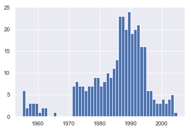
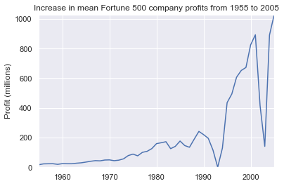
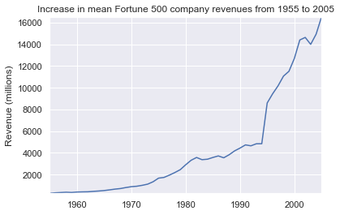
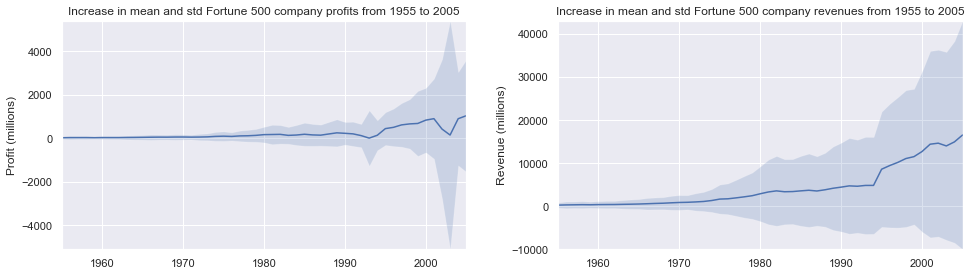

__File Info:__

Date: 20181022

Author: Stephanie Langeland 

File Name: 02_tutorial.ipynb

Version: 01

Previous Version/File: None

Dependencies: None

Purpose: Our goal is to find out how the profits of the largest companies in the US changed historically.

Input File(s): fortune500.csv

Output File(s): None

Required by: 
- A beginner's guide to Python.
- Tutorial (example analysis - last sections): https://www.dataquest.io/blog/jupyter-notebook-tutorial/

Status: Complete

Machine: Dell Latitude - Windows 10

Python Version: Python 3


```python
%matplotlib inline 
## ^ this isn't a Python command, but uses a line magic to instruct Jupyter to capture Matplotlib plots and render them in the cell output

import pandas as pd ## pandas to work w/ our data 
import matplotlib.pyplot as plt ## matplotlib to plot charts 
import seaborn as sns ## seaborn to make our charts prettier 
```


```python
sns.set(style = "darkgrid")
```

Import data:


```python
df = pd.read_csv("C:/Users/stephanie.langeland/OneDrive - Slalom/bit_bucket/a_beginners_guide_to_python/input_output_files/fortune500.csv")
```

Investigate the data:


```python
df.head()
```


<div>
<style scoped>
    .dataframe tbody tr th:only-of-type {
        vertical-align: middle;
    }

    .dataframe tbody tr th {
        vertical-align: top;
    }

    .dataframe thead th {
        text-align: right;
    }
</style>
<table border="1" class="dataframe">
  <thead>
    <tr style="text-align: right;">
      <th></th>
      <th>Year</th>
      <th>Rank</th>
      <th>Company</th>
      <th>Revenue (in millions)</th>
      <th>Profit (in millions)</th>
    </tr>
  </thead>
  <tbody>
    <tr>
      <th>0</th>
      <td>1955</td>
      <td>1</td>
      <td>General Motors</td>
      <td>9823.5</td>
      <td>806</td>
    </tr>
    <tr>
      <th>1</th>
      <td>1955</td>
      <td>2</td>
      <td>Exxon Mobil</td>
      <td>5661.4</td>
      <td>584.8</td>
    </tr>
    <tr>
      <th>2</th>
      <td>1955</td>
      <td>3</td>
      <td>U.S. Steel</td>
      <td>3250.4</td>
      <td>195.4</td>
    </tr>
    <tr>
      <th>3</th>
      <td>1955</td>
      <td>4</td>
      <td>General Electric</td>
      <td>2959.1</td>
      <td>212.6</td>
    </tr>
    <tr>
      <th>4</th>
      <td>1955</td>
      <td>5</td>
      <td>Esmark</td>
      <td>2510.8</td>
      <td>19.1</td>
    </tr>
  </tbody>
</table>
</div>


```python
df.tail()
```


<div>
<style scoped>
    .dataframe tbody tr th:only-of-type {
        vertical-align: middle;
    }

    .dataframe tbody tr th {
        vertical-align: top;
    }

    .dataframe thead th {
        text-align: right;
    }
</style>
<table border="1" class="dataframe">
  <thead>
    <tr style="text-align: right;">
      <th></th>
      <th>Year</th>
      <th>Rank</th>
      <th>Company</th>
      <th>Revenue (in millions)</th>
      <th>Profit (in millions)</th>
    </tr>
  </thead>
  <tbody>
    <tr>
      <th>25495</th>
      <td>2005</td>
      <td>496</td>
      <td>Wm. Wrigley Jr.</td>
      <td>3648.6</td>
      <td>493</td>
    </tr>
    <tr>
      <th>25496</th>
      <td>2005</td>
      <td>497</td>
      <td>Peabody Energy</td>
      <td>3631.6</td>
      <td>175.4</td>
    </tr>
    <tr>
      <th>25497</th>
      <td>2005</td>
      <td>498</td>
      <td>Wendy's International</td>
      <td>3630.4</td>
      <td>57.8</td>
    </tr>
    <tr>
      <th>25498</th>
      <td>2005</td>
      <td>499</td>
      <td>Kindred Healthcare</td>
      <td>3616.6</td>
      <td>70.6</td>
    </tr>
    <tr>
      <th>25499</th>
      <td>2005</td>
      <td>500</td>
      <td>Cincinnati Financial</td>
      <td>3614.0</td>
      <td>584</td>
    </tr>
  </tbody>
</table>
</div>


```python
## Rename the df columns:
df.columns = ['year', 'rank', 'company', 'revenue', 'profit']
```


```python
df.head()
```


<div>
<style scoped>
    .dataframe tbody tr th:only-of-type {
        vertical-align: middle;
    }

    .dataframe tbody tr th {
        vertical-align: top;
    }

    .dataframe thead th {
        text-align: right;
    }
</style>
<table border="1" class="dataframe">
  <thead>
    <tr style="text-align: right;">
      <th></th>
      <th>year</th>
      <th>rank</th>
      <th>company</th>
      <th>revenue</th>
      <th>profit</th>
    </tr>
  </thead>
  <tbody>
    <tr>
      <th>0</th>
      <td>1955</td>
      <td>1</td>
      <td>General Motors</td>
      <td>9823.5</td>
      <td>806</td>
    </tr>
    <tr>
      <th>1</th>
      <td>1955</td>
      <td>2</td>
      <td>Exxon Mobil</td>
      <td>5661.4</td>
      <td>584.8</td>
    </tr>
    <tr>
      <th>2</th>
      <td>1955</td>
      <td>3</td>
      <td>U.S. Steel</td>
      <td>3250.4</td>
      <td>195.4</td>
    </tr>
    <tr>
      <th>3</th>
      <td>1955</td>
      <td>4</td>
      <td>General Electric</td>
      <td>2959.1</td>
      <td>212.6</td>
    </tr>
    <tr>
      <th>4</th>
      <td>1955</td>
      <td>5</td>
      <td>Esmark</td>
      <td>2510.8</td>
      <td>19.1</td>
    </tr>
  </tbody>
</table>
</div>


```python
len(df) ## number of rows in df 
```


    25500


```python
df.dtypes ## structure of df
```


    year         int64
    rank         int64
    company     object
    revenue    float64
    profit      object
    dtype: object


It looks like there's something wrong with the profits column — we would expect it to be a float64 like the revenue column. This indicates that it probably contains some non-integer values, so let's take a look:


```python
non_numeric_profits = df.profit.str.contains('[^0-9.-]') ## extract non-numeric values using this regular expression: NOT^ 0-9, decimal, or negative sign

df.loc[non_numeric_profits].head() ## loc = Access a group of rows and columns by label(s) or a boolean array
```


<div>
<style scoped>
    .dataframe tbody tr th:only-of-type {
        vertical-align: middle;
    }

    .dataframe tbody tr th {
        vertical-align: top;
    }

    .dataframe thead th {
        text-align: right;
    }
</style>
<table border="1" class="dataframe">
  <thead>
    <tr style="text-align: right;">
      <th></th>
      <th>year</th>
      <th>rank</th>
      <th>company</th>
      <th>revenue</th>
      <th>profit</th>
    </tr>
  </thead>
  <tbody>
    <tr>
      <th>228</th>
      <td>1955</td>
      <td>229</td>
      <td>Norton</td>
      <td>135.0</td>
      <td>N.A.</td>
    </tr>
    <tr>
      <th>290</th>
      <td>1955</td>
      <td>291</td>
      <td>Schlitz Brewing</td>
      <td>100.0</td>
      <td>N.A.</td>
    </tr>
    <tr>
      <th>294</th>
      <td>1955</td>
      <td>295</td>
      <td>Pacific Vegetable Oil</td>
      <td>97.9</td>
      <td>N.A.</td>
    </tr>
    <tr>
      <th>296</th>
      <td>1955</td>
      <td>297</td>
      <td>Liebmann Breweries</td>
      <td>96.0</td>
      <td>N.A.</td>
    </tr>
    <tr>
      <th>352</th>
      <td>1955</td>
      <td>353</td>
      <td>Minneapolis-Moline</td>
      <td>77.4</td>
      <td>N.A.</td>
    </tr>
  </tbody>
</table>
</div>


```python
set(df.profit[non_numeric_profits]) ## set = return these values were ID'ed above 
```


    {'N.A.'}


```python
len(df.profit[non_numeric_profits]) ## number of these non-numeric values we've ID'ed above
```


    369


```python
len(df.profit[non_numeric_profits]) / len(df)
```


    0.014470588235294117


It's a small fraction of our data set, though not completely inconsequential as it is still around 1.5%. If rows containing N.A. are, roughly, uniformly distributed over the years, the easiest solution would just be to remove them. So let's have a quick look at the distribution:


```python
bin_sizes, _, _ = plt.hist(
    df.year[non_numeric_profits], 
    bins = range(
        1955, 
        2006
    )
)
```





    Most missing values have fewer than 25 cases per year.

Remove the non-numeric (missing) profits:


```python
df = df.loc[~non_numeric_profits]

df.profit = df.profit.apply(
    pd.to_numeric
)
```

Check if the above worked:


```python
len(df)
```


    25131


```python
df.dtypes ## it worked bc profit = float64
```


    year         int64
    rank         int64
    company     object
    revenue    float64
    profit     float64
    dtype: object


__Plotting with matplotlib:__

Next, we can get to addressing the question at hand by plotting the average profit by year. We might as well plot the revenue as well, so first we can define some variables and a method to reduce our code:


```python
group_by_year = df.loc[
    :, 
    [
        'year',
        'revenue',
        'profit'
    ]
].groupby('year')


avgs = group_by_year.mean()


x = avgs.index

y1 = avgs.profit


def plot(x, y, ax, title, y_label):
    ax.set_title(title)
    ax.set_ylabel(y_label)
    ax.plot(x, y)
    ax.margins(x = 0, y = 0)
```


```python
fig, ax = plt.subplots()

plot(
    x,
    y1,
    ax,
    'Increase in mean Fortune 500 company profits from 1955 to 2005',
    'Profit (millions)'
)
```





Average revenue by year:


```python
y2 = avgs.revenue

fig, ax = plt.subplots()

plot(
    x,
    y2,
    ax,
    'Increase in mean Fortune 500 company revenues from 1955 to 2005',
    'Revenue (millions)'
)
```





With a little help from Stack Overflow, we can superimpose these plots with +/- their standard deviations:


```python
def plot_with_std(x, y, stds, ax, title, y_label):
    ax.fill_between(
        x,
        y - stds,
        y + stds,
        alpha = 0.2
    )
    plot(
        x,
        y,
        ax,
        title,
        y_label
    );
    
fig, (ax1, ax2) = plt.subplots(ncols = 2);

title = 'Increase in mean and std Fortune 500 company %s from 1955 to 2005'

stds1 = group_by_year.std().profit.as_matrix();

stds2 = group_by_year.std().revenue.as_matrix();

plot_with_std(
    x,
    y1.as_matrix(),
    stds1,
    ax1,
    title % 'profits',
    'Profit (millions)'
);

plot_with_std(
    x,
    y2.as_matrix(),
    stds2,
    ax2,
    title % 'revenues',
    'Revenue (millions)'
);

fig.set_size_inches(14, 4);

fig.tight_layout();
```

    C:\Users\stephanie.langeland\AppData\Local\Continuum\anaconda3\lib\site-packages\ipykernel_launcher.py:20: FutureWarning: Method .as_matrix will be removed in a future version. Use .values instead.
    C:\Users\stephanie.langeland\AppData\Local\Continuum\anaconda3\lib\site-packages\ipykernel_launcher.py:22: FutureWarning: Method .as_matrix will be removed in a future version. Use .values instead.
    C:\Users\stephanie.langeland\AppData\Local\Continuum\anaconda3\lib\site-packages\ipykernel_launcher.py:26: FutureWarning: Method .as_matrix will be removed in a future version. Use .values instead.
    C:\Users\stephanie.langeland\AppData\Local\Continuum\anaconda3\lib\site-packages\ipykernel_launcher.py:35: FutureWarning: Method .as_matrix will be removed in a future version. Use .values instead.
    




