<h1>Table of Contents<span class="tocSkip"></span></h1>
<div class="toc"><ul class="toc-item"><li><span><a href="#Prep" data-toc-modified-id="Prep-1"><span class="toc-item-num">1&nbsp;&nbsp;</span>Prep</a></span></li><li><span><a href="#Housing-price-distribution" data-toc-modified-id="Housing-price-distribution-2"><span class="toc-item-num">2&nbsp;&nbsp;</span>Housing price distribution</a></span></li><li><span><a href="#Numerical-Data-Distribution" data-toc-modified-id="Numerical-Data-Distribution-3"><span class="toc-item-num">3&nbsp;&nbsp;</span>Numerical Data Distribution</a></span></li><li><span><a href="#Correlation" data-toc-modified-id="Correlation-4"><span class="toc-item-num">4&nbsp;&nbsp;</span>Correlation</a></span></li><li><span><a href="#Feature-to-feature-relationship" data-toc-modified-id="Feature-to-feature-relationship-5"><span class="toc-item-num">5&nbsp;&nbsp;</span>Feature to feature relationship</a></span></li><li><span><a href="#Q--&gt;-Q-(Quantitative-to-Quantitative-relationship)" data-toc-modified-id="Q-->-Q-(Quantitative-to-Quantitative-relationship)-6"><span class="toc-item-num">6&nbsp;&nbsp;</span>Q -&gt; Q (Quantitative to Quantitative relationship)</a></span></li><li><span><a href="#C--&gt;-Q-(Categorical-to-Quantitative-relationship)" data-toc-modified-id="C-->-Q-(Categorical-to-Quantitative-relationship)-7"><span class="toc-item-num">7&nbsp;&nbsp;</span>C -&gt; Q (Categorical to Quantitative relationship)</a></span></li></ul></div>

__File Info:__

Date: 20181023

Author: Stephanie Langeland 

File Name: 04_EDA_tutorial.ipynb

Version: 01

Previous Version/File: None

Dependencies: Data dictionary: ".\data_info\data_description.txt"

Purpose: Detailed exploratory data analysis with Python

Input File(s): train.csv

Output File(s): None

Required by: 
 - A beginner's guide to Python.
 - Tutorial: https://www.kaggle.com/ekami66/detailed-exploratory-data-analysis-with-python/notebook

Status: Complete

Machine: Dell Latitude - Windows 10

Python Version: Python 3

# Prep


```python
## Import packages:
import pandas as pd
import seaborn as sns
import matplotlib.pyplot as plt
import operator ## to use Standard operators as functions
```


```python
# Comment this if the data visualizsations doesn't work on your side
%matplotlib inline

plt.style.use('bmh')
```


```python
## Import training data:
df = pd.read_csv("C:/Users/stephanie.langeland/OneDrive - Slalom/bit_bucket/a_beginners_guide_to_python/input_output_files/train.csv")

df.head()
```


<div>
<style scoped>
    .dataframe tbody tr th:only-of-type {
        vertical-align: middle;
    }

    .dataframe tbody tr th {
        vertical-align: top;
    }

    .dataframe thead th {
        text-align: right;
    }
</style>
<table border="1" class="dataframe">
  <thead>
    <tr style="text-align: right;">
      <th></th>
      <th>Id</th>
      <th>MSSubClass</th>
      <th>MSZoning</th>
      <th>LotFrontage</th>
      <th>LotArea</th>
      <th>Street</th>
      <th>Alley</th>
      <th>LotShape</th>
      <th>LandContour</th>
      <th>Utilities</th>
      <th>...</th>
      <th>PoolArea</th>
      <th>PoolQC</th>
      <th>Fence</th>
      <th>MiscFeature</th>
      <th>MiscVal</th>
      <th>MoSold</th>
      <th>YrSold</th>
      <th>SaleType</th>
      <th>SaleCondition</th>
      <th>SalePrice</th>
    </tr>
  </thead>
  <tbody>
    <tr>
      <th>0</th>
      <td>1</td>
      <td>60</td>
      <td>RL</td>
      <td>65.0</td>
      <td>8450</td>
      <td>Pave</td>
      <td>NaN</td>
      <td>Reg</td>
      <td>Lvl</td>
      <td>AllPub</td>
      <td>...</td>
      <td>0</td>
      <td>NaN</td>
      <td>NaN</td>
      <td>NaN</td>
      <td>0</td>
      <td>2</td>
      <td>2008</td>
      <td>WD</td>
      <td>Normal</td>
      <td>208500</td>
    </tr>
    <tr>
      <th>1</th>
      <td>2</td>
      <td>20</td>
      <td>RL</td>
      <td>80.0</td>
      <td>9600</td>
      <td>Pave</td>
      <td>NaN</td>
      <td>Reg</td>
      <td>Lvl</td>
      <td>AllPub</td>
      <td>...</td>
      <td>0</td>
      <td>NaN</td>
      <td>NaN</td>
      <td>NaN</td>
      <td>0</td>
      <td>5</td>
      <td>2007</td>
      <td>WD</td>
      <td>Normal</td>
      <td>181500</td>
    </tr>
    <tr>
      <th>2</th>
      <td>3</td>
      <td>60</td>
      <td>RL</td>
      <td>68.0</td>
      <td>11250</td>
      <td>Pave</td>
      <td>NaN</td>
      <td>IR1</td>
      <td>Lvl</td>
      <td>AllPub</td>
      <td>...</td>
      <td>0</td>
      <td>NaN</td>
      <td>NaN</td>
      <td>NaN</td>
      <td>0</td>
      <td>9</td>
      <td>2008</td>
      <td>WD</td>
      <td>Normal</td>
      <td>223500</td>
    </tr>
    <tr>
      <th>3</th>
      <td>4</td>
      <td>70</td>
      <td>RL</td>
      <td>60.0</td>
      <td>9550</td>
      <td>Pave</td>
      <td>NaN</td>
      <td>IR1</td>
      <td>Lvl</td>
      <td>AllPub</td>
      <td>...</td>
      <td>0</td>
      <td>NaN</td>
      <td>NaN</td>
      <td>NaN</td>
      <td>0</td>
      <td>2</td>
      <td>2006</td>
      <td>WD</td>
      <td>Abnorml</td>
      <td>140000</td>
    </tr>
    <tr>
      <th>4</th>
      <td>5</td>
      <td>60</td>
      <td>RL</td>
      <td>84.0</td>
      <td>14260</td>
      <td>Pave</td>
      <td>NaN</td>
      <td>IR1</td>
      <td>Lvl</td>
      <td>AllPub</td>
      <td>...</td>
      <td>0</td>
      <td>NaN</td>
      <td>NaN</td>
      <td>NaN</td>
      <td>0</td>
      <td>12</td>
      <td>2008</td>
      <td>WD</td>
      <td>Normal</td>
      <td>250000</td>
    </tr>
  </tbody>
</table>
<p>5 rows × 81 columns</p>
</div>


```python
df.info()
```

    <class 'pandas.core.frame.DataFrame'>
    RangeIndex: 1460 entries, 0 to 1459
    Data columns (total 81 columns):
    Id               1460 non-null int64
    MSSubClass       1460 non-null int64
    MSZoning         1460 non-null object
    LotFrontage      1201 non-null float64
    LotArea          1460 non-null int64
    Street           1460 non-null object
    Alley            91 non-null object
    LotShape         1460 non-null object
    LandContour      1460 non-null object
    Utilities        1460 non-null object
    LotConfig        1460 non-null object
    LandSlope        1460 non-null object
    Neighborhood     1460 non-null object
    Condition1       1460 non-null object
    Condition2       1460 non-null object
    BldgType         1460 non-null object
    HouseStyle       1460 non-null object
    OverallQual      1460 non-null int64
    OverallCond      1460 non-null int64
    YearBuilt        1460 non-null int64
    YearRemodAdd     1460 non-null int64
    RoofStyle        1460 non-null object
    RoofMatl         1460 non-null object
    Exterior1st      1460 non-null object
    Exterior2nd      1460 non-null object
    MasVnrType       1452 non-null object
    MasVnrArea       1452 non-null float64
    ExterQual        1460 non-null object
    ExterCond        1460 non-null object
    Foundation       1460 non-null object
    BsmtQual         1423 non-null object
    BsmtCond         1423 non-null object
    BsmtExposure     1422 non-null object
    BsmtFinType1     1423 non-null object
    BsmtFinSF1       1460 non-null int64
    BsmtFinType2     1422 non-null object
    BsmtFinSF2       1460 non-null int64
    BsmtUnfSF        1460 non-null int64
    TotalBsmtSF      1460 non-null int64
    Heating          1460 non-null object
    HeatingQC        1460 non-null object
    CentralAir       1460 non-null object
    Electrical       1459 non-null object
    1stFlrSF         1460 non-null int64
    2ndFlrSF         1460 non-null int64
    LowQualFinSF     1460 non-null int64
    GrLivArea        1460 non-null int64
    BsmtFullBath     1460 non-null int64
    BsmtHalfBath     1460 non-null int64
    FullBath         1460 non-null int64
    HalfBath         1460 non-null int64
    BedroomAbvGr     1460 non-null int64
    KitchenAbvGr     1460 non-null int64
    KitchenQual      1460 non-null object
    TotRmsAbvGrd     1460 non-null int64
    Functional       1460 non-null object
    Fireplaces       1460 non-null int64
    FireplaceQu      770 non-null object
    GarageType       1379 non-null object
    GarageYrBlt      1379 non-null float64
    GarageFinish     1379 non-null object
    GarageCars       1460 non-null int64
    GarageArea       1460 non-null int64
    GarageQual       1379 non-null object
    GarageCond       1379 non-null object
    PavedDrive       1460 non-null object
    WoodDeckSF       1460 non-null int64
    OpenPorchSF      1460 non-null int64
    EnclosedPorch    1460 non-null int64
    3SsnPorch        1460 non-null int64
    ScreenPorch      1460 non-null int64
    PoolArea         1460 non-null int64
    PoolQC           7 non-null object
    Fence            281 non-null object
    MiscFeature      54 non-null object
    MiscVal          1460 non-null int64
    MoSold           1460 non-null int64
    YrSold           1460 non-null int64
    SaleType         1460 non-null object
    SaleCondition    1460 non-null object
    SalePrice        1460 non-null int64
    dtypes: float64(3), int64(35), object(43)
    memory usage: 924.0+ KB
    

Let's just remove Id and the features with 30% or more NaN values:


```python
df2 = df[ ## create a copy of df
    [
        column for column in df if df[
            column
        ].count() / len(df) >= 0.3
    ]
] ## identify columns in df that have >= 30% NaN values

del df2['Id'] ## delete this column

print(
    "List of dropped columns:",
    end = " "
) 

for c in df.columns:
    if c not in df2.columns:
        print(
            c,
            end = ", "
        )
print("\n") ## list the previously identified columns

df = df2 ## overwrite df as df2
```

    List of dropped columns: Id, Alley, PoolQC, Fence, MiscFeature, 
    
    

# Housing price distribution


```python
print(
    df["SalePrice"].describe()
)

plt.figure(
    figsize = (9, 8)
)

sns.distplot(
    df["SalePrice"],
    color = "g",
    bins = 100,
    hist_kws = {"alpha": 0.4}
)
```

    count      1460.000000
    mean     180921.195890
    std       79442.502883
    min       34900.000000
    25%      129975.000000
    50%      163000.000000
    75%      214000.000000
    max      755000.000000
    Name: SalePrice, dtype: float64
    

    C:\Users\stephanie.langeland\AppData\Local\Continuum\anaconda3\lib\site-packages\scipy\stats\stats.py:1713: FutureWarning: Using a non-tuple sequence for multidimensional indexing is deprecated; use `arr[tuple(seq)]` instead of `arr[seq]`. In the future this will be interpreted as an array index, `arr[np.array(seq)]`, which will result either in an error or a different result.
      return np.add.reduce(sorted[indexer] * weights, axis=axis) / sumval
    


    <matplotlib.axes._subplots.AxesSubplot at 0x24565710f60>


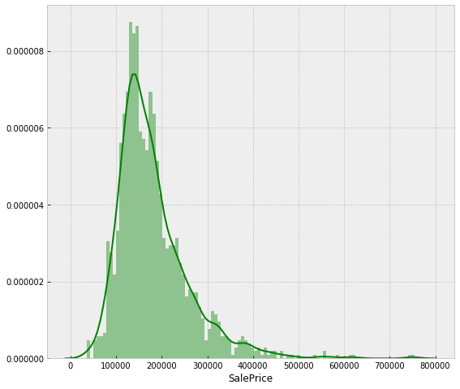


# Numerical Data Distribution

For this part lets look at the distribution of all of the features by plotting them.  

To do so lets first list all the types of our data from our data set and take only the numerical ones:


```python
list(
    set(
        df.dtypes.tolist()
    )
)
```


    [dtype('O'), dtype('int64'), dtype('float64')]


```python
df_num = df.select_dtypes(include = ["float64", "int64"])

df_num.head()
```


<div>
<style scoped>
    .dataframe tbody tr th:only-of-type {
        vertical-align: middle;
    }

    .dataframe tbody tr th {
        vertical-align: top;
    }

    .dataframe thead th {
        text-align: right;
    }
</style>
<table border="1" class="dataframe">
  <thead>
    <tr style="text-align: right;">
      <th></th>
      <th>MSSubClass</th>
      <th>LotFrontage</th>
      <th>LotArea</th>
      <th>OverallQual</th>
      <th>OverallCond</th>
      <th>YearBuilt</th>
      <th>YearRemodAdd</th>
      <th>MasVnrArea</th>
      <th>BsmtFinSF1</th>
      <th>BsmtFinSF2</th>
      <th>...</th>
      <th>WoodDeckSF</th>
      <th>OpenPorchSF</th>
      <th>EnclosedPorch</th>
      <th>3SsnPorch</th>
      <th>ScreenPorch</th>
      <th>PoolArea</th>
      <th>MiscVal</th>
      <th>MoSold</th>
      <th>YrSold</th>
      <th>SalePrice</th>
    </tr>
  </thead>
  <tbody>
    <tr>
      <th>0</th>
      <td>60</td>
      <td>65.0</td>
      <td>8450</td>
      <td>7</td>
      <td>5</td>
      <td>2003</td>
      <td>2003</td>
      <td>196.0</td>
      <td>706</td>
      <td>0</td>
      <td>...</td>
      <td>0</td>
      <td>61</td>
      <td>0</td>
      <td>0</td>
      <td>0</td>
      <td>0</td>
      <td>0</td>
      <td>2</td>
      <td>2008</td>
      <td>208500</td>
    </tr>
    <tr>
      <th>1</th>
      <td>20</td>
      <td>80.0</td>
      <td>9600</td>
      <td>6</td>
      <td>8</td>
      <td>1976</td>
      <td>1976</td>
      <td>0.0</td>
      <td>978</td>
      <td>0</td>
      <td>...</td>
      <td>298</td>
      <td>0</td>
      <td>0</td>
      <td>0</td>
      <td>0</td>
      <td>0</td>
      <td>0</td>
      <td>5</td>
      <td>2007</td>
      <td>181500</td>
    </tr>
    <tr>
      <th>2</th>
      <td>60</td>
      <td>68.0</td>
      <td>11250</td>
      <td>7</td>
      <td>5</td>
      <td>2001</td>
      <td>2002</td>
      <td>162.0</td>
      <td>486</td>
      <td>0</td>
      <td>...</td>
      <td>0</td>
      <td>42</td>
      <td>0</td>
      <td>0</td>
      <td>0</td>
      <td>0</td>
      <td>0</td>
      <td>9</td>
      <td>2008</td>
      <td>223500</td>
    </tr>
    <tr>
      <th>3</th>
      <td>70</td>
      <td>60.0</td>
      <td>9550</td>
      <td>7</td>
      <td>5</td>
      <td>1915</td>
      <td>1970</td>
      <td>0.0</td>
      <td>216</td>
      <td>0</td>
      <td>...</td>
      <td>0</td>
      <td>35</td>
      <td>272</td>
      <td>0</td>
      <td>0</td>
      <td>0</td>
      <td>0</td>
      <td>2</td>
      <td>2006</td>
      <td>140000</td>
    </tr>
    <tr>
      <th>4</th>
      <td>60</td>
      <td>84.0</td>
      <td>14260</td>
      <td>8</td>
      <td>5</td>
      <td>2000</td>
      <td>2000</td>
      <td>350.0</td>
      <td>655</td>
      <td>0</td>
      <td>...</td>
      <td>192</td>
      <td>84</td>
      <td>0</td>
      <td>0</td>
      <td>0</td>
      <td>0</td>
      <td>0</td>
      <td>12</td>
      <td>2008</td>
      <td>250000</td>
    </tr>
  </tbody>
</table>
<p>5 rows × 37 columns</p>
</div>


Plot all numerical features' distributions:


```python
df_num.hist(
    figsize = (16, 20),
    bins = 50,
    xlabelsize = 8,
    ylabelsize = 8
); ## use the ";" to avoid verbose matplotlib information displayed 
```


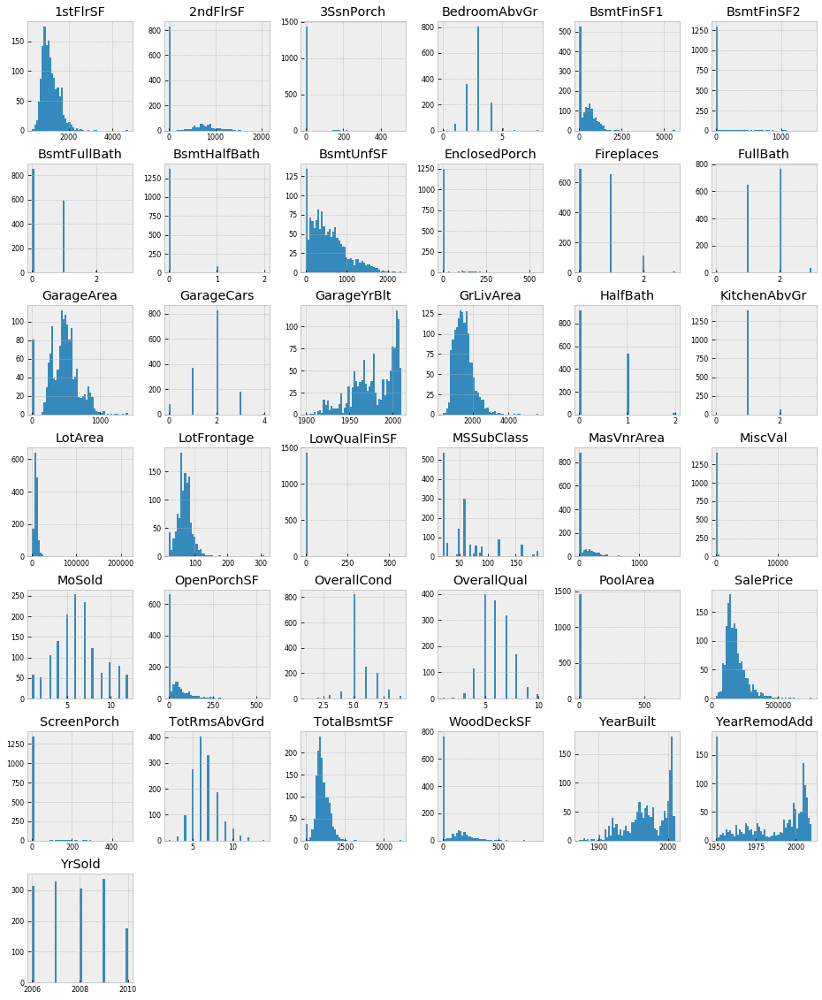


# Correlation

Now we'll try to find which features are strongly correlated with `SalePrice`. We'll store them in a var called `golden_features_list`. We'll reuse our `df_num` data set to do so.


```python
df_num.head()
```


<div>
<style scoped>
    .dataframe tbody tr th:only-of-type {
        vertical-align: middle;
    }

    .dataframe tbody tr th {
        vertical-align: top;
    }

    .dataframe thead th {
        text-align: right;
    }
</style>
<table border="1" class="dataframe">
  <thead>
    <tr style="text-align: right;">
      <th></th>
      <th>MSSubClass</th>
      <th>LotFrontage</th>
      <th>LotArea</th>
      <th>OverallQual</th>
      <th>OverallCond</th>
      <th>YearBuilt</th>
      <th>YearRemodAdd</th>
      <th>MasVnrArea</th>
      <th>BsmtFinSF1</th>
      <th>BsmtFinSF2</th>
      <th>...</th>
      <th>WoodDeckSF</th>
      <th>OpenPorchSF</th>
      <th>EnclosedPorch</th>
      <th>3SsnPorch</th>
      <th>ScreenPorch</th>
      <th>PoolArea</th>
      <th>MiscVal</th>
      <th>MoSold</th>
      <th>YrSold</th>
      <th>SalePrice</th>
    </tr>
  </thead>
  <tbody>
    <tr>
      <th>0</th>
      <td>60</td>
      <td>65.0</td>
      <td>8450</td>
      <td>7</td>
      <td>5</td>
      <td>2003</td>
      <td>2003</td>
      <td>196.0</td>
      <td>706</td>
      <td>0</td>
      <td>...</td>
      <td>0</td>
      <td>61</td>
      <td>0</td>
      <td>0</td>
      <td>0</td>
      <td>0</td>
      <td>0</td>
      <td>2</td>
      <td>2008</td>
      <td>208500</td>
    </tr>
    <tr>
      <th>1</th>
      <td>20</td>
      <td>80.0</td>
      <td>9600</td>
      <td>6</td>
      <td>8</td>
      <td>1976</td>
      <td>1976</td>
      <td>0.0</td>
      <td>978</td>
      <td>0</td>
      <td>...</td>
      <td>298</td>
      <td>0</td>
      <td>0</td>
      <td>0</td>
      <td>0</td>
      <td>0</td>
      <td>0</td>
      <td>5</td>
      <td>2007</td>
      <td>181500</td>
    </tr>
    <tr>
      <th>2</th>
      <td>60</td>
      <td>68.0</td>
      <td>11250</td>
      <td>7</td>
      <td>5</td>
      <td>2001</td>
      <td>2002</td>
      <td>162.0</td>
      <td>486</td>
      <td>0</td>
      <td>...</td>
      <td>0</td>
      <td>42</td>
      <td>0</td>
      <td>0</td>
      <td>0</td>
      <td>0</td>
      <td>0</td>
      <td>9</td>
      <td>2008</td>
      <td>223500</td>
    </tr>
    <tr>
      <th>3</th>
      <td>70</td>
      <td>60.0</td>
      <td>9550</td>
      <td>7</td>
      <td>5</td>
      <td>1915</td>
      <td>1970</td>
      <td>0.0</td>
      <td>216</td>
      <td>0</td>
      <td>...</td>
      <td>0</td>
      <td>35</td>
      <td>272</td>
      <td>0</td>
      <td>0</td>
      <td>0</td>
      <td>0</td>
      <td>2</td>
      <td>2006</td>
      <td>140000</td>
    </tr>
    <tr>
      <th>4</th>
      <td>60</td>
      <td>84.0</td>
      <td>14260</td>
      <td>8</td>
      <td>5</td>
      <td>2000</td>
      <td>2000</td>
      <td>350.0</td>
      <td>655</td>
      <td>0</td>
      <td>...</td>
      <td>192</td>
      <td>84</td>
      <td>0</td>
      <td>0</td>
      <td>0</td>
      <td>0</td>
      <td>0</td>
      <td>12</td>
      <td>2008</td>
      <td>250000</td>
    </tr>
  </tbody>
</table>
<p>5 rows × 37 columns</p>
</div>


```python
df_num_corr = df_num.corr()["SalePrice"][:-1] ## correlations of each variable with SalePrice (which is the last column)

golden_features_list = df_num_corr[
    abs(
        df_num_corr
    ) > 0.5 ## identify which variables have a correlation of more than 0.5 with SalePrice
].sort_values(
    ascending = False ## sort them in descending order
)

print(
    "There are {} strongly correlated values with SalePrice:\n{}".format(
        len(
            golden_features_list
        ), ## insert this length in the {} after "There are" above
        golden_features_list ## display this object 
    )
)
```

    There are 10 strongly correlated values with SalePrice:
    OverallQual     0.790982
    GrLivArea       0.708624
    GarageCars      0.640409
    GarageArea      0.623431
    TotalBsmtSF     0.613581
    1stFlrSF        0.605852
    FullBath        0.560664
    TotRmsAbvGrd    0.533723
    YearBuilt       0.522897
    YearRemodAdd    0.507101
    Name: SalePrice, dtype: float64
    

Explore the affect of outliers on the above correlations:

 - Plot the numerical features - which variables have very few or explainable outliers?

 - Remove the outliers from these features - which variables still have  strong correlations with SalePrice without outliers?


```python
for i in range(
    0, ## start
    len(df_num.columns), ## stop
    5 ## step
):
    sns.pairplot(
        data = df_num,
        x_vars = df_num.columns[i:i + 5], ## step by 5
        y_vars = ["SalePrice"]
    )
    
```


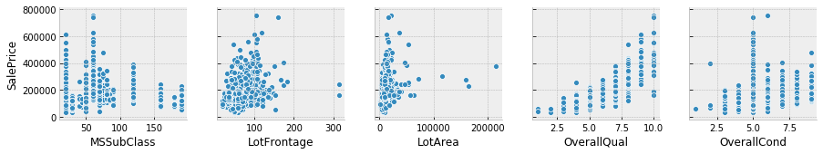


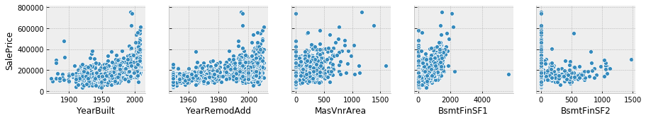


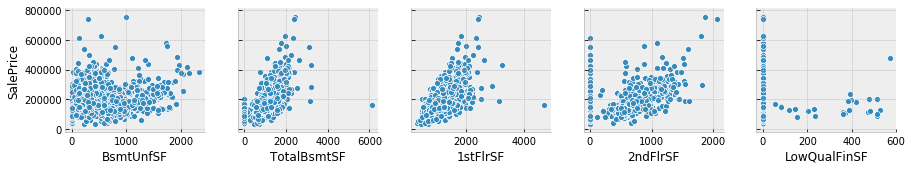


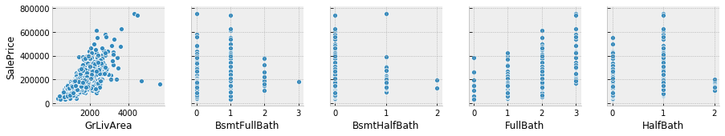


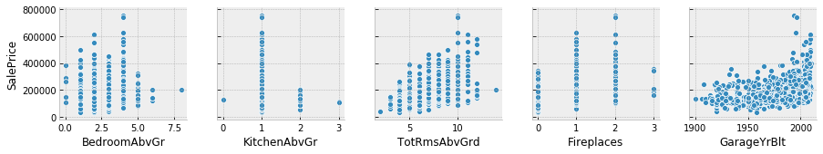


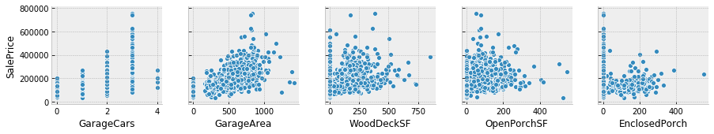


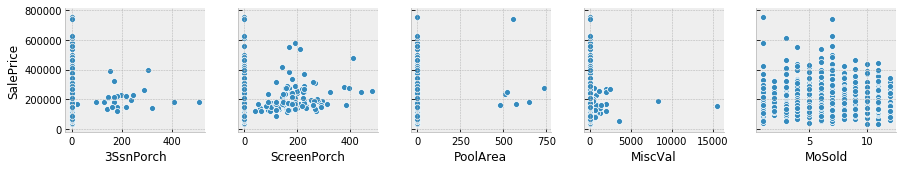


    We see many points at x = 0 in various graphs, which denotes the absence of 
    that feature in a home, e.g. fireplaces, pool area, etc.  Remove these 0
    values and redo the correlation values:


```python
individual_features_df = [] ## create an empty list 

for i in range(
    0, ## start
    len(df_num.columns) - 1 ## stop; all columns except SalePrice which is the last column
):
    tmpDf = df_num[
        [
            df_num.columns[i],
            "SalePrice"
        ]
    ] ## for all columns in df_num except SalePrice
    
    tmpDf = tmpDf[
        tmpDf[
            df_num.columns[i]
        ] != 0
    ] ## columns in tmpDf that don't equal 0
    
    individual_features_df.append(tmpDf)
    

all_correlations = {
    feature.columns[0]: feature.corr()["SalePrice"][0] for feature in individual_features_df
} ## each variable's correlation with SalePrice


all_correlations = sorted(
    all_correlations.items(), ## items() method returns a view obj that displays a list of dictionary's (key, value) tuple pairs
    key = operator.itemgetter(1) ##  operator.itemgetter(1): A function that grabs the nth (here is 1) item from a list-like obj
) 


for (key, value) in all_correlations:
    print(
        "{:>15}: {:>15}".format(
            key, ## corresponds to key =  in the revious function?
            value ## value that needs to be formatted
        )
    )
```

       KitchenAbvGr: -0.13920069217785566
           HalfBath: -0.08439171127179887
         MSSubClass: -0.08428413512659523
        OverallCond: -0.0778558940486776
             YrSold: -0.028922585168730426
       BsmtHalfBath: -0.028834567185481712
           PoolArea: -0.014091521506356928
       BsmtFullBath: 0.011439163340408634
             MoSold: 0.04643224522381936
          3SsnPorch: 0.06393243256889079
        OpenPorchSF: 0.08645298857147708
            MiscVal: 0.08896338917298924
         Fireplaces: 0.1216605842136395
          BsmtUnfSF: 0.16926100049514192
       BedroomAbvGr: 0.18093669310849045
         WoodDeckSF: 0.19370601237520677
         BsmtFinSF2: 0.19895609430836586
      EnclosedPorch: 0.2412788363011751
        ScreenPorch: 0.25543007954878405
            LotArea: 0.2638433538714063
       LowQualFinSF: 0.3000750165550133
        LotFrontage: 0.35179909657067854
         MasVnrArea: 0.4340902197568926
         BsmtFinSF1: 0.4716904265235731
        GarageYrBlt: 0.48636167748786213
       YearRemodAdd: 0.5071009671113867
          YearBuilt: 0.5228973328794967
       TotRmsAbvGrd: 0.5337231555820238
           FullBath: 0.5745626737760816
           1stFlrSF: 0.6058521846919166
         GarageArea: 0.6084052829168343
        TotalBsmtSF: 0.6096808188074366
         GarageCars: 0.6370954062078953
           2ndFlrSF: 0.6733048324568383
          GrLivArea: 0.7086244776126511
        OverallQual: 0.7909816005838047
    

Now our golden_features_list var looks like this:


```python
golden_features_list = [
    key for key,
    value in all_correlations if abs(value) >= 0.5
]

print(
    "There are {} strongly correlated values with SalePrice:\n{}".format(
        len(golden_features_list),
        golden_features_list
    )
)
```

    There are 11 strongly correlated values with SalePrice:
    ['YearRemodAdd', 'YearBuilt', 'TotRmsAbvGrd', 'FullBath', '1stFlrSF', 'GarageArea', 'TotalBsmtSF', 'GarageCars', '2ndFlrSF', 'GrLivArea', 'OverallQual']
    

Therefore, there are 11 features that are strongly correlated with SalePrice.

# Feature to feature relationship

Rather than plotting all of the numerical features using seasborn (which is very time consuming and difficult to interpret), explore whether some variables have relationships with each other:


```python
corr  = df_num.drop("SalePrice", axis = 1).corr() ## drop SalePrice bc we already explored this above

plt.figure(figsize = (12, 10))

sns.heatmap(
    corr[
        (corr >= 0.5) | (corr <= -0.4) ## only plot these correlations
    ],
    cmap = "viridis", ## color list 
    vmax = 1.0, ## value to anchor color map
    linewidths = 0.1, 
    annot = True, ## If True, write the data value in each cell
    annot_kws = {"size": 8}, ## value mapping
    square = True ## If True, set the Axes aspect to “equal” so each cell will be square-shaped.
);
```


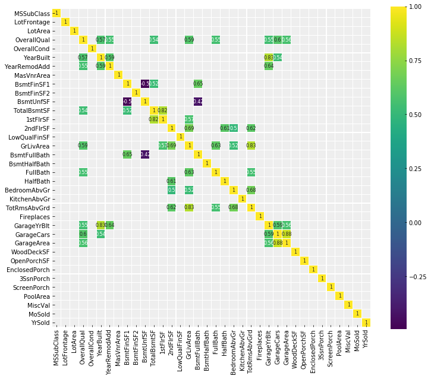


# Q -> Q (Quantitative to Quantitative relationship)

Examine the quantitative features of our dataframe and how they relate to the `SalePrice`.

Separate the categorical from quantitative features (refer to the following data dictionary: "C:\Users\stephanie.langeland\OneDrive - Slalom\Misc\Personal\Coding Reference Files\Python\a_beginners_guide_to_python\data_info\data_description.txt"):


```python
quantitative_features_list = [
    'LotFrontage', 
    'LotArea', 
    'MasVnrArea', 
    'BsmtFinSF1', 
    'BsmtFinSF2', 
    'TotalBsmtSF', 
    '1stFlrSF',
    '2ndFlrSF', 
    'LowQualFinSF', 
    'GrLivArea', 
    'BsmtFullBath', 
    'BsmtHalfBath', 
    'FullBath', 
    'HalfBath',
    'BedroomAbvGr', 
    'KitchenAbvGr', 
    'TotRmsAbvGrd', 
    'Fireplaces', 
    'GarageCars', 
    'GarageArea', 
    'WoodDeckSF', 
    'OpenPorchSF', 
    'EnclosedPorch', 
    '3SsnPorch', 
    'ScreenPorch', 
    'PoolArea', 
    'MiscVal', 
    'SalePrice'
]


df_quantitative_values = df[quantitative_features_list] ## subset this list of columns

df_quantitative_values.head()
```


<div>
<style scoped>
    .dataframe tbody tr th:only-of-type {
        vertical-align: middle;
    }

    .dataframe tbody tr th {
        vertical-align: top;
    }

    .dataframe thead th {
        text-align: right;
    }
</style>
<table border="1" class="dataframe">
  <thead>
    <tr style="text-align: right;">
      <th></th>
      <th>LotFrontage</th>
      <th>LotArea</th>
      <th>MasVnrArea</th>
      <th>BsmtFinSF1</th>
      <th>BsmtFinSF2</th>
      <th>TotalBsmtSF</th>
      <th>1stFlrSF</th>
      <th>2ndFlrSF</th>
      <th>LowQualFinSF</th>
      <th>GrLivArea</th>
      <th>...</th>
      <th>GarageCars</th>
      <th>GarageArea</th>
      <th>WoodDeckSF</th>
      <th>OpenPorchSF</th>
      <th>EnclosedPorch</th>
      <th>3SsnPorch</th>
      <th>ScreenPorch</th>
      <th>PoolArea</th>
      <th>MiscVal</th>
      <th>SalePrice</th>
    </tr>
  </thead>
  <tbody>
    <tr>
      <th>0</th>
      <td>65.0</td>
      <td>8450</td>
      <td>196.0</td>
      <td>706</td>
      <td>0</td>
      <td>856</td>
      <td>856</td>
      <td>854</td>
      <td>0</td>
      <td>1710</td>
      <td>...</td>
      <td>2</td>
      <td>548</td>
      <td>0</td>
      <td>61</td>
      <td>0</td>
      <td>0</td>
      <td>0</td>
      <td>0</td>
      <td>0</td>
      <td>208500</td>
    </tr>
    <tr>
      <th>1</th>
      <td>80.0</td>
      <td>9600</td>
      <td>0.0</td>
      <td>978</td>
      <td>0</td>
      <td>1262</td>
      <td>1262</td>
      <td>0</td>
      <td>0</td>
      <td>1262</td>
      <td>...</td>
      <td>2</td>
      <td>460</td>
      <td>298</td>
      <td>0</td>
      <td>0</td>
      <td>0</td>
      <td>0</td>
      <td>0</td>
      <td>0</td>
      <td>181500</td>
    </tr>
    <tr>
      <th>2</th>
      <td>68.0</td>
      <td>11250</td>
      <td>162.0</td>
      <td>486</td>
      <td>0</td>
      <td>920</td>
      <td>920</td>
      <td>866</td>
      <td>0</td>
      <td>1786</td>
      <td>...</td>
      <td>2</td>
      <td>608</td>
      <td>0</td>
      <td>42</td>
      <td>0</td>
      <td>0</td>
      <td>0</td>
      <td>0</td>
      <td>0</td>
      <td>223500</td>
    </tr>
    <tr>
      <th>3</th>
      <td>60.0</td>
      <td>9550</td>
      <td>0.0</td>
      <td>216</td>
      <td>0</td>
      <td>756</td>
      <td>961</td>
      <td>756</td>
      <td>0</td>
      <td>1717</td>
      <td>...</td>
      <td>3</td>
      <td>642</td>
      <td>0</td>
      <td>35</td>
      <td>272</td>
      <td>0</td>
      <td>0</td>
      <td>0</td>
      <td>0</td>
      <td>140000</td>
    </tr>
    <tr>
      <th>4</th>
      <td>84.0</td>
      <td>14260</td>
      <td>350.0</td>
      <td>655</td>
      <td>0</td>
      <td>1145</td>
      <td>1145</td>
      <td>1053</td>
      <td>0</td>
      <td>2198</td>
      <td>...</td>
      <td>3</td>
      <td>836</td>
      <td>192</td>
      <td>84</td>
      <td>0</td>
      <td>0</td>
      <td>0</td>
      <td>0</td>
      <td>0</td>
      <td>250000</td>
    </tr>
  </tbody>
</table>
<p>5 rows × 28 columns</p>
</div>


Look at the strongly correlated features:


```python
features_to_analyse = [
    x for x in quantitative_features_list if x in golden_features_list ## extract variables in both lists
]


features_to_analyse.append("SalePrice") ## add this variable name to the list we created

features_to_analyse
```


    ['TotalBsmtSF',
     '1stFlrSF',
     '2ndFlrSF',
     'GrLivArea',
     'FullBath',
     'TotRmsAbvGrd',
     'GarageCars',
     'GarageArea',
     'SalePrice']


Distribution of `features_to_analyse`:


```python
fig, ax = plt.subplots(
    round(
        len(features_to_analyse) / 3
    ),
    3,
    figsize = (18,12)
) ## this creates the blank plots with just the grey background 


for i, ax in enumerate(fig.axes):
    if i < len(features_to_analyse) - 1:
        sns.regplot(
            x = features_to_analyse[i],
            y = "SalePrice",
            data = df[features_to_analyse],
            ax = ax
        ) ## for each variable in features_to_analyse, plot it against SalePrice
```

    C:\Users\stephanie.langeland\AppData\Local\Continuum\anaconda3\lib\site-packages\scipy\stats\stats.py:1713: FutureWarning: Using a non-tuple sequence for multidimensional indexing is deprecated; use `arr[tuple(seq)]` instead of `arr[seq]`. In the future this will be interpreted as an array index, `arr[np.array(seq)]`, which will result either in an error or a different result.
      return np.add.reduce(sorted[indexer] * weights, axis=axis) / sumval
    


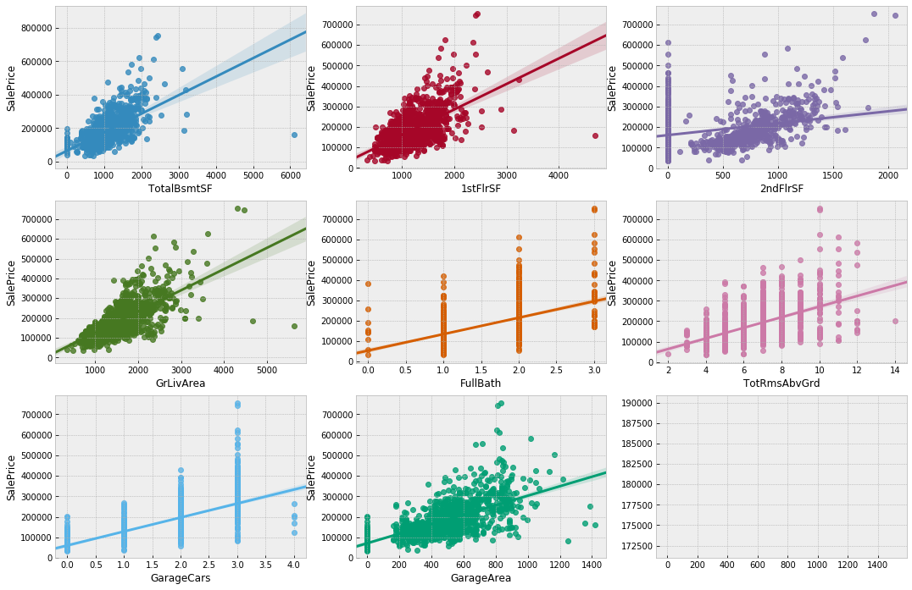


# C -> Q (Categorical to Quantitative relationship)

Subset the categorical variables --> just remove quantitative_features_list and irrelevant non-numerical features from our entire dataframe:


```python
## remove columns from df that are included in quantitative_features_list:
categorical_features = [
    a for a in quantitative_features_list[:-1] + ## need to keep SalePrice which is the last column
    df.columns.tolist() if ( ## tolist() converts the array into a list.
        a not in quantitative_features_list[:-1] ## if columns in df are not in quantitative_features_list
    ) or (
        a not in df.columns.tolist()  ## or in df
    )
] 


df_categ = df[categorical_features]

df_categ.head()
```


<div>
<style scoped>
    .dataframe tbody tr th:only-of-type {
        vertical-align: middle;
    }

    .dataframe tbody tr th {
        vertical-align: top;
    }

    .dataframe thead th {
        text-align: right;
    }
</style>
<table border="1" class="dataframe">
  <thead>
    <tr style="text-align: right;">
      <th></th>
      <th>MSSubClass</th>
      <th>MSZoning</th>
      <th>Street</th>
      <th>LotShape</th>
      <th>LandContour</th>
      <th>Utilities</th>
      <th>LotConfig</th>
      <th>LandSlope</th>
      <th>Neighborhood</th>
      <th>Condition1</th>
      <th>...</th>
      <th>GarageYrBlt</th>
      <th>GarageFinish</th>
      <th>GarageQual</th>
      <th>GarageCond</th>
      <th>PavedDrive</th>
      <th>MoSold</th>
      <th>YrSold</th>
      <th>SaleType</th>
      <th>SaleCondition</th>
      <th>SalePrice</th>
    </tr>
  </thead>
  <tbody>
    <tr>
      <th>0</th>
      <td>60</td>
      <td>RL</td>
      <td>Pave</td>
      <td>Reg</td>
      <td>Lvl</td>
      <td>AllPub</td>
      <td>Inside</td>
      <td>Gtl</td>
      <td>CollgCr</td>
      <td>Norm</td>
      <td>...</td>
      <td>2003.0</td>
      <td>RFn</td>
      <td>TA</td>
      <td>TA</td>
      <td>Y</td>
      <td>2</td>
      <td>2008</td>
      <td>WD</td>
      <td>Normal</td>
      <td>208500</td>
    </tr>
    <tr>
      <th>1</th>
      <td>20</td>
      <td>RL</td>
      <td>Pave</td>
      <td>Reg</td>
      <td>Lvl</td>
      <td>AllPub</td>
      <td>FR2</td>
      <td>Gtl</td>
      <td>Veenker</td>
      <td>Feedr</td>
      <td>...</td>
      <td>1976.0</td>
      <td>RFn</td>
      <td>TA</td>
      <td>TA</td>
      <td>Y</td>
      <td>5</td>
      <td>2007</td>
      <td>WD</td>
      <td>Normal</td>
      <td>181500</td>
    </tr>
    <tr>
      <th>2</th>
      <td>60</td>
      <td>RL</td>
      <td>Pave</td>
      <td>IR1</td>
      <td>Lvl</td>
      <td>AllPub</td>
      <td>Inside</td>
      <td>Gtl</td>
      <td>CollgCr</td>
      <td>Norm</td>
      <td>...</td>
      <td>2001.0</td>
      <td>RFn</td>
      <td>TA</td>
      <td>TA</td>
      <td>Y</td>
      <td>9</td>
      <td>2008</td>
      <td>WD</td>
      <td>Normal</td>
      <td>223500</td>
    </tr>
    <tr>
      <th>3</th>
      <td>70</td>
      <td>RL</td>
      <td>Pave</td>
      <td>IR1</td>
      <td>Lvl</td>
      <td>AllPub</td>
      <td>Corner</td>
      <td>Gtl</td>
      <td>Crawfor</td>
      <td>Norm</td>
      <td>...</td>
      <td>1998.0</td>
      <td>Unf</td>
      <td>TA</td>
      <td>TA</td>
      <td>Y</td>
      <td>2</td>
      <td>2006</td>
      <td>WD</td>
      <td>Abnorml</td>
      <td>140000</td>
    </tr>
    <tr>
      <th>4</th>
      <td>60</td>
      <td>RL</td>
      <td>Pave</td>
      <td>IR1</td>
      <td>Lvl</td>
      <td>AllPub</td>
      <td>FR2</td>
      <td>Gtl</td>
      <td>NoRidge</td>
      <td>Norm</td>
      <td>...</td>
      <td>2000.0</td>
      <td>RFn</td>
      <td>TA</td>
      <td>TA</td>
      <td>Y</td>
      <td>12</td>
      <td>2008</td>
      <td>WD</td>
      <td>Normal</td>
      <td>250000</td>
    </tr>
  </tbody>
</table>
<p>5 rows × 49 columns</p>
</div>


```python
## remove non-numerical features:
df_not_num = df_categ.select_dtypes(include = ['O'])


print(
    "There are {} non-numerical features:\n{}".format(
        len(df_not_num.columns),
        df_not_num.columns.tolist()
    )
)
```

    There are 39 non-numerical features:
    ['MSZoning', 'Street', 'LotShape', 'LandContour', 'Utilities', 'LotConfig', 'LandSlope', 'Neighborhood', 'Condition1', 'Condition2', 'BldgType', 'HouseStyle', 'RoofStyle', 'RoofMatl', 'Exterior1st', 'Exterior2nd', 'MasVnrType', 'ExterQual', 'ExterCond', 'Foundation', 'BsmtQual', 'BsmtCond', 'BsmtExposure', 'BsmtFinType1', 'BsmtFinType2', 'Heating', 'HeatingQC', 'CentralAir', 'Electrical', 'KitchenQual', 'Functional', 'FireplaceQu', 'GarageType', 'GarageFinish', 'GarageQual', 'GarageCond', 'PavedDrive', 'SaleType', 'SaleCondition']
    

Plot some categorical features:


```python
plt.figure(figsize = (10, 6))

ax = sns.boxplot(
    x = "BsmtExposure",
    y = "SalePrice",
    data = df_categ
)


plt.setp(
    ax.artists, 
    alpha = 0.5,
    linewidth = 2, 
    edgecolor = "k"
)


plt.xticks(rotation = 45)
```


    (array([0, 1, 2, 3]), <a list of 4 Text xticklabel objects>)


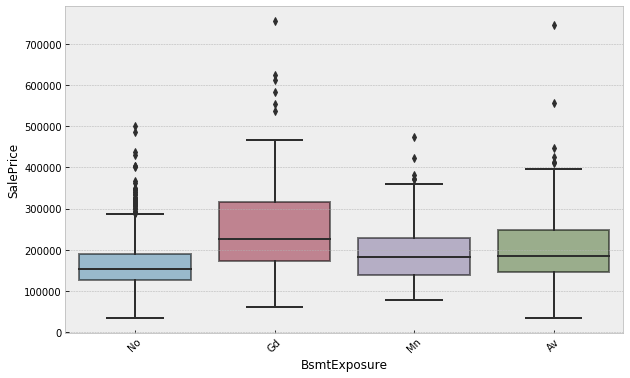


```python
plt.figure(figsize = (12, 6 ))

ax = sns.boxplot(
    x = "SaleCondition",
    y = "SalePrice",
    data = df_categ
)

plt.setp(
    ax.artists,
    alpha = 0.5,
    linewidth = 2,
    edgecolor = "k"
)

plt.xticks(rotation = 45)
```


    (array([0, 1, 2, 3, 4, 5]), <a list of 6 Text xticklabel objects>)


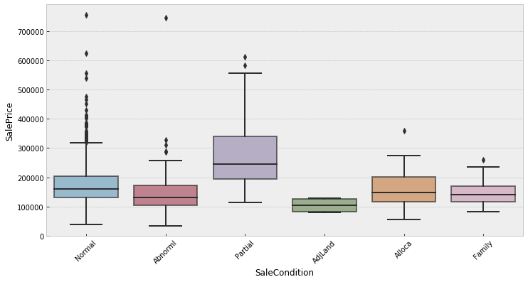


Distributions of Categorical Features:


```python
fig, axes = plt.subplots(
    round(
        len(df_not_num.columns) / 3
    ), 
    3,
    figsize = (12, 30)
)


for i, ax in enumerate(fig.axes):
    if i < len(df_not_num.columns):
        ax.set_xticklabels(
            ax.xaxis.get_majorticklabels(),
            rotation = 45
        )
        
        sns.countplot(
            x = df_not_num.columns[i],
            alpha = 0.7,
            data = df_not_num,
            ax = ax
        )
```


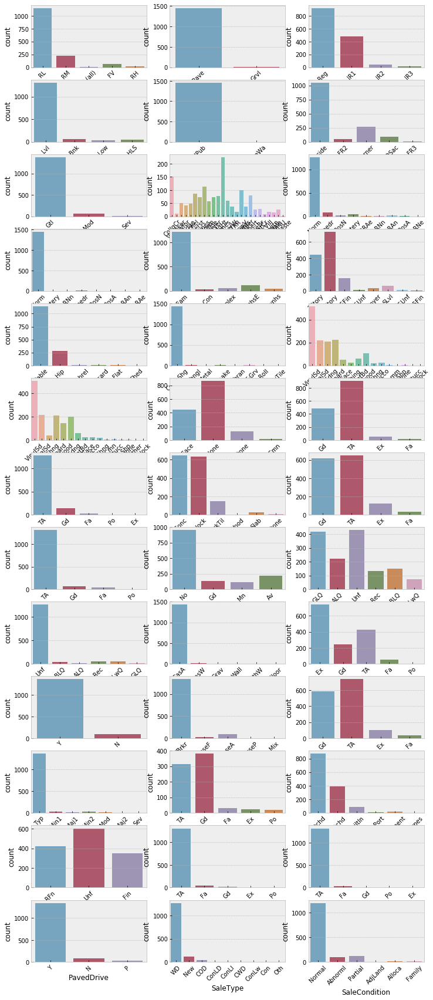

