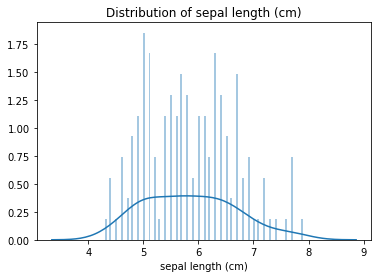
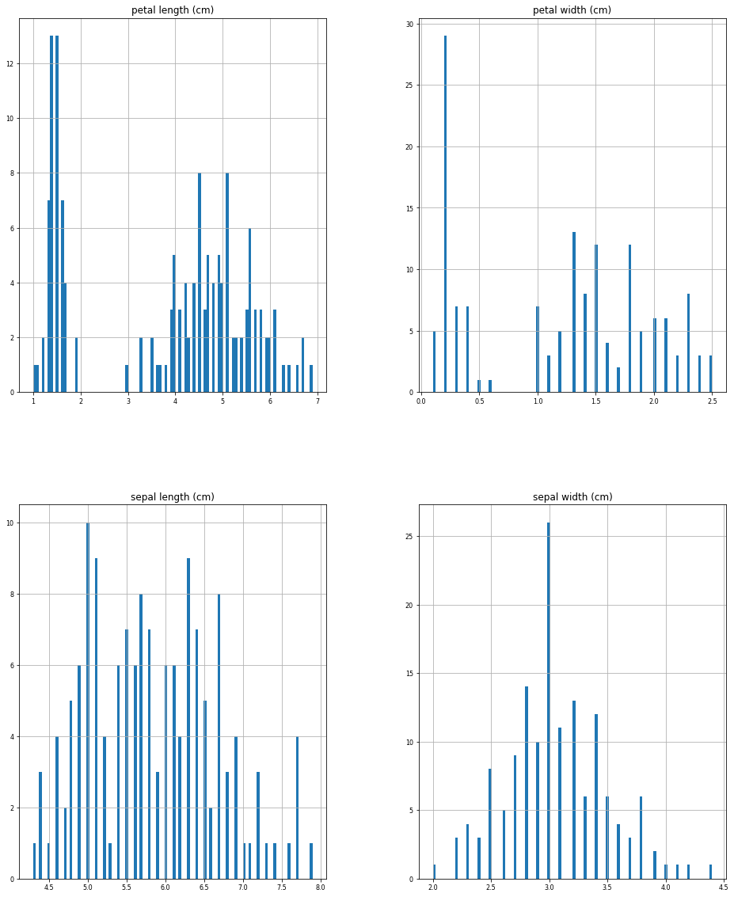
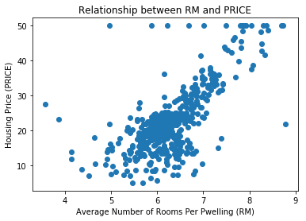
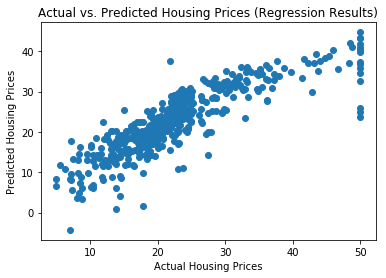
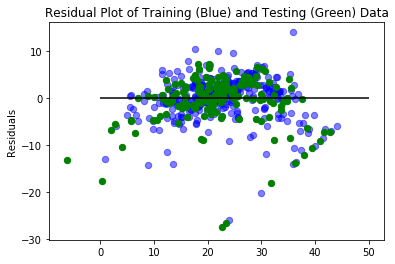

<h1>Table of Contents<span class="tocSkip"></span></h1>
<div class="toc"><ul class="toc-item"><li><span><a href="#Import-data-to-explore-from-sklearn-(http://scikit-learn.org/stable/datasets/)" data-toc-modified-id="Import-data-to-explore-from-sklearn-(http://scikit-learn.org/stable/datasets/)-1"><span class="toc-item-num">1&nbsp;&nbsp;</span>Import data to explore from sklearn (<a href="http://scikit-learn.org/stable/datasets/" target="_blank">http://scikit-learn.org/stable/datasets/</a>)</a></span><ul class="toc-item"><li><span><a href="#iris-data-set" data-toc-modified-id="iris-data-set-1.1"><span class="toc-item-num">1.1&nbsp;&nbsp;</span><code>iris</code> data set</a></span></li></ul></li><li><span><a href="#Regression-with-the-boston-housing-data-set-(https://bigdata-madesimple.com/how-to-run-linear-regression-in-python-scikit-learn/)" data-toc-modified-id="Regression-with-the-boston-housing-data-set-(https://bigdata-madesimple.com/how-to-run-linear-regression-in-python-scikit-learn/)-2"><span class="toc-item-num">2&nbsp;&nbsp;</span>Regression with the boston housing data set (<a href="https://bigdata-madesimple.com/how-to-run-linear-regression-in-python-scikit-learn/" target="_blank">https://bigdata-madesimple.com/how-to-run-linear-regression-in-python-scikit-learn/</a>)</a></span></li></ul></div>

__File Info:__

Date: 20181029

Author: Stephanie Langeland 

File Name: 06_tutorial.ipynb

Version: 01

Previous Version/File: None

Dependencies: None

Purpose: Practice creating OLS models.

Input File(s): None

Output File(s): None

Required by: 
 - A beginner's guide to Python.
 - Refer to the links below for tutorials.

Status: Complete

Machine: Dell Latitude - Windows 10

Python Version: Python 3


```python
## Import packages:
from sklearn.datasets import load_iris
import pandas as pd
import seaborn as sns
import matplotlib.pyplot as plt
import numpy as np
import scipy.stats as stats
from sklearn.datasets import load_boston
from sklearn.linear_model import LinearRegression
from sklearn.model_selection import train_test_split
```

# Import data to explore from sklearn (http://scikit-learn.org/stable/datasets/)

## `iris` data set


```python
load_iris()
```


    {'data': array([[5.1, 3.5, 1.4, 0.2],
            [4.9, 3. , 1.4, 0.2],
            [4.7, 3.2, 1.3, 0.2],
            [4.6, 3.1, 1.5, 0.2],
            [5. , 3.6, 1.4, 0.2],
            [5.4, 3.9, 1.7, 0.4],
            [4.6, 3.4, 1.4, 0.3],
            [5. , 3.4, 1.5, 0.2],
            [4.4, 2.9, 1.4, 0.2],
            [4.9, 3.1, 1.5, 0.1],
            [5.4, 3.7, 1.5, 0.2],
            [4.8, 3.4, 1.6, 0.2],
            [4.8, 3. , 1.4, 0.1],
            [4.3, 3. , 1.1, 0.1],
            [5.8, 4. , 1.2, 0.2],
            [5.7, 4.4, 1.5, 0.4],
            [5.4, 3.9, 1.3, 0.4],
            [5.1, 3.5, 1.4, 0.3],
            [5.7, 3.8, 1.7, 0.3],
            [5.1, 3.8, 1.5, 0.3],
            [5.4, 3.4, 1.7, 0.2],
            [5.1, 3.7, 1.5, 0.4],
            [4.6, 3.6, 1. , 0.2],
            [5.1, 3.3, 1.7, 0.5],
            [4.8, 3.4, 1.9, 0.2],
            [5. , 3. , 1.6, 0.2],
            [5. , 3.4, 1.6, 0.4],
            [5.2, 3.5, 1.5, 0.2],
            [5.2, 3.4, 1.4, 0.2],
            [4.7, 3.2, 1.6, 0.2],
            [4.8, 3.1, 1.6, 0.2],
            [5.4, 3.4, 1.5, 0.4],
            [5.2, 4.1, 1.5, 0.1],
            [5.5, 4.2, 1.4, 0.2],
            [4.9, 3.1, 1.5, 0.2],
            [5. , 3.2, 1.2, 0.2],
            [5.5, 3.5, 1.3, 0.2],
            [4.9, 3.6, 1.4, 0.1],
            [4.4, 3. , 1.3, 0.2],
            [5.1, 3.4, 1.5, 0.2],
            [5. , 3.5, 1.3, 0.3],
            [4.5, 2.3, 1.3, 0.3],
            [4.4, 3.2, 1.3, 0.2],
            [5. , 3.5, 1.6, 0.6],
            [5.1, 3.8, 1.9, 0.4],
            [4.8, 3. , 1.4, 0.3],
            [5.1, 3.8, 1.6, 0.2],
            [4.6, 3.2, 1.4, 0.2],
            [5.3, 3.7, 1.5, 0.2],
            [5. , 3.3, 1.4, 0.2],
            [7. , 3.2, 4.7, 1.4],
            [6.4, 3.2, 4.5, 1.5],
            [6.9, 3.1, 4.9, 1.5],
            [5.5, 2.3, 4. , 1.3],
            [6.5, 2.8, 4.6, 1.5],
            [5.7, 2.8, 4.5, 1.3],
            [6.3, 3.3, 4.7, 1.6],
            [4.9, 2.4, 3.3, 1. ],
            [6.6, 2.9, 4.6, 1.3],
            [5.2, 2.7, 3.9, 1.4],
            [5. , 2. , 3.5, 1. ],
            [5.9, 3. , 4.2, 1.5],
            [6. , 2.2, 4. , 1. ],
            [6.1, 2.9, 4.7, 1.4],
            [5.6, 2.9, 3.6, 1.3],
            [6.7, 3.1, 4.4, 1.4],
            [5.6, 3. , 4.5, 1.5],
            [5.8, 2.7, 4.1, 1. ],
            [6.2, 2.2, 4.5, 1.5],
            [5.6, 2.5, 3.9, 1.1],
            [5.9, 3.2, 4.8, 1.8],
            [6.1, 2.8, 4. , 1.3],
            [6.3, 2.5, 4.9, 1.5],
            [6.1, 2.8, 4.7, 1.2],
            [6.4, 2.9, 4.3, 1.3],
            [6.6, 3. , 4.4, 1.4],
            [6.8, 2.8, 4.8, 1.4],
            [6.7, 3. , 5. , 1.7],
            [6. , 2.9, 4.5, 1.5],
            [5.7, 2.6, 3.5, 1. ],
            [5.5, 2.4, 3.8, 1.1],
            [5.5, 2.4, 3.7, 1. ],
            [5.8, 2.7, 3.9, 1.2],
            [6. , 2.7, 5.1, 1.6],
            [5.4, 3. , 4.5, 1.5],
            [6. , 3.4, 4.5, 1.6],
            [6.7, 3.1, 4.7, 1.5],
            [6.3, 2.3, 4.4, 1.3],
            [5.6, 3. , 4.1, 1.3],
            [5.5, 2.5, 4. , 1.3],
            [5.5, 2.6, 4.4, 1.2],
            [6.1, 3. , 4.6, 1.4],
            [5.8, 2.6, 4. , 1.2],
            [5. , 2.3, 3.3, 1. ],
            [5.6, 2.7, 4.2, 1.3],
            [5.7, 3. , 4.2, 1.2],
            [5.7, 2.9, 4.2, 1.3],
            [6.2, 2.9, 4.3, 1.3],
            [5.1, 2.5, 3. , 1.1],
            [5.7, 2.8, 4.1, 1.3],
            [6.3, 3.3, 6. , 2.5],
            [5.8, 2.7, 5.1, 1.9],
            [7.1, 3. , 5.9, 2.1],
            [6.3, 2.9, 5.6, 1.8],
            [6.5, 3. , 5.8, 2.2],
            [7.6, 3. , 6.6, 2.1],
            [4.9, 2.5, 4.5, 1.7],
            [7.3, 2.9, 6.3, 1.8],
            [6.7, 2.5, 5.8, 1.8],
            [7.2, 3.6, 6.1, 2.5],
            [6.5, 3.2, 5.1, 2. ],
            [6.4, 2.7, 5.3, 1.9],
            [6.8, 3. , 5.5, 2.1],
            [5.7, 2.5, 5. , 2. ],
            [5.8, 2.8, 5.1, 2.4],
            [6.4, 3.2, 5.3, 2.3],
            [6.5, 3. , 5.5, 1.8],
            [7.7, 3.8, 6.7, 2.2],
            [7.7, 2.6, 6.9, 2.3],
            [6. , 2.2, 5. , 1.5],
            [6.9, 3.2, 5.7, 2.3],
            [5.6, 2.8, 4.9, 2. ],
            [7.7, 2.8, 6.7, 2. ],
            [6.3, 2.7, 4.9, 1.8],
            [6.7, 3.3, 5.7, 2.1],
            [7.2, 3.2, 6. , 1.8],
            [6.2, 2.8, 4.8, 1.8],
            [6.1, 3. , 4.9, 1.8],
            [6.4, 2.8, 5.6, 2.1],
            [7.2, 3. , 5.8, 1.6],
            [7.4, 2.8, 6.1, 1.9],
            [7.9, 3.8, 6.4, 2. ],
            [6.4, 2.8, 5.6, 2.2],
            [6.3, 2.8, 5.1, 1.5],
            [6.1, 2.6, 5.6, 1.4],
            [7.7, 3. , 6.1, 2.3],
            [6.3, 3.4, 5.6, 2.4],
            [6.4, 3.1, 5.5, 1.8],
            [6. , 3. , 4.8, 1.8],
            [6.9, 3.1, 5.4, 2.1],
            [6.7, 3.1, 5.6, 2.4],
            [6.9, 3.1, 5.1, 2.3],
            [5.8, 2.7, 5.1, 1.9],
            [6.8, 3.2, 5.9, 2.3],
            [6.7, 3.3, 5.7, 2.5],
            [6.7, 3. , 5.2, 2.3],
            [6.3, 2.5, 5. , 1.9],
            [6.5, 3. , 5.2, 2. ],
            [6.2, 3.4, 5.4, 2.3],
            [5.9, 3. , 5.1, 1.8]]),
     'target': array([0, 0, 0, 0, 0, 0, 0, 0, 0, 0, 0, 0, 0, 0, 0, 0, 0, 0, 0, 0, 0, 0,
            0, 0, 0, 0, 0, 0, 0, 0, 0, 0, 0, 0, 0, 0, 0, 0, 0, 0, 0, 0, 0, 0,
            0, 0, 0, 0, 0, 0, 1, 1, 1, 1, 1, 1, 1, 1, 1, 1, 1, 1, 1, 1, 1, 1,
            1, 1, 1, 1, 1, 1, 1, 1, 1, 1, 1, 1, 1, 1, 1, 1, 1, 1, 1, 1, 1, 1,
            1, 1, 1, 1, 1, 1, 1, 1, 1, 1, 1, 1, 2, 2, 2, 2, 2, 2, 2, 2, 2, 2,
            2, 2, 2, 2, 2, 2, 2, 2, 2, 2, 2, 2, 2, 2, 2, 2, 2, 2, 2, 2, 2, 2,
            2, 2, 2, 2, 2, 2, 2, 2, 2, 2, 2, 2, 2, 2, 2, 2, 2, 2]),
     'target_names': array(['setosa', 'versicolor', 'virginica'], dtype='<U10'),
     'DESCR': '.. _iris_dataset:\n\nIris plants dataset\n--------------------\n\n**Data Set Characteristics:**\n\n    :Number of Instances: 150 (50 in each of three classes)\n    :Number of Attributes: 4 numeric, predictive attributes and the class\n    :Attribute Information:\n        - sepal length in cm\n        - sepal width in cm\n        - petal length in cm\n        - petal width in cm\n        - class:\n                - Iris-Setosa\n                - Iris-Versicolour\n                - Iris-Virginica\n                \n    :Summary Statistics:\n\n    ============== ==== ==== ======= ===== ====================\n                    Min  Max   Mean    SD   Class Correlation\n    ============== ==== ==== ======= ===== ====================\n    sepal length:   4.3  7.9   5.84   0.83    0.7826\n    sepal width:    2.0  4.4   3.05   0.43   -0.4194\n    petal length:   1.0  6.9   3.76   1.76    0.9490  (high!)\n    petal width:    0.1  2.5   1.20   0.76    0.9565  (high!)\n    ============== ==== ==== ======= ===== ====================\n\n    :Missing Attribute Values: None\n    :Class Distribution: 33.3% for each of 3 classes.\n    :Creator: R.A. Fisher\n    :Donor: Michael Marshall (MARSHALL%PLU@io.arc.nasa.gov)\n    :Date: July, 1988\n\nThe famous Iris database, first used by Sir R.A. Fisher. The dataset is taken\nfrom Fisher\'s paper. Note that it\'s the same as in R, but not as in the UCI\nMachine Learning Repository, which has two wrong data points.\n\nThis is perhaps the best known database to be found in the\npattern recognition literature.  Fisher\'s paper is a classic in the field and\nis referenced frequently to this day.  (See Duda & Hart, for example.)  The\ndata set contains 3 classes of 50 instances each, where each class refers to a\ntype of iris plant.  One class is linearly separable from the other 2; the\nlatter are NOT linearly separable from each other.\n\n.. topic:: References\n\n   - Fisher, R.A. "The use of multiple measurements in taxonomic problems"\n     Annual Eugenics, 7, Part II, 179-188 (1936); also in "Contributions to\n     Mathematical Statistics" (John Wiley, NY, 1950).\n   - Duda, R.O., & Hart, P.E. (1973) Pattern Classification and Scene Analysis.\n     (Q327.D83) John Wiley & Sons.  ISBN 0-471-22361-1.  See page 218.\n   - Dasarathy, B.V. (1980) "Nosing Around the Neighborhood: A New System\n     Structure and Classification Rule for Recognition in Partially Exposed\n     Environments".  IEEE Transactions on Pattern Analysis and Machine\n     Intelligence, Vol. PAMI-2, No. 1, 67-71.\n   - Gates, G.W. (1972) "The Reduced Nearest Neighbor Rule".  IEEE Transactions\n     on Information Theory, May 1972, 431-433.\n   - See also: 1988 MLC Proceedings, 54-64.  Cheeseman et al"s AUTOCLASS II\n     conceptual clustering system finds 3 classes in the data.\n   - Many, many more ...',
     'feature_names': ['sepal length (cm)',
      'sepal width (cm)',
      'petal length (cm)',
      'petal width (cm)'],
     'filename': 'C:\\Users\\stephanie.langeland\\AppData\\Local\\Continuum\\anaconda3\\lib\\site-packages\\sklearn\\datasets\\data\\iris.csv'}


The iris data set comes in as an array, convert it to a pandas dataframe:


```python
iris = load_iris()

iris = pd.DataFrame(
    iris.data,
    columns = iris.feature_names
)

iris.head()
```


<div>
<style scoped>
    .dataframe tbody tr th:only-of-type {
        vertical-align: middle;
    }

    .dataframe tbody tr th {
        vertical-align: top;
    }

    .dataframe thead th {
        text-align: right;
    }
</style>
<table border="1" class="dataframe">
  <thead>
    <tr style="text-align: right;">
      <th></th>
      <th>sepal length (cm)</th>
      <th>sepal width (cm)</th>
      <th>petal length (cm)</th>
      <th>petal width (cm)</th>
    </tr>
  </thead>
  <tbody>
    <tr>
      <th>0</th>
      <td>5.1</td>
      <td>3.5</td>
      <td>1.4</td>
      <td>0.2</td>
    </tr>
    <tr>
      <th>1</th>
      <td>4.9</td>
      <td>3.0</td>
      <td>1.4</td>
      <td>0.2</td>
    </tr>
    <tr>
      <th>2</th>
      <td>4.7</td>
      <td>3.2</td>
      <td>1.3</td>
      <td>0.2</td>
    </tr>
    <tr>
      <th>3</th>
      <td>4.6</td>
      <td>3.1</td>
      <td>1.5</td>
      <td>0.2</td>
    </tr>
    <tr>
      <th>4</th>
      <td>5.0</td>
      <td>3.6</td>
      <td>1.4</td>
      <td>0.2</td>
    </tr>
  </tbody>
</table>
</div>


```python
iris.dtypes
```


    sepal length (cm)    float64
    sepal width (cm)     float64
    petal length (cm)    float64
    petal width (cm)     float64
    dtype: object


```python
iris.describe()
```


<div>
<style scoped>
    .dataframe tbody tr th:only-of-type {
        vertical-align: middle;
    }

    .dataframe tbody tr th {
        vertical-align: top;
    }

    .dataframe thead th {
        text-align: right;
    }
</style>
<table border="1" class="dataframe">
  <thead>
    <tr style="text-align: right;">
      <th></th>
      <th>sepal length (cm)</th>
      <th>sepal width (cm)</th>
      <th>petal length (cm)</th>
      <th>petal width (cm)</th>
    </tr>
  </thead>
  <tbody>
    <tr>
      <th>count</th>
      <td>150.000000</td>
      <td>150.000000</td>
      <td>150.000000</td>
      <td>150.000000</td>
    </tr>
    <tr>
      <th>mean</th>
      <td>5.843333</td>
      <td>3.057333</td>
      <td>3.758000</td>
      <td>1.199333</td>
    </tr>
    <tr>
      <th>std</th>
      <td>0.828066</td>
      <td>0.435866</td>
      <td>1.765298</td>
      <td>0.762238</td>
    </tr>
    <tr>
      <th>min</th>
      <td>4.300000</td>
      <td>2.000000</td>
      <td>1.000000</td>
      <td>0.100000</td>
    </tr>
    <tr>
      <th>25%</th>
      <td>5.100000</td>
      <td>2.800000</td>
      <td>1.600000</td>
      <td>0.300000</td>
    </tr>
    <tr>
      <th>50%</th>
      <td>5.800000</td>
      <td>3.000000</td>
      <td>4.350000</td>
      <td>1.300000</td>
    </tr>
    <tr>
      <th>75%</th>
      <td>6.400000</td>
      <td>3.300000</td>
      <td>5.100000</td>
      <td>1.800000</td>
    </tr>
    <tr>
      <th>max</th>
      <td>7.900000</td>
      <td>4.400000</td>
      <td>6.900000</td>
      <td>2.500000</td>
    </tr>
  </tbody>
</table>
</div>


Plot the distribution of `sepal length (cm)`:


```python
ax = plt.axes();

sns.distplot(
    iris["sepal length (cm)"],
    bins = 100 ## psace btwn the bar
);

ax.set_title("Distribution of sepal length (cm)");
```

    C:\Users\stephanie.langeland\AppData\Local\Continuum\anaconda3\lib\site-packages\scipy\stats\stats.py:1713: FutureWarning: Using a non-tuple sequence for multidimensional indexing is deprecated; use `arr[tuple(seq)]` instead of `arr[seq]`. In the future this will be interpreted as an array index, `arr[np.array(seq)]`, which will result either in an error or a different result.
      return np.add.reduce(sorted[indexer] * weights, axis=axis) / sumval
    





Plot all of the features of `iris`:


```python
iris.hist(
    figsize = (16, 20),
    bins = 100,
    xlabelsize = 8,
    ylabelsize = 8
);
```





Simple OLS model:


```python
target = pd.DataFrame(
    data = iris,
    columns = iris["sepal length (cm)"]
)
```

# Regression with the boston housing data set (https://bigdata-madesimple.com/how-to-run-linear-regression-in-python-scikit-learn/)


```python
boston = load_boston()
```

The object boston is a dictionary, so you can explore the keys of this dictionary:


```python
boston.keys()
```


    dict_keys(['data', 'target', 'feature_names', 'DESCR', 'filename'])


```python
boston.data.shape
```


    (506, 13)


```python
print(boston.feature_names)
```

    ['CRIM' 'ZN' 'INDUS' 'CHAS' 'NOX' 'RM' 'AGE' 'DIS' 'RAD' 'TAX' 'PTRATIO'
     'B' 'LSTAT']
    


```python
print(boston.DESCR)
```

    .. _boston_dataset:
    
    Boston house prices dataset
    ---------------------------
    
    **Data Set Characteristics:**  
    
        :Number of Instances: 506 
    
        :Number of Attributes: 13 numeric/categorical predictive. Median Value (attribute 14) is usually the target.
    
        :Attribute Information (in order):
            - CRIM     per capita crime rate by town
            - ZN       proportion of residential land zoned for lots over 25,000 sq.ft.
            - INDUS    proportion of non-retail business acres per town
            - CHAS     Charles River dummy variable (= 1 if tract bounds river; 0 otherwise)
            - NOX      nitric oxides concentration (parts per 10 million)
            - RM       average number of rooms per dwelling
            - AGE      proportion of owner-occupied units built prior to 1940
            - DIS      weighted distances to five Boston employment centres
            - RAD      index of accessibility to radial highways
            - TAX      full-value property-tax rate per $10,000
            - PTRATIO  pupil-teacher ratio by town
            - B        1000(Bk - 0.63)^2 where Bk is the proportion of blacks by town
            - LSTAT    % lower status of the population
            - MEDV     Median value of owner-occupied homes in $1000's
    
        :Missing Attribute Values: None
    
        :Creator: Harrison, D. and Rubinfeld, D.L.
    
    This is a copy of UCI ML housing dataset.
    https://archive.ics.uci.edu/ml/machine-learning-databases/housing/
    
    
    This dataset was taken from the StatLib library which is maintained at Carnegie Mellon University.
    
    The Boston house-price data of Harrison, D. and Rubinfeld, D.L. 'Hedonic
    prices and the demand for clean air', J. Environ. Economics & Management,
    vol.5, 81-102, 1978.   Used in Belsley, Kuh & Welsch, 'Regression diagnostics
    ...', Wiley, 1980.   N.B. Various transformations are used in the table on
    pages 244-261 of the latter.
    
    The Boston house-price data has been used in many machine learning papers that address regression
    problems.   
         
    .. topic:: References
    
       - Belsley, Kuh & Welsch, 'Regression diagnostics: Identifying Influential Data and Sources of Collinearity', Wiley, 1980. 244-261.
       - Quinlan,R. (1993). Combining Instance-Based and Model-Based Learning. In Proceedings on the Tenth International Conference of Machine Learning, 236-243, University of Massachusetts, Amherst. Morgan Kaufmann.
    
    


```python
bos = pd.DataFrame(
    boston.data,
    columns = boston.feature_names
)

bos.head()
```


<div>
<style scoped>
    .dataframe tbody tr th:only-of-type {
        vertical-align: middle;
    }

    .dataframe tbody tr th {
        vertical-align: top;
    }

    .dataframe thead th {
        text-align: right;
    }
</style>
<table border="1" class="dataframe">
  <thead>
    <tr style="text-align: right;">
      <th></th>
      <th>CRIM</th>
      <th>ZN</th>
      <th>INDUS</th>
      <th>CHAS</th>
      <th>NOX</th>
      <th>RM</th>
      <th>AGE</th>
      <th>DIS</th>
      <th>RAD</th>
      <th>TAX</th>
      <th>PTRATIO</th>
      <th>B</th>
      <th>LSTAT</th>
    </tr>
  </thead>
  <tbody>
    <tr>
      <th>0</th>
      <td>0.00632</td>
      <td>18.0</td>
      <td>2.31</td>
      <td>0.0</td>
      <td>0.538</td>
      <td>6.575</td>
      <td>65.2</td>
      <td>4.0900</td>
      <td>1.0</td>
      <td>296.0</td>
      <td>15.3</td>
      <td>396.90</td>
      <td>4.98</td>
    </tr>
    <tr>
      <th>1</th>
      <td>0.02731</td>
      <td>0.0</td>
      <td>7.07</td>
      <td>0.0</td>
      <td>0.469</td>
      <td>6.421</td>
      <td>78.9</td>
      <td>4.9671</td>
      <td>2.0</td>
      <td>242.0</td>
      <td>17.8</td>
      <td>396.90</td>
      <td>9.14</td>
    </tr>
    <tr>
      <th>2</th>
      <td>0.02729</td>
      <td>0.0</td>
      <td>7.07</td>
      <td>0.0</td>
      <td>0.469</td>
      <td>7.185</td>
      <td>61.1</td>
      <td>4.9671</td>
      <td>2.0</td>
      <td>242.0</td>
      <td>17.8</td>
      <td>392.83</td>
      <td>4.03</td>
    </tr>
    <tr>
      <th>3</th>
      <td>0.03237</td>
      <td>0.0</td>
      <td>2.18</td>
      <td>0.0</td>
      <td>0.458</td>
      <td>6.998</td>
      <td>45.8</td>
      <td>6.0622</td>
      <td>3.0</td>
      <td>222.0</td>
      <td>18.7</td>
      <td>394.63</td>
      <td>2.94</td>
    </tr>
    <tr>
      <th>4</th>
      <td>0.06905</td>
      <td>0.0</td>
      <td>2.18</td>
      <td>0.0</td>
      <td>0.458</td>
      <td>7.147</td>
      <td>54.2</td>
      <td>6.0622</td>
      <td>3.0</td>
      <td>222.0</td>
      <td>18.7</td>
      <td>396.90</td>
      <td>5.33</td>
    </tr>
  </tbody>
</table>
</div>


`boston.target` is an array that contains the housing prices - add it to the data frame:


```python
bos["PRICE"] = boston.target
```


```python
bos.head()
```


<div>
<style scoped>
    .dataframe tbody tr th:only-of-type {
        vertical-align: middle;
    }

    .dataframe tbody tr th {
        vertical-align: top;
    }

    .dataframe thead th {
        text-align: right;
    }
</style>
<table border="1" class="dataframe">
  <thead>
    <tr style="text-align: right;">
      <th></th>
      <th>CRIM</th>
      <th>ZN</th>
      <th>INDUS</th>
      <th>CHAS</th>
      <th>NOX</th>
      <th>RM</th>
      <th>AGE</th>
      <th>DIS</th>
      <th>RAD</th>
      <th>TAX</th>
      <th>PTRATIO</th>
      <th>B</th>
      <th>LSTAT</th>
      <th>PRICE</th>
    </tr>
  </thead>
  <tbody>
    <tr>
      <th>0</th>
      <td>0.00632</td>
      <td>18.0</td>
      <td>2.31</td>
      <td>0.0</td>
      <td>0.538</td>
      <td>6.575</td>
      <td>65.2</td>
      <td>4.0900</td>
      <td>1.0</td>
      <td>296.0</td>
      <td>15.3</td>
      <td>396.90</td>
      <td>4.98</td>
      <td>24.0</td>
    </tr>
    <tr>
      <th>1</th>
      <td>0.02731</td>
      <td>0.0</td>
      <td>7.07</td>
      <td>0.0</td>
      <td>0.469</td>
      <td>6.421</td>
      <td>78.9</td>
      <td>4.9671</td>
      <td>2.0</td>
      <td>242.0</td>
      <td>17.8</td>
      <td>396.90</td>
      <td>9.14</td>
      <td>21.6</td>
    </tr>
    <tr>
      <th>2</th>
      <td>0.02729</td>
      <td>0.0</td>
      <td>7.07</td>
      <td>0.0</td>
      <td>0.469</td>
      <td>7.185</td>
      <td>61.1</td>
      <td>4.9671</td>
      <td>2.0</td>
      <td>242.0</td>
      <td>17.8</td>
      <td>392.83</td>
      <td>4.03</td>
      <td>34.7</td>
    </tr>
    <tr>
      <th>3</th>
      <td>0.03237</td>
      <td>0.0</td>
      <td>2.18</td>
      <td>0.0</td>
      <td>0.458</td>
      <td>6.998</td>
      <td>45.8</td>
      <td>6.0622</td>
      <td>3.0</td>
      <td>222.0</td>
      <td>18.7</td>
      <td>394.63</td>
      <td>2.94</td>
      <td>33.4</td>
    </tr>
    <tr>
      <th>4</th>
      <td>0.06905</td>
      <td>0.0</td>
      <td>2.18</td>
      <td>0.0</td>
      <td>0.458</td>
      <td>7.147</td>
      <td>54.2</td>
      <td>6.0622</td>
      <td>3.0</td>
      <td>222.0</td>
      <td>18.7</td>
      <td>396.90</td>
      <td>5.33</td>
      <td>36.2</td>
    </tr>
  </tbody>
</table>
</div>


__OLS Model:__

Y = boston housing prices (aka "target" data in Python)

Xs = all remaining variables

Import linear regression from sci-kit learn module:

Drop the `price` column as so that only the parameters for the X values remain:


```python
X = bos.drop(
    "PRICE",
    axis = 1
)
```

Store linear regression object in a variable called `lm.S`:


```python
lm = LinearRegression()
lm 

## now you can explore the functions inside lm object by pressing lm.<tab>
```


    LinearRegression(copy_X=True, fit_intercept=True, n_jobs=None,
             normalize=False)


Fit the model:


```python
lm.fit(
    X,
    bos.PRICE
)
```


    LinearRegression(copy_X=True, fit_intercept=True, n_jobs=None,
             normalize=False)


Intercept:


```python
print(
    "Estimated intercept coefficient: ",
    lm.intercept_
)
```

    Estimated intercept coefficient:  36.45948838509015
    

Number of coefficients: 


```python
print(
    "Number of coefficients: ",
    len(lm.coef_)
)
```

    Number of coefficients:  13
    

Construct a dataframe containing the features and estimated coefficients:


```python
pd.DataFrame(
    data = {
        "features": X.columns,
        "estimatedCoefficients": lm.coef_
    }
)
```


<div>
<style scoped>
    .dataframe tbody tr th:only-of-type {
        vertical-align: middle;
    }

    .dataframe tbody tr th {
        vertical-align: top;
    }

    .dataframe thead th {
        text-align: right;
    }
</style>
<table border="1" class="dataframe">
  <thead>
    <tr style="text-align: right;">
      <th></th>
      <th>features</th>
      <th>estimatedCoefficients</th>
    </tr>
  </thead>
  <tbody>
    <tr>
      <th>0</th>
      <td>CRIM</td>
      <td>-0.108011</td>
    </tr>
    <tr>
      <th>1</th>
      <td>ZN</td>
      <td>0.046420</td>
    </tr>
    <tr>
      <th>2</th>
      <td>INDUS</td>
      <td>0.020559</td>
    </tr>
    <tr>
      <th>3</th>
      <td>CHAS</td>
      <td>2.686734</td>
    </tr>
    <tr>
      <th>4</th>
      <td>NOX</td>
      <td>-17.766611</td>
    </tr>
    <tr>
      <th>5</th>
      <td>RM</td>
      <td>3.809865</td>
    </tr>
    <tr>
      <th>6</th>
      <td>AGE</td>
      <td>0.000692</td>
    </tr>
    <tr>
      <th>7</th>
      <td>DIS</td>
      <td>-1.475567</td>
    </tr>
    <tr>
      <th>8</th>
      <td>RAD</td>
      <td>0.306049</td>
    </tr>
    <tr>
      <th>9</th>
      <td>TAX</td>
      <td>-0.012335</td>
    </tr>
    <tr>
      <th>10</th>
      <td>PTRATIO</td>
      <td>-0.952747</td>
    </tr>
    <tr>
      <th>11</th>
      <td>B</td>
      <td>0.009312</td>
    </tr>
    <tr>
      <th>12</th>
      <td>LSTAT</td>
      <td>-0.524758</td>
    </tr>
  </tbody>
</table>
</div>


Break down the relationship between `RM` and `PRICE`:


```python
plt.scatter(bos.RM, bos.PRICE);

plt.xlabel("Average Number of Rooms Per Pwelling (RM)");

plt.ylabel("Housing Price (PRICE)");

plt.title("Relationship between RM and PRICE");
```





Predict `PRICE`:


```python
lm.predict(X)
```


    array([30.00384338, 25.02556238, 30.56759672, 28.60703649, 27.94352423,
           25.25628446, 23.00180827, 19.53598843, 11.52363685, 18.92026211,
           18.99949651, 21.58679568, 20.90652153, 19.55290281, 19.28348205,
           19.29748321, 20.52750979, 16.91140135, 16.17801106, 18.40613603,
           12.52385753, 17.67103669, 15.83288129, 13.80628535, 15.67833832,
           13.38668561, 15.46397655, 14.70847428, 19.54737285, 20.8764282 ,
           11.45511759, 18.05923295,  8.81105736, 14.28275814, 13.70675891,
           23.81463526, 22.34193708, 23.10891142, 22.91502612, 31.35762569,
           34.21510225, 28.02056414, 25.20386628, 24.60979273, 22.94149176,
           22.09669817, 20.42320032, 18.03655088,  9.10655377, 17.20607751,
           21.28152535, 23.97222285, 27.6558508 , 24.04901809, 15.3618477 ,
           31.15264947, 24.85686978, 33.10919806, 21.77537987, 21.08493555,
           17.8725804 , 18.51110208, 23.98742856, 22.55408869, 23.37308644,
           30.36148358, 25.53056512, 21.11338564, 17.42153786, 20.78483633,
           25.20148859, 21.7426577 , 24.55744957, 24.04295712, 25.50499716,
           23.9669302 , 22.94545403, 23.35699818, 21.26198266, 22.42817373,
           28.40576968, 26.99486086, 26.03576297, 25.05873482, 24.78456674,
           27.79049195, 22.16853423, 25.89276415, 30.67461827, 30.83110623,
           27.1190194 , 27.41266734, 28.94122762, 29.08105546, 27.03977365,
           28.62459949, 24.72744978, 35.78159518, 35.11454587, 32.25102801,
           24.58022019, 25.59413475, 19.79013684, 20.31167129, 21.43482591,
           18.53994008, 17.18755992, 20.75049026, 22.64829115, 19.7720367 ,
           20.64965864, 26.52586744, 20.77323638, 20.71548315, 25.17208881,
           20.43025591, 23.37724626, 23.69043261, 20.33578364, 20.79180873,
           21.91632071, 22.47107777, 20.55738556, 16.36661977, 20.56099819,
           22.48178446, 14.61706633, 15.17876684, 18.93868592, 14.05573285,
           20.03527399, 19.41013402, 20.06191566, 15.75807673, 13.25645238,
           17.26277735, 15.87841883, 19.36163954, 13.81483897, 16.44881475,
           13.57141932,  3.98885508, 14.59495478, 12.1488148 ,  8.72822362,
           12.03585343, 15.82082058,  8.5149902 ,  9.71844139, 14.80451374,
           20.83858153, 18.30101169, 20.12282558, 17.28601894, 22.36600228,
           20.10375923, 13.62125891, 33.25982697, 29.03017268, 25.56752769,
           32.70827666, 36.77467015, 40.55765844, 41.84728168, 24.78867379,
           25.37889238, 37.20347455, 23.08748747, 26.40273955, 26.65382114,
           22.5551466 , 24.29082812, 22.97657219, 29.07194308, 26.5219434 ,
           30.72209056, 25.61669307, 29.13740979, 31.43571968, 32.92231568,
           34.72440464, 27.76552111, 33.88787321, 30.99238036, 22.71820008,
           24.7664781 , 35.88497226, 33.42476722, 32.41199147, 34.51509949,
           30.76109485, 30.28934141, 32.91918714, 32.11260771, 31.55871004,
           40.84555721, 36.12770079, 32.6692081 , 34.70469116, 30.09345162,
           30.64393906, 29.28719501, 37.07148392, 42.03193124, 43.18949844,
           22.69034796, 23.68284712, 17.85447214, 23.49428992, 17.00587718,
           22.39251096, 17.06042754, 22.73892921, 25.21942554, 11.11916737,
           24.51049148, 26.60334775, 28.35518713, 24.91525464, 29.68652768,
           33.18419746, 23.77456656, 32.14051958, 29.7458199 , 38.37102453,
           39.81461867, 37.58605755, 32.3995325 , 35.45665242, 31.23411512,
           24.48449227, 33.28837292, 38.0481048 , 37.16328631, 31.71383523,
           25.26705571, 30.10010745, 32.71987156, 28.42717057, 28.42940678,
           27.29375938, 23.74262478, 24.12007891, 27.40208414, 16.3285756 ,
           13.39891261, 20.01638775, 19.86184428, 21.2883131 , 24.0798915 ,
           24.20633547, 25.04215821, 24.91964007, 29.94563374, 23.97228316,
           21.69580887, 37.51109239, 43.30239043, 36.48361421, 34.98988594,
           34.81211508, 37.16631331, 40.98928501, 34.44634089, 35.83397547,
           28.245743  , 31.22673593, 40.8395575 , 39.31792393, 25.70817905,
           22.30295533, 27.20340972, 28.51169472, 35.47676598, 36.10639164,
           33.79668274, 35.61085858, 34.83993382, 30.35192656, 35.30980701,
           38.79756966, 34.33123186, 40.33963075, 44.67308339, 31.59689086,
           27.3565923 , 20.10174154, 27.04206674, 27.2136458 , 26.91395839,
           33.43563311, 34.40349633, 31.8333982 , 25.81783237, 24.42982348,
           28.45764337, 27.36266999, 19.53928758, 29.11309844, 31.91054611,
           30.77159449, 28.94275871, 28.88191022, 32.79887232, 33.20905456,
           30.76831792, 35.56226857, 32.70905124, 28.64244237, 23.58965827,
           18.54266897, 26.87889843, 23.28133979, 25.54580246, 25.48120057,
           20.53909901, 17.61572573, 18.37581686, 24.29070277, 21.32529039,
           24.88682244, 24.86937282, 22.86952447, 19.45123791, 25.11783401,
           24.66786913, 23.68076177, 19.34089616, 21.17418105, 24.25249073,
           21.59260894, 19.98446605, 23.33888   , 22.14060692, 21.55509929,
           20.61872907, 20.16097176, 19.28490387, 22.1667232 , 21.24965774,
           21.42939305, 30.32788796, 22.04734975, 27.70647912, 28.54794117,
           16.54501121, 14.78359641, 25.27380082, 27.54205117, 22.14837562,
           20.45944095, 20.54605423, 16.88063827, 25.40253506, 14.32486632,
           16.59488462, 19.63704691, 22.71806607, 22.20218887, 19.20548057,
           22.66616105, 18.93192618, 18.22846804, 20.23150811, 37.4944739 ,
           14.28190734, 15.54286248, 10.83162324, 23.80072902, 32.6440736 ,
           34.60684042, 24.94331333, 25.9998091 ,  6.126325  ,  0.77779806,
           25.30713064, 17.74061065, 20.23274414, 15.83331301, 16.83512587,
           14.36994825, 18.47682833, 13.4276828 , 13.06177512,  3.27918116,
            8.06022171,  6.12842196,  5.6186481 ,  6.4519857 , 14.20764735,
           17.21225183, 17.29887265,  9.89116643, 20.22124193, 17.94181175,
           20.30445783, 19.29559075, 16.33632779,  6.55162319, 10.89016778,
           11.88145871, 17.81174507, 18.26126587, 12.97948781,  7.37816361,
            8.21115861,  8.06626193, 19.98294786, 13.70756369, 19.85268454,
           15.22308298, 16.96071981,  1.71851807, 11.80578387, -4.28131071,
            9.58376737, 13.36660811,  6.89562363,  6.14779852, 14.60661794,
           19.6000267 , 18.12427476, 18.52177132, 13.1752861 , 14.62617624,
            9.92374976, 16.34590647, 14.07519426, 14.25756243, 13.04234787,
           18.15955693, 18.69554354, 21.527283  , 17.03141861, 15.96090435,
           13.36141611, 14.52079384,  8.81976005,  4.86751102, 13.06591313,
           12.70609699, 17.29558059, 18.740485  , 18.05901029, 11.51474683,
           11.97400359, 17.68344618, 18.12695239, 17.5183465 , 17.22742507,
           16.52271631, 19.41291095, 18.58215236, 22.48944791, 15.28000133,
           15.82089335, 12.68725581, 12.8763379 , 17.18668531, 18.51247609,
           19.04860533, 20.17208927, 19.7740732 , 22.42940768, 20.31911854,
           17.88616253, 14.37478523, 16.94776851, 16.98405762, 18.58838397,
           20.16719441, 22.97718032, 22.45580726, 25.57824627, 16.39147632,
           16.1114628 , 20.534816  , 11.54272738, 19.20496304, 21.86276391,
           23.46878866, 27.09887315, 28.56994302, 21.08398783, 19.45516196,
           22.22225914, 19.65591961, 21.32536104, 11.85583717,  8.22386687,
            3.66399672, 13.75908538, 15.93118545, 20.62662054, 20.61249414,
           16.88541964, 14.01320787, 19.10854144, 21.29805174, 18.45498841,
           20.46870847, 23.53334055, 22.37571892, 27.6274261 , 26.12796681,
           22.34421229])


Plot the actual vs. predicted homes prices:


```python
plt.scatter(bos.PRICE, lm.predict(X));

plt.xlabel("Actual Housing Prices");

plt.ylabel("Predicted Housing Prices");

plt.title("Actual vs. Predicted Housing Prices (Regression Results)");
```





Calculate the mean squared error (MSE):


```python
mseFull = np.mean(
    (
        bos.PRICE - lm.predict(X)
    ) ** 2 ## "** 2 "= raised to the second power
)

print(mseFull)
```

    21.89483118172922
    

Is the MSE lower using only one predictor?


```python
lm.fit(
    X[["PTRATIO"]],
    bos.PRICE
)
```


    LinearRegression(copy_X=True, fit_intercept=True, n_jobs=None,
             normalize=False)


```python
msePTRATIO = np.mean(
    (
        bos.PRICE - lm.predict(X[["PTRATIO"]])
    ) ** 2
)

print(msePTRATIO)
```

    62.65220001376927
    

        The model predicts better (lower MSE) with all of the variables as 
        predictors rather than only one.

Redo the full model with training and testing data:


```python
X_train, X_test, Y_train, Y_test = train_test_split(
    X,
    bos.PRICE,
    test_size = 0.33, ## randomly select 33% of the data 
    random_state = 5 ## equivalent is set.seed in R
)

print(
    "X_train dimensions: ",
    X_train.shape,
    "\n",
    "X_test dimensions: ",
    X_test.shape,
    "\n",
    "Y_train dimensions: ",
    Y_train.shape,
    "\n",
    "Y_test dimensions: ",
    Y_test.shape
)
```

    X_train dimensions:  (339, 13) 
     X_test dimensions:  (167, 13) 
     Y_train dimensions:  (339,) 
     Y_test dimensions:  (167,)
    

__OLS Model Using Testing and Training Data:__


```python
lm.fit(X_train, Y_train) ## fit the model in training

pred_train = lm.predict(X_train) ## predict in training

pred_test = lm.predict(X_test) ## predict in testing 
```

Calculate the MSE:


```python
mseTrain = np.mean(
    (
        Y_test - pred_test
    ) ** 2
)

print(mseTrain)
```

    28.530458765974604
    

Plot the model results


```python
## training in blue:
plt.scatter(
    pred_train,
    pred_train - Y_train,
    c = "b", ## color = blue
    s = 40,
    alpha = 0.5
);


## testing in green:
plt.scatter(
    pred_test,
    pred_test - Y_test,
    c = "g",
    s = 40
);


## draw a horizontal line:
plt.hlines(
    y = 0,
    xmin = 0,
    xmax = 50
);


plt.title("Residual Plot of Training (Blue) and Testing (Green) Data");

plt.ylabel("Residuals");
```




