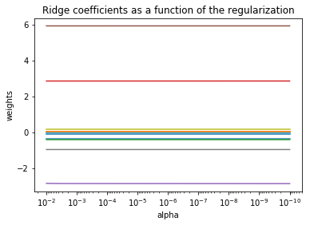

<h1>Table of Contents<span class="tocSkip"></span></h1>
<div class="toc"><ul class="toc-item"><li><span><a href="#Data-Prep" data-toc-modified-id="Data-Prep-1"><span class="toc-item-num">1&nbsp;&nbsp;</span>Data Prep</a></span></li><li><span><a href="#Ridge-Regression" data-toc-modified-id="Ridge-Regression-2"><span class="toc-item-num">2&nbsp;&nbsp;</span>Ridge Regression</a></span><ul class="toc-item"><li><span><a href="#Ridge-Regression---Plot-Ridge-coefficients-as-a-function-of-the-regularization" data-toc-modified-id="Ridge-Regression---Plot-Ridge-coefficients-as-a-function-of-the-regularization-2.1"><span class="toc-item-num">2.1&nbsp;&nbsp;</span>Ridge Regression - Plot Ridge coefficients as a function of the regularization</a></span></li></ul></li></ul></div>

__File Info:__

Date: 20181030

Author: Stephanie Langeland 

File Name: 08_ridge_regression_sklearn.ipynb

Version: 01

Previous Version/File: None

Dependencies: None

Purpose: Ridge regression using scikit-learn.

Input File(s): None

Output File(s): None

Required by: 
- A beginner's guide to Python.
- Tutorial: http://scikit-learn.org/stable/auto_examples/linear_model/plot_ridge_path.html#sphx-glr-auto-examples-linear-model-plot-ridge-path-py

Status: Complete

Machine: Dell Latitude - Windows 10

Python Version: Python 3

# Data Prep


```python
## Import packages:
from sklearn.datasets import load_boston
import pandas as pd
from sklearn.model_selection import train_test_split
import numpy as np
from sklearn import linear_model
import matplotlib.pyplot as plt
```


```python
boston = load_boston()

boston.keys()
```


    dict_keys(['data', 'target', 'feature_names', 'DESCR', 'filename'])


```python
bos = pd.DataFrame(
    boston.data,
    columns = boston.feature_names
)

bos["PRICE"] = boston.target

bos.head()
```


<div>
<style scoped>
    .dataframe tbody tr th:only-of-type {
        vertical-align: middle;
    }

    .dataframe tbody tr th {
        vertical-align: top;
    }

    .dataframe thead th {
        text-align: right;
    }
</style>
<table border="1" class="dataframe">
  <thead>
    <tr style="text-align: right;">
      <th></th>
      <th>CRIM</th>
      <th>ZN</th>
      <th>INDUS</th>
      <th>CHAS</th>
      <th>NOX</th>
      <th>RM</th>
      <th>AGE</th>
      <th>DIS</th>
      <th>RAD</th>
      <th>TAX</th>
      <th>PTRATIO</th>
      <th>B</th>
      <th>LSTAT</th>
      <th>PRICE</th>
    </tr>
  </thead>
  <tbody>
    <tr>
      <th>0</th>
      <td>0.00632</td>
      <td>18.0</td>
      <td>2.31</td>
      <td>0.0</td>
      <td>0.538</td>
      <td>6.575</td>
      <td>65.2</td>
      <td>4.0900</td>
      <td>1.0</td>
      <td>296.0</td>
      <td>15.3</td>
      <td>396.90</td>
      <td>4.98</td>
      <td>24.0</td>
    </tr>
    <tr>
      <th>1</th>
      <td>0.02731</td>
      <td>0.0</td>
      <td>7.07</td>
      <td>0.0</td>
      <td>0.469</td>
      <td>6.421</td>
      <td>78.9</td>
      <td>4.9671</td>
      <td>2.0</td>
      <td>242.0</td>
      <td>17.8</td>
      <td>396.90</td>
      <td>9.14</td>
      <td>21.6</td>
    </tr>
    <tr>
      <th>2</th>
      <td>0.02729</td>
      <td>0.0</td>
      <td>7.07</td>
      <td>0.0</td>
      <td>0.469</td>
      <td>7.185</td>
      <td>61.1</td>
      <td>4.9671</td>
      <td>2.0</td>
      <td>242.0</td>
      <td>17.8</td>
      <td>392.83</td>
      <td>4.03</td>
      <td>34.7</td>
    </tr>
    <tr>
      <th>3</th>
      <td>0.03237</td>
      <td>0.0</td>
      <td>2.18</td>
      <td>0.0</td>
      <td>0.458</td>
      <td>6.998</td>
      <td>45.8</td>
      <td>6.0622</td>
      <td>3.0</td>
      <td>222.0</td>
      <td>18.7</td>
      <td>394.63</td>
      <td>2.94</td>
      <td>33.4</td>
    </tr>
    <tr>
      <th>4</th>
      <td>0.06905</td>
      <td>0.0</td>
      <td>2.18</td>
      <td>0.0</td>
      <td>0.458</td>
      <td>7.147</td>
      <td>54.2</td>
      <td>6.0622</td>
      <td>3.0</td>
      <td>222.0</td>
      <td>18.7</td>
      <td>396.90</td>
      <td>5.33</td>
      <td>36.2</td>
    </tr>
  </tbody>
</table>
</div>


```python
## X Variable dataframe:
bos_X = bos.drop(
    "PRICE",
    axis = 1
)


## training and testing data:

X_train, X_test, Y_train, Y_test = train_test_split(
    bos_X,
    bos.PRICE,
    test_size = 0.33, ## randomly select 33% of the data 
    random_state = 5 ## equivalent is set.seed in R
)

print(
    "X_train dimensions: ",
    X_train.shape,
    "\n",
    "X_test dimensions: ",
    X_test.shape,
    "\n",
    "Y_train dimensions: ",
    Y_train.shape,
    "\n",
    "Y_test dimensions: ",
    Y_test.shape
)
```

    X_train dimensions:  (339, 13) 
     X_test dimensions:  (167, 13) 
     Y_train dimensions:  (339,) 
     Y_test dimensions:  (167,)
    

# Ridge Regression


## Ridge Regression - Plot Ridge coefficients as a function of the regularization


```python
## Compute the regularization paths:
n_alphas = 200

alphas = np.logspace( ## Return numbers spaced evenly on a log scale.
    -10, ## start
    -2, ## stop
    num = n_alphas ## number os samples to generate
)


coefs = [] ## create empty list

for a in alphas:
    ridge = linear_model.Ridge(
        alpha = a,
        fit_intercept = False ##Whether to calculate the intercept for this model. 
    )
    
    ridge.fit(
        bos_X,
        bos["PRICE"]
    )
    
    coefs.append(
        ridge.coef_
    )
```


```python
## Model output:
ax = plt.gca()

ax.plot(
    alphas, 
    coefs
);

ax.set_xscale("log");

ax.set_xlim(
    ax.get_xlim()[::-1] ## reverse axis
);

plt.xlabel("alpha");

plt.ylabel("weights");

plt.title("Ridge coefficients as a function of the regularization");

plt.axis("tight"); ## remove extra white space

plt.show();
```




