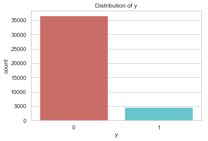
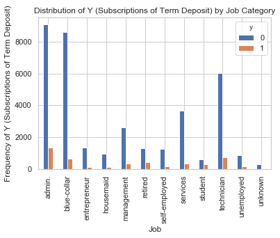
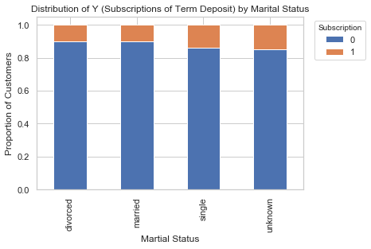
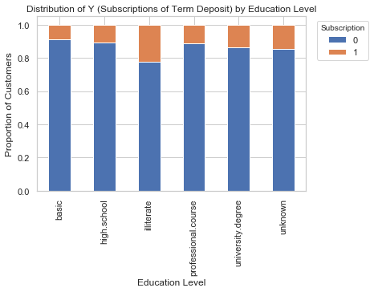
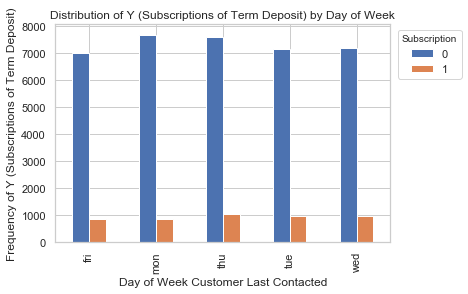
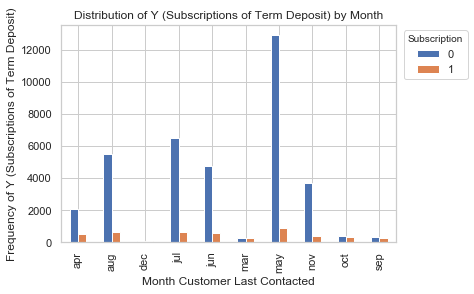
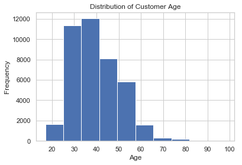
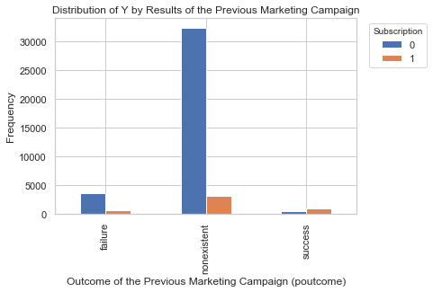

<h1>Table of Contents<span class="tocSkip"></span></h1>
<div class="toc"><ul class="toc-item"><li><span><a href="#Data-Prep" data-toc-modified-id="Data-Prep-1"><span class="toc-item-num">1&nbsp;&nbsp;</span>Data Prep</a></span></li><li><span><a href="#Data-Exploration" data-toc-modified-id="Data-Exploration-2"><span class="toc-item-num">2&nbsp;&nbsp;</span>Data Exploration</a></span></li><li><span><a href="#Data-Visualizations" data-toc-modified-id="Data-Visualizations-3"><span class="toc-item-num">3&nbsp;&nbsp;</span>Data Visualizations</a></span></li><li><span><a href="#Logistic-Regression" data-toc-modified-id="Logistic-Regression-4"><span class="toc-item-num">4&nbsp;&nbsp;</span>Logistic Regression</a></span><ul class="toc-item"><li><span><a href="#Create-dummy-variables" data-toc-modified-id="Create-dummy-variables-4.1"><span class="toc-item-num">4.1&nbsp;&nbsp;</span>Create dummy variables</a></span></li><li><span><a href="#Training-and-testing-data" data-toc-modified-id="Training-and-testing-data-4.2"><span class="toc-item-num">4.2&nbsp;&nbsp;</span>Training and testing data</a></span></li><li><span><a href="#Fit-in-training" data-toc-modified-id="Fit-in-training-4.3"><span class="toc-item-num">4.3&nbsp;&nbsp;</span>Fit in training</a></span></li><li><span><a href="#Predict-in-testing" data-toc-modified-id="Predict-in-testing-4.4"><span class="toc-item-num">4.4&nbsp;&nbsp;</span>Predict in testing</a></span><ul class="toc-item"><li><span><a href="#Confusion-Matrix" data-toc-modified-id="Confusion-Matrix-4.4.1"><span class="toc-item-num">4.4.1&nbsp;&nbsp;</span>Confusion Matrix</a></span></li></ul></li></ul></li></ul></div>

__File Info:__

Date: 20181101

Author: Stephanie Langeland 

File Name: 10_logit_regression.ipynb

Version: 01

Previous Version/File: None

Dependencies: None

Purpose: Building A Logistic Regression in Python.

Input File(s): None

Output File(s): None

Required by: 
- A beginner's guide to Python.
- Tutorial: https://towardsdatascience.com/building-a-logistic-regression-in-python-step-by-step-becd4d56c9c8

Status: Complete

Machine: Dell Latitude - Windows 10

Python Version: Python 3


```python
## import packages:
import pandas as pd

import numpy as np

from sklearn import preprocessing

import matplotlib.pyplot as plt 

plt.rc("font", size = 14) ## font size of the plot text

from sklearn.linear_model import LogisticRegression

#from sklearn.cross_validation import train_test_split

from sklearn.model_selection import train_test_split

import seaborn as sns

sns.set(style = "white") ## reset the default matplotlib parameters 

sns.set(style = "whitegrid", color_codes = True) ## seasbon style https://seaborn.pydata.org/tutorial/aesthetics.html

from sklearn import metrics

from sklearn.metrics import classification_report
```

# Data Prep

The dataset comes from the UCI Machine Learning repository, and it is related to direct marketing campaigns (phone calls) of a Portuguese banking institution. The classification goal is to predict whether the client will subscribe (1/0) to a term deposit (variable y).


```python
data_import = pd.read_csv(
    "https://raw.githubusercontent.com/madmashup/targeted-marketing-predictive-engine/master/banking.csv"
)
```


```python
data_import.head()
```


<div>
<style scoped>
    .dataframe tbody tr th:only-of-type {
        vertical-align: middle;
    }

    .dataframe tbody tr th {
        vertical-align: top;
    }

    .dataframe thead th {
        text-align: right;
    }
</style>
<table border="1" class="dataframe">
  <thead>
    <tr style="text-align: right;">
      <th></th>
      <th>age</th>
      <th>job</th>
      <th>marital</th>
      <th>education</th>
      <th>default</th>
      <th>housing</th>
      <th>loan</th>
      <th>contact</th>
      <th>month</th>
      <th>day_of_week</th>
      <th>...</th>
      <th>campaign</th>
      <th>pdays</th>
      <th>previous</th>
      <th>poutcome</th>
      <th>emp_var_rate</th>
      <th>cons_price_idx</th>
      <th>cons_conf_idx</th>
      <th>euribor3m</th>
      <th>nr_employed</th>
      <th>y</th>
    </tr>
  </thead>
  <tbody>
    <tr>
      <th>0</th>
      <td>44</td>
      <td>blue-collar</td>
      <td>married</td>
      <td>basic.4y</td>
      <td>unknown</td>
      <td>yes</td>
      <td>no</td>
      <td>cellular</td>
      <td>aug</td>
      <td>thu</td>
      <td>...</td>
      <td>1</td>
      <td>999</td>
      <td>0</td>
      <td>nonexistent</td>
      <td>1.4</td>
      <td>93.444</td>
      <td>-36.1</td>
      <td>4.963</td>
      <td>5228.1</td>
      <td>0</td>
    </tr>
    <tr>
      <th>1</th>
      <td>53</td>
      <td>technician</td>
      <td>married</td>
      <td>unknown</td>
      <td>no</td>
      <td>no</td>
      <td>no</td>
      <td>cellular</td>
      <td>nov</td>
      <td>fri</td>
      <td>...</td>
      <td>1</td>
      <td>999</td>
      <td>0</td>
      <td>nonexistent</td>
      <td>-0.1</td>
      <td>93.200</td>
      <td>-42.0</td>
      <td>4.021</td>
      <td>5195.8</td>
      <td>0</td>
    </tr>
    <tr>
      <th>2</th>
      <td>28</td>
      <td>management</td>
      <td>single</td>
      <td>university.degree</td>
      <td>no</td>
      <td>yes</td>
      <td>no</td>
      <td>cellular</td>
      <td>jun</td>
      <td>thu</td>
      <td>...</td>
      <td>3</td>
      <td>6</td>
      <td>2</td>
      <td>success</td>
      <td>-1.7</td>
      <td>94.055</td>
      <td>-39.8</td>
      <td>0.729</td>
      <td>4991.6</td>
      <td>1</td>
    </tr>
    <tr>
      <th>3</th>
      <td>39</td>
      <td>services</td>
      <td>married</td>
      <td>high.school</td>
      <td>no</td>
      <td>no</td>
      <td>no</td>
      <td>cellular</td>
      <td>apr</td>
      <td>fri</td>
      <td>...</td>
      <td>2</td>
      <td>999</td>
      <td>0</td>
      <td>nonexistent</td>
      <td>-1.8</td>
      <td>93.075</td>
      <td>-47.1</td>
      <td>1.405</td>
      <td>5099.1</td>
      <td>0</td>
    </tr>
    <tr>
      <th>4</th>
      <td>55</td>
      <td>retired</td>
      <td>married</td>
      <td>basic.4y</td>
      <td>no</td>
      <td>yes</td>
      <td>no</td>
      <td>cellular</td>
      <td>aug</td>
      <td>fri</td>
      <td>...</td>
      <td>1</td>
      <td>3</td>
      <td>1</td>
      <td>success</td>
      <td>-2.9</td>
      <td>92.201</td>
      <td>-31.4</td>
      <td>0.869</td>
      <td>5076.2</td>
      <td>1</td>
    </tr>
  </tbody>
</table>
<p>5 rows × 21 columns</p>
</div>


```python
data_import.shape
```


    (41188, 21)


The dataset provides the bank customers’ information. It includes 41,188 records and 21 fields.


```python
data_import.dtypes
```


    age                 int64
    job                object
    marital            object
    education          object
    default            object
    housing            object
    loan               object
    contact            object
    month              object
    day_of_week        object
    duration            int64
    campaign            int64
    pdays               int64
    previous            int64
    poutcome           object
    emp_var_rate      float64
    cons_price_idx    float64
    cons_conf_idx     float64
    euribor3m         float64
    nr_employed       float64
    y                   int64
    dtype: object


Detect and remove missing values:


```python
null_count = data_import.isnull().sum()

null_count
```


    age               0
    job               0
    marital           0
    education         0
    default           0
    housing           0
    loan              0
    contact           0
    month             0
    day_of_week       0
    duration          0
    campaign          0
    pdays             0
    previous          0
    poutcome          0
    emp_var_rate      0
    cons_price_idx    0
    cons_conf_idx     0
    euribor3m         0
    nr_employed       0
    y                 0
    dtype: int64


```python
na_count = data_import.isna().sum()

na_count
```


    age               0
    job               0
    marital           0
    education         0
    default           0
    housing           0
    loan              0
    contact           0
    month             0
    day_of_week       0
    duration          0
    campaign          0
    pdays             0
    previous          0
    poutcome          0
    emp_var_rate      0
    cons_price_idx    0
    cons_conf_idx     0
    euribor3m         0
    nr_employed       0
    y                 0
    dtype: int64


There are no missing values.

Variables:

 - 	age (numeric)
 - 	job : type of job (categorical: “admin”, “blue-collar”, “entrepreneur”, “housemaid”, “management”, “retired”, “self-employed”, “services”, “student”, “technician”, “unemployed”, “unknown”)
 - 	marital : marital status (categorical: “divorced”, “married”, “single”, “unknown”)
 - 	education (categorical: “basic.4y”, “basic.6y”, “basic.9y”, “high.school”, “illiterate”, “professional.course”, “university.degree”, “unknown”)
 - 	default: has credit in default? (categorical: “no”, “yes”, “unknown”)
 - 	housing: has housing loan? (categorical: “no”, “yes”, “unknown”)
 - 	loan: has personal loan? (categorical: “no”, “yes”, “unknown”)
 - 	contact: contact communication type (categorical: “cellular”, “telephone”)
 - 	month: last contact month of year (categorical: “jan”, “feb”, “mar”, …, “nov”, “dec”)
 - 	day_of_week: last contact day of the week (categorical: “mon”, “tue”, “wed”, “thu”, “fri”)
 - 	duration: last contact duration, in seconds (numeric). Important note: this attribute highly affects the output target (e.g., if duration=0 then y=’no’). The duration is not known before a call is performed, also, after the end of the call, y is obviously known. Thus, this input should only be included for benchmark purposes and should be discarded if the intention is to have a realistic predictive model
 - 	campaign: number of contacts performed during this campaign and for this client (numeric, includes last contact)
 - 	pdays: number of days that passed by after the client was last contacted from a previous campaign (numeric; 999 means client was not previously contacted)
 - 	previous: number of contacts performed before this campaign and for this client (numeric)
 - 	poutcome: outcome of the previous marketing campaign (categorical: “failure”, “nonexistent”, “success”)
 - 	emp.var.rate: employment variation rate — (numeric)
 - 	cons.price.idx: consumer price index — (numeric)
 - 	cons.conf.idx: consumer confidence index — (numeric)
 - 	euribor3m: euribor 3 month rate — (numeric)
 - 	nr.employed: number of employees — (numeric)
 - y: has the client subscribed a term deposit? (binary: “1”, means “Yes”, “0” means “No”)

The education column of the dataset has many categories and we need to reduce the categories for a better modelling. The education column has the following categories:


```python
data_import["education"].unique()
```


    array(['basic.4y', 'unknown', 'university.degree', 'high.school',
           'basic.9y', 'professional.course', 'basic.6y', 'illiterate'],
          dtype=object)


Let us group “basic.4y”, “basic.9y” and “basic.6y” together and call them “basic”:


```python
data_import["education"] = np.where(
    data_import["education"] == "basic.4y",
    "basic",
    data_import["education"]
)


data_import["education"] = np.where(
    data_import["education"] == "basic.9y",
    "basic",
    data_import["education"]
)


data_import["education"] = np.where(
    data_import["education"] == "basic.6y",
    "basic",
    data_import["education"]
)
```


```python
data_import["education"].unique()
```


    array(['basic', 'unknown', 'university.degree', 'high.school',
           'professional.course', 'illiterate'], dtype=object)


# Data Exploration

Counts of y values:


```python
data_import["y"].value_counts()
```


    0    36548
    1     4640
    Name: y, dtype: int64


```python
sns.countplot(
    x = "y",
    data = data_import,
    palette = "hls"
)

plt.title("Distribution of y");
```





Percentages of y values:


```python
count_no_sub = len(
    data_import[data_import["y"] == 0] ## alone, this line will display the data frame subset for y = 0
)

count_sub = len(
    data_import[data_import["y"] == 1] ## alone, this line will display the data frame subset for y = 1
)


pct_no_sub = ( count_no_sub / (count_no_sub + count_sub) ) * 100

print(
    round(pct_no_sub, 2)
)

print("% of customers have not subscribed to term deposit.")
```

    88.73
    % of customers have not subscribed to term deposit.
    


```python
pct_sub = ( count_sub / (count_no_sub + count_sub) ) * 100

print(
    round(pct_sub, 2)
)

print("% of customers have subscribed to term deposit.")
```

    11.27
    % of customers have subscribed to term deposit.
    

Average for each __numeric__ variable by Y = 0 or Y = 1:


```python
data_import.groupby("y").mean()
```


<div>
<style scoped>
    .dataframe tbody tr th:only-of-type {
        vertical-align: middle;
    }

    .dataframe tbody tr th {
        vertical-align: top;
    }

    .dataframe thead th {
        text-align: right;
    }
</style>
<table border="1" class="dataframe">
  <thead>
    <tr style="text-align: right;">
      <th></th>
      <th>age</th>
      <th>duration</th>
      <th>campaign</th>
      <th>pdays</th>
      <th>previous</th>
      <th>emp_var_rate</th>
      <th>cons_price_idx</th>
      <th>cons_conf_idx</th>
      <th>euribor3m</th>
      <th>nr_employed</th>
    </tr>
    <tr>
      <th>y</th>
      <th></th>
      <th></th>
      <th></th>
      <th></th>
      <th></th>
      <th></th>
      <th></th>
      <th></th>
      <th></th>
      <th></th>
    </tr>
  </thead>
  <tbody>
    <tr>
      <th>0</th>
      <td>39.911185</td>
      <td>220.844807</td>
      <td>2.633085</td>
      <td>984.113878</td>
      <td>0.132374</td>
      <td>0.248875</td>
      <td>93.603757</td>
      <td>-40.593097</td>
      <td>3.811491</td>
      <td>5176.166600</td>
    </tr>
    <tr>
      <th>1</th>
      <td>40.913147</td>
      <td>553.191164</td>
      <td>2.051724</td>
      <td>792.035560</td>
      <td>0.492672</td>
      <td>-1.233448</td>
      <td>93.354386</td>
      <td>-39.789784</td>
      <td>2.123135</td>
      <td>5095.115991</td>
    </tr>
  </tbody>
</table>
</div>


Average for education, marital status, and job category by each of their categories:


```python
data_import.groupby("education").mean()
```


<div>
<style scoped>
    .dataframe tbody tr th:only-of-type {
        vertical-align: middle;
    }

    .dataframe tbody tr th {
        vertical-align: top;
    }

    .dataframe thead th {
        text-align: right;
    }
</style>
<table border="1" class="dataframe">
  <thead>
    <tr style="text-align: right;">
      <th></th>
      <th>age</th>
      <th>duration</th>
      <th>campaign</th>
      <th>pdays</th>
      <th>previous</th>
      <th>emp_var_rate</th>
      <th>cons_price_idx</th>
      <th>cons_conf_idx</th>
      <th>euribor3m</th>
      <th>nr_employed</th>
      <th>y</th>
    </tr>
    <tr>
      <th>education</th>
      <th></th>
      <th></th>
      <th></th>
      <th></th>
      <th></th>
      <th></th>
      <th></th>
      <th></th>
      <th></th>
      <th></th>
      <th></th>
    </tr>
  </thead>
  <tbody>
    <tr>
      <th>basic</th>
      <td>42.163910</td>
      <td>263.043874</td>
      <td>2.559498</td>
      <td>974.877967</td>
      <td>0.141053</td>
      <td>0.191329</td>
      <td>93.639933</td>
      <td>-40.927595</td>
      <td>3.729654</td>
      <td>5172.014113</td>
      <td>0.087029</td>
    </tr>
    <tr>
      <th>high.school</th>
      <td>37.998213</td>
      <td>260.886810</td>
      <td>2.568576</td>
      <td>964.358382</td>
      <td>0.185917</td>
      <td>0.032937</td>
      <td>93.584857</td>
      <td>-40.940641</td>
      <td>3.556157</td>
      <td>5164.994735</td>
      <td>0.108355</td>
    </tr>
    <tr>
      <th>illiterate</th>
      <td>48.500000</td>
      <td>276.777778</td>
      <td>2.277778</td>
      <td>943.833333</td>
      <td>0.111111</td>
      <td>-0.133333</td>
      <td>93.317333</td>
      <td>-39.950000</td>
      <td>3.516556</td>
      <td>5171.777778</td>
      <td>0.222222</td>
    </tr>
    <tr>
      <th>professional.course</th>
      <td>40.080107</td>
      <td>252.533855</td>
      <td>2.586115</td>
      <td>960.765974</td>
      <td>0.163075</td>
      <td>0.173012</td>
      <td>93.569864</td>
      <td>-40.124108</td>
      <td>3.710457</td>
      <td>5170.155979</td>
      <td>0.113485</td>
    </tr>
    <tr>
      <th>university.degree</th>
      <td>38.879191</td>
      <td>253.223373</td>
      <td>2.563527</td>
      <td>951.807692</td>
      <td>0.192390</td>
      <td>-0.028090</td>
      <td>93.493466</td>
      <td>-39.975805</td>
      <td>3.529663</td>
      <td>5163.226298</td>
      <td>0.137245</td>
    </tr>
    <tr>
      <th>unknown</th>
      <td>43.481225</td>
      <td>262.390526</td>
      <td>2.596187</td>
      <td>942.830734</td>
      <td>0.226459</td>
      <td>0.059099</td>
      <td>93.658615</td>
      <td>-39.877816</td>
      <td>3.571098</td>
      <td>5159.549509</td>
      <td>0.145003</td>
    </tr>
  </tbody>
</table>
</div>


```python
data_import.groupby("marital").mean()
```


<div>
<style scoped>
    .dataframe tbody tr th:only-of-type {
        vertical-align: middle;
    }

    .dataframe tbody tr th {
        vertical-align: top;
    }

    .dataframe thead th {
        text-align: right;
    }
</style>
<table border="1" class="dataframe">
  <thead>
    <tr style="text-align: right;">
      <th></th>
      <th>age</th>
      <th>duration</th>
      <th>campaign</th>
      <th>pdays</th>
      <th>previous</th>
      <th>emp_var_rate</th>
      <th>cons_price_idx</th>
      <th>cons_conf_idx</th>
      <th>euribor3m</th>
      <th>nr_employed</th>
      <th>y</th>
    </tr>
    <tr>
      <th>marital</th>
      <th></th>
      <th></th>
      <th></th>
      <th></th>
      <th></th>
      <th></th>
      <th></th>
      <th></th>
      <th></th>
      <th></th>
      <th></th>
    </tr>
  </thead>
  <tbody>
    <tr>
      <th>divorced</th>
      <td>44.899393</td>
      <td>253.790330</td>
      <td>2.61340</td>
      <td>968.639853</td>
      <td>0.168690</td>
      <td>0.163985</td>
      <td>93.606563</td>
      <td>-40.707069</td>
      <td>3.715603</td>
      <td>5170.878643</td>
      <td>0.103209</td>
    </tr>
    <tr>
      <th>married</th>
      <td>42.307165</td>
      <td>257.438623</td>
      <td>2.57281</td>
      <td>967.247673</td>
      <td>0.155608</td>
      <td>0.183625</td>
      <td>93.597367</td>
      <td>-40.270659</td>
      <td>3.745832</td>
      <td>5171.848772</td>
      <td>0.101573</td>
    </tr>
    <tr>
      <th>single</th>
      <td>33.158714</td>
      <td>261.524378</td>
      <td>2.53380</td>
      <td>949.909578</td>
      <td>0.211359</td>
      <td>-0.167989</td>
      <td>93.517300</td>
      <td>-40.918698</td>
      <td>3.317447</td>
      <td>5155.199265</td>
      <td>0.140041</td>
    </tr>
    <tr>
      <th>unknown</th>
      <td>40.275000</td>
      <td>312.725000</td>
      <td>3.18750</td>
      <td>937.100000</td>
      <td>0.275000</td>
      <td>-0.221250</td>
      <td>93.471250</td>
      <td>-40.820000</td>
      <td>3.313038</td>
      <td>5157.393750</td>
      <td>0.150000</td>
    </tr>
  </tbody>
</table>
</div>


```python
data_import.groupby("job").mean()
```


<div>
<style scoped>
    .dataframe tbody tr th:only-of-type {
        vertical-align: middle;
    }

    .dataframe tbody tr th {
        vertical-align: top;
    }

    .dataframe thead th {
        text-align: right;
    }
</style>
<table border="1" class="dataframe">
  <thead>
    <tr style="text-align: right;">
      <th></th>
      <th>age</th>
      <th>duration</th>
      <th>campaign</th>
      <th>pdays</th>
      <th>previous</th>
      <th>emp_var_rate</th>
      <th>cons_price_idx</th>
      <th>cons_conf_idx</th>
      <th>euribor3m</th>
      <th>nr_employed</th>
      <th>y</th>
    </tr>
    <tr>
      <th>job</th>
      <th></th>
      <th></th>
      <th></th>
      <th></th>
      <th></th>
      <th></th>
      <th></th>
      <th></th>
      <th></th>
      <th></th>
      <th></th>
    </tr>
  </thead>
  <tbody>
    <tr>
      <th>admin.</th>
      <td>38.187296</td>
      <td>254.312128</td>
      <td>2.623489</td>
      <td>954.319229</td>
      <td>0.189023</td>
      <td>0.015563</td>
      <td>93.534054</td>
      <td>-40.245433</td>
      <td>3.550274</td>
      <td>5164.125350</td>
      <td>0.129726</td>
    </tr>
    <tr>
      <th>blue-collar</th>
      <td>39.555760</td>
      <td>264.542360</td>
      <td>2.558461</td>
      <td>985.160363</td>
      <td>0.122542</td>
      <td>0.248995</td>
      <td>93.656656</td>
      <td>-41.375816</td>
      <td>3.771996</td>
      <td>5175.615150</td>
      <td>0.068943</td>
    </tr>
    <tr>
      <th>entrepreneur</th>
      <td>41.723214</td>
      <td>263.267857</td>
      <td>2.535714</td>
      <td>981.267170</td>
      <td>0.138736</td>
      <td>0.158723</td>
      <td>93.605372</td>
      <td>-41.283654</td>
      <td>3.791120</td>
      <td>5176.313530</td>
      <td>0.085165</td>
    </tr>
    <tr>
      <th>housemaid</th>
      <td>45.500000</td>
      <td>250.454717</td>
      <td>2.639623</td>
      <td>960.579245</td>
      <td>0.137736</td>
      <td>0.433396</td>
      <td>93.676576</td>
      <td>-39.495283</td>
      <td>4.009645</td>
      <td>5179.529623</td>
      <td>0.100000</td>
    </tr>
    <tr>
      <th>management</th>
      <td>42.362859</td>
      <td>257.058140</td>
      <td>2.476060</td>
      <td>962.647059</td>
      <td>0.185021</td>
      <td>-0.012688</td>
      <td>93.522755</td>
      <td>-40.489466</td>
      <td>3.611316</td>
      <td>5166.650513</td>
      <td>0.112175</td>
    </tr>
    <tr>
      <th>retired</th>
      <td>62.027326</td>
      <td>273.712209</td>
      <td>2.476744</td>
      <td>897.936047</td>
      <td>0.327326</td>
      <td>-0.698314</td>
      <td>93.430786</td>
      <td>-38.573081</td>
      <td>2.770066</td>
      <td>5122.262151</td>
      <td>0.252326</td>
    </tr>
    <tr>
      <th>self-employed</th>
      <td>39.949331</td>
      <td>264.142153</td>
      <td>2.660802</td>
      <td>976.621393</td>
      <td>0.143561</td>
      <td>0.094159</td>
      <td>93.559982</td>
      <td>-40.488107</td>
      <td>3.689376</td>
      <td>5170.674384</td>
      <td>0.104856</td>
    </tr>
    <tr>
      <th>services</th>
      <td>37.926430</td>
      <td>258.398085</td>
      <td>2.587805</td>
      <td>979.974049</td>
      <td>0.154951</td>
      <td>0.175359</td>
      <td>93.634659</td>
      <td>-41.290048</td>
      <td>3.699187</td>
      <td>5171.600126</td>
      <td>0.081381</td>
    </tr>
    <tr>
      <th>student</th>
      <td>25.894857</td>
      <td>283.683429</td>
      <td>2.104000</td>
      <td>840.217143</td>
      <td>0.524571</td>
      <td>-1.408000</td>
      <td>93.331613</td>
      <td>-40.187543</td>
      <td>1.884224</td>
      <td>5085.939086</td>
      <td>0.314286</td>
    </tr>
    <tr>
      <th>technician</th>
      <td>38.507638</td>
      <td>250.232241</td>
      <td>2.577339</td>
      <td>964.408127</td>
      <td>0.153789</td>
      <td>0.274566</td>
      <td>93.561471</td>
      <td>-39.927569</td>
      <td>3.820401</td>
      <td>5175.648391</td>
      <td>0.108260</td>
    </tr>
    <tr>
      <th>unemployed</th>
      <td>39.733728</td>
      <td>249.451677</td>
      <td>2.564103</td>
      <td>935.316568</td>
      <td>0.199211</td>
      <td>-0.111736</td>
      <td>93.563781</td>
      <td>-40.007594</td>
      <td>3.466583</td>
      <td>5157.156509</td>
      <td>0.142012</td>
    </tr>
    <tr>
      <th>unknown</th>
      <td>45.563636</td>
      <td>239.675758</td>
      <td>2.648485</td>
      <td>938.727273</td>
      <td>0.154545</td>
      <td>0.357879</td>
      <td>93.718942</td>
      <td>-38.797879</td>
      <td>3.949033</td>
      <td>5172.931818</td>
      <td>0.112121</td>
    </tr>
  </tbody>
</table>
</div>


# Data Visualizations


```python
pd.crosstab(
    data_import.job,
    data_import.y
).plot(
    kind = "bar"
)

plt.title("Distribution of Y (Subscriptions of Term Deposit) by Job Category");

plt.xlabel("Job");

plt.ylabel("Frequency of Y (Subscriptions of Term Deposit)");
```





    Subscription rate greatly varies by job type.


```python
table = pd.crosstab(
    data_import.marital,
    data_import.y
)

table
```


<div>
<style scoped>
    .dataframe tbody tr th:only-of-type {
        vertical-align: middle;
    }

    .dataframe tbody tr th {
        vertical-align: top;
    }

    .dataframe thead th {
        text-align: right;
    }
</style>
<table border="1" class="dataframe">
  <thead>
    <tr style="text-align: right;">
      <th>y</th>
      <th>0</th>
      <th>1</th>
    </tr>
    <tr>
      <th>marital</th>
      <th></th>
      <th></th>
    </tr>
  </thead>
  <tbody>
    <tr>
      <th>divorced</th>
      <td>4136</td>
      <td>476</td>
    </tr>
    <tr>
      <th>married</th>
      <td>22396</td>
      <td>2532</td>
    </tr>
    <tr>
      <th>single</th>
      <td>9948</td>
      <td>1620</td>
    </tr>
    <tr>
      <th>unknown</th>
      <td>68</td>
      <td>12</td>
    </tr>
  </tbody>
</table>
</div>


```python
table.div(
    table.sum(1).astype(float),
    axis = 0
).plot(
    kind = "bar",
    stacked = True
);


plt.title("Distribution of Y (Subscriptions of Term Deposit) by Marital Status");

plt.xlabel("Martial Status");

plt.ylabel("Proportion of Customers");

plt.legend(
    loc = 'upper right', 
    bbox_to_anchor = (
        1.25, ## right (positive number) or left (negative number)
        1 ## up (positive number) or down (negative number)
    ),
    title = "Subscription"
);
```





```python
edu_table = pd.crosstab(
    data_import.education,
    data_import.y
)

edu_table
```


<div>
<style scoped>
    .dataframe tbody tr th:only-of-type {
        vertical-align: middle;
    }

    .dataframe tbody tr th {
        vertical-align: top;
    }

    .dataframe thead th {
        text-align: right;
    }
</style>
<table border="1" class="dataframe">
  <thead>
    <tr style="text-align: right;">
      <th>y</th>
      <th>0</th>
      <th>1</th>
    </tr>
    <tr>
      <th>education</th>
      <th></th>
      <th></th>
    </tr>
  </thead>
  <tbody>
    <tr>
      <th>basic</th>
      <td>11424</td>
      <td>1089</td>
    </tr>
    <tr>
      <th>high.school</th>
      <td>8484</td>
      <td>1031</td>
    </tr>
    <tr>
      <th>illiterate</th>
      <td>14</td>
      <td>4</td>
    </tr>
    <tr>
      <th>professional.course</th>
      <td>4648</td>
      <td>595</td>
    </tr>
    <tr>
      <th>university.degree</th>
      <td>10498</td>
      <td>1670</td>
    </tr>
    <tr>
      <th>unknown</th>
      <td>1480</td>
      <td>251</td>
    </tr>
  </tbody>
</table>
</div>


```python
edu_table.div(
    edu_table.sum(1).astype(float),
    axis = 0
).plot(
    kind = "bar",
    stacked = True
);


plt.title("Distribution of Y (Subscriptions of Term Deposit) by Education Level");

plt.xlabel("Education Level");

plt.ylabel("Proportion of Customers");

plt.legend(
    loc = 'upper right', ## initial location of the legend
    bbox_to_anchor = ( ## to move the location of the legend right, left, up, or down
        1.25, ## right (positive number) or left (negative number)
        1 ## up (positive number) or down (negative number)
    ),
    title = "Subscription"
);
```





```python
pd.crosstab(
    data_import.day_of_week,
    data_import.y
).plot(
    kind = "bar"
);

plt.title("Distribution of Y (Subscriptions of Term Deposit) by Day of Week");

plt.xlabel("Day of Week Customer Last Contacted");

plt.ylabel("Frequency of Y (Subscriptions of Term Deposit)");

plt.legend(
    loc = "upper right",
    bbox_to_anchor = (1.23, 1),
    title = "Subscription"
);
```





```python
pd.crosstab(
    data_import.month,
    data_import.y
).plot(
    kind = "bar"
);

plt.title("Distribution of Y (Subscriptions of Term Deposit) by Month");

plt.xlabel("Month Customer Last Contacted");

plt.ylabel("Frequency of Y (Subscriptions of Term Deposit)");

plt.legend(
    loc = "upper right",
    bbox_to_anchor = (1.23, 1),
    title = "Subscription"
);
```





```python
data_import.age.hist();

plt.title("Distribution of Customer Age");

plt.xlabel("Age");

plt.ylabel("Frequency");
```





```python
pd.crosstab(
    data_import.poutcome,
    data_import.y
).plot(
    kind = "bar"
);

plt.xlabel("Outcome of the Previous Marketing Campaign (poutcome)");

plt.ylabel("Frequency");

plt.title("Distribution of Y by Results of the Previous Marketing Campaign");

plt.legend(
    loc = "upper right",
    bbox_to_anchor = (1.25, 1),
    title = "Subscription"
);
```





# Logistic Regression

## Create dummy variables


```python
data_dummies = data_import ## create a new copy of the data in order to avoid overwriting the old one in final 2 lines of the loop below

cat_vars = [
    'job',
    'marital',
    'education',
    'default',
    'housing',
    'loan',
    'contact',
    'month',
    'day_of_week',
    'poutcome'
]


for var in cat_vars:
    cat_list = 'var' + '_' + var ## concatenate existing variable name, "_", and level of that variable
    cat_list = pd.get_dummies( ## convert to dummy variables so each column (per the ^ naming convention) will have a 0/1 in it
        data_dummies[var], 
        prefix = var
    )
    data1 = data_dummies.join(cat_list) ## data1 will be a temporary item onto which we can add on the new columns
    data_dummies = data1 ## rename


data_vars = data_dummies.columns.values.tolist() ## list of new dummy variables

to_keep = [i for i in data_vars if i not in cat_vars] ## only keep if variable is in data_vars but not in cat_vars

data_final = data_dummies[to_keep] ## subset only variables that are listed in to_keep

data_final.columns.values
```


    array(['age', 'duration', 'campaign', 'pdays', 'previous', 'emp_var_rate',
           'cons_price_idx', 'cons_conf_idx', 'euribor3m', 'nr_employed', 'y',
           'job_admin.', 'job_blue-collar', 'job_entrepreneur',
           'job_housemaid', 'job_management', 'job_retired',
           'job_self-employed', 'job_services', 'job_student',
           'job_technician', 'job_unemployed', 'job_unknown',
           'marital_divorced', 'marital_married', 'marital_single',
           'marital_unknown', 'education_basic', 'education_high.school',
           'education_illiterate', 'education_professional.course',
           'education_university.degree', 'education_unknown', 'default_no',
           'default_unknown', 'default_yes', 'housing_no', 'housing_unknown',
           'housing_yes', 'loan_no', 'loan_unknown', 'loan_yes',
           'contact_cellular', 'contact_telephone', 'month_apr', 'month_aug',
           'month_dec', 'month_jul', 'month_jun', 'month_mar', 'month_may',
           'month_nov', 'month_oct', 'month_sep', 'day_of_week_fri',
           'day_of_week_mon', 'day_of_week_thu', 'day_of_week_tue',
           'day_of_week_wed', 'poutcome_failure', 'poutcome_nonexistent',
           'poutcome_success'], dtype=object)


## Training and testing data


```python
## subset X and y variables:
y = data_final["y"]

X = data_final.loc[
    :,
    data_final.columns != "y"
]

## split:
X_train, X_test, y_train, y_test = train_test_split(
    X,
    y,
    test_size = 0.3,
    random_state = 123
)


## import logit fn:
logreg = LogisticRegression()
```

## Fit in training


```python
logreg.fit(
    X_train, 
    y_train
)
```

    C:\Users\stephanie.langeland\AppData\Local\Continuum\anaconda3\lib\site-packages\sklearn\linear_model\logistic.py:432: FutureWarning: Default solver will be changed to 'lbfgs' in 0.22. Specify a solver to silence this warning.
      FutureWarning)
    


    LogisticRegression(C=1.0, class_weight=None, dual=False, fit_intercept=True,
              intercept_scaling=1, max_iter=100, multi_class='warn',
              n_jobs=None, penalty='l2', random_state=None, solver='warn',
              tol=0.0001, verbose=0, warm_start=False)


## Predict in testing


```python
print(
    "The prediction accuracy of the logit model in testing is {:.2f}.".format(logreg.score(X_test, y_test))
)
```

    The prediction accuracy of the logit model in testing is 0.91.
    

### Confusion Matrix


```python
y_pred = logreg.predict(
    X_test
)


pd.crosstab(
    y_test,
    y_pred,
    rownames = ["Testing (Actual) Data"],
    colnames = ["Predictions"]
)
```


<div>
<style scoped>
    .dataframe tbody tr th:only-of-type {
        vertical-align: middle;
    }

    .dataframe tbody tr th {
        vertical-align: top;
    }

    .dataframe thead th {
        text-align: right;
    }
</style>
<table border="1" class="dataframe">
  <thead>
    <tr style="text-align: right;">
      <th>Predictions</th>
      <th>0</th>
      <th>1</th>
    </tr>
    <tr>
      <th>Testing (Actual) Data</th>
      <th></th>
      <th></th>
    </tr>
  </thead>
  <tbody>
    <tr>
      <th>0</th>
      <td>10687</td>
      <td>267</td>
    </tr>
    <tr>
      <th>1</th>
      <td>845</td>
      <td>558</td>
    </tr>
  </tbody>
</table>
</div>


```python
print(
    classification_report(
        y_test,
        y_pred
    )
)
```

                  precision    recall  f1-score   support
    
               0       0.93      0.98      0.95     10954
               1       0.68      0.40      0.50      1403
    
       micro avg       0.91      0.91      0.91     12357
       macro avg       0.80      0.69      0.73     12357
    weighted avg       0.90      0.91      0.90     12357
    
    

- The precision is the ratio tp / (tp + fp) where tp is the number of true positives and fp the number of false positives. The precision is intuitively the ability of the classifier not to label as positive a sample that is negative.
- The recall is the ratio tp / (tp + fn) where tp is the number of true positives and fn the number of false negatives. The recall is intuitively the ability of the classifier to find all the positive samples.
- The F1 score can be interpreted as a weighted average of the precision and recall, where an F1 score reaches its best value at 1 and worst score at 0.
- Support is the number of true instances for each label.

http://scikit-learn.org/stable/modules/generated/sklearn.metrics.f1_score.html
