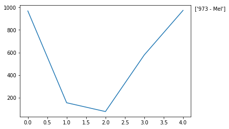

<h1>Table of Contents<span class="tocSkip"></span></h1>
<div class="toc"><ul class="toc-item"><li><span><a href="#Create-data" data-toc-modified-id="Create-data-1"><span class="toc-item-num">1&nbsp;&nbsp;</span>Create data</a></span></li><li><span><a href="#Data-prep" data-toc-modified-id="Data-prep-2"><span class="toc-item-num">2&nbsp;&nbsp;</span>Data prep</a></span></li><li><span><a href="#Analyze-the-data" data-toc-modified-id="Analyze-the-data-3"><span class="toc-item-num">3&nbsp;&nbsp;</span>Analyze the data</a></span></li><li><span><a href="#Plot-data" data-toc-modified-id="Plot-data-4"><span class="toc-item-num">4&nbsp;&nbsp;</span>Plot data</a></span></li></ul></div>

__File Info:__

Date: 20181119

Author: Stephanie Langeland 

File Name: 11_pandas_lesson_01.ipynb

Version: 01

Previous Version/File: None

Dependencies: None

Purpose: 01 - Pandas Lesson: - Importing libraries - Creating data sets - Creating data frames - Reading from CSV - Exporting to CSV - Finding maximums - Plotting data

Input File(s): None

Output File(s):
- births1880.csv

Required by: 
- A beginner's guide to Python.
- Tutorial: https://pandas.pydata.org/pandas-docs/stable/tutorials.html

Status: Complete

Machine: Dell Latitude - Windows 10

Python Version: Python 3


```python
## Import libraries

from pandas import DataFrame, read_csv ## import these functions from pandas

import matplotlib.pyplot as plt

import pandas as pd 

import sys ## to get python version number 

import matplotlib ## to get matplotlib version number 
```

Get Python, matplotlib, and pandas versions:


```python
print(
    "Python version " + sys.version
)

print(
    "Pandas version " + pd.__version__
)

print(
    "Matplotlib version " + matplotlib.__version__
)
```

    Python version 3.7.0 (default, Jun 28 2018, 08:04:48) [MSC v.1912 64 bit (AMD64)]
    Pandas version 0.23.4
    Matplotlib version 2.2.3
    

# Create data 

The data set will consist of 5 baby names and the number of births recorded for that year (1880).


```python
names = [
    "Bob",
    "Jessica",
    "Mary",
    "John",
    "Mel"
]

births = [
    968,
    155,
    77,
    578,
    973
]
```


```python
## merge names and births using the zip function
zip?
```


```python
BabyDataSet = list(
    zip(
        names,
        births
    )
)

BabyDataSet
```


    [('Bob', 968), ('Jessica', 155), ('Mary', 77), ('John', 578), ('Mel', 973)]


Convert the list to a data frame:


```python
pd.DataFrame?
```


```python
df = pd.DataFrame(
    data = BabyDataSet,
    columns = ["Names", "Births"]
)

df
```


<div>
<style scoped>
    .dataframe tbody tr th:only-of-type {
        vertical-align: middle;
    }

    .dataframe tbody tr th {
        vertical-align: top;
    }

    .dataframe thead th {
        text-align: right;
    }
</style>
<table border="1" class="dataframe">
  <thead>
    <tr style="text-align: right;">
      <th></th>
      <th>Names</th>
      <th>Births</th>
    </tr>
  </thead>
  <tbody>
    <tr>
      <th>0</th>
      <td>Bob</td>
      <td>968</td>
    </tr>
    <tr>
      <th>1</th>
      <td>Jessica</td>
      <td>155</td>
    </tr>
    <tr>
      <th>2</th>
      <td>Mary</td>
      <td>77</td>
    </tr>
    <tr>
      <th>3</th>
      <td>John</td>
      <td>578</td>
    </tr>
    <tr>
      <th>4</th>
      <td>Mel</td>
      <td>973</td>
    </tr>
  </tbody>
</table>
</div>


Export `df` to a csv file:


```python
df.to_csv?
```


```python
## change working directory:
import os
os.chdir("C:\\Users\\stephanie.langeland\\OneDrive - Slalom\\bit_bucket\\a_beginners_guide_to_python\\input_output_files")

## save csv to new working directory
df.to_csv(
    "births1880.csv",
    index = False, 
    header = False
)
```

Read the csv file:


```python
read_csv?
```


```python
## Notice the r before the string. Since the slashes are special characters, prefixing the string with a r will escape the whole string:
Location = r"C:\Users\stephanie.langeland\OneDrive - Slalom\bit_bucket\a_beginners_guide_to_python\input_output_files\births1880.csv"

df = pd.read_csv(
    Location,
    header = None, ## don't treat row #1 as the header,
    names = ["Names", "Births"] ## assign column names
)
```


```python
df
```


<div>
<style scoped>
    .dataframe tbody tr th:only-of-type {
        vertical-align: middle;
    }

    .dataframe tbody tr th {
        vertical-align: top;
    }

    .dataframe thead th {
        text-align: right;
    }
</style>
<table border="1" class="dataframe">
  <thead>
    <tr style="text-align: right;">
      <th></th>
      <th>Names</th>
      <th>Births</th>
    </tr>
  </thead>
  <tbody>
    <tr>
      <th>0</th>
      <td>Bob</td>
      <td>968</td>
    </tr>
    <tr>
      <th>1</th>
      <td>Jessica</td>
      <td>155</td>
    </tr>
    <tr>
      <th>2</th>
      <td>Mary</td>
      <td>77</td>
    </tr>
    <tr>
      <th>3</th>
      <td>John</td>
      <td>578</td>
    </tr>
    <tr>
      <th>4</th>
      <td>Mel</td>
      <td>973</td>
    </tr>
  </tbody>
</table>
</div>


```python
## To delete the csv file:
#os.remove(Location)
```

# Data prep

Check the of the columns:


```python
df.dtypes
```


    Names     object
    Births     int64
    dtype: object


```python
## check just he type of the Births column (useful when you have a lot of columns in a data frame):
df.dtypes.Births
```


    dtype('int64')


# Analyze the data

Find the most popular baby name:


```python
## Method #1 - sort names:
Sorted = df.sort_values(
    ["Births"],
    ascending = False
)

Sorted.head() ## the whole sorted data frame
```


<div>
<style scoped>
    .dataframe tbody tr th:only-of-type {
        vertical-align: middle;
    }

    .dataframe tbody tr th {
        vertical-align: top;
    }

    .dataframe thead th {
        text-align: right;
    }
</style>
<table border="1" class="dataframe">
  <thead>
    <tr style="text-align: right;">
      <th></th>
      <th>Names</th>
      <th>Births</th>
    </tr>
  </thead>
  <tbody>
    <tr>
      <th>4</th>
      <td>Mel</td>
      <td>973</td>
    </tr>
    <tr>
      <th>0</th>
      <td>Bob</td>
      <td>968</td>
    </tr>
    <tr>
      <th>3</th>
      <td>John</td>
      <td>578</td>
    </tr>
    <tr>
      <th>1</th>
      <td>Jessica</td>
      <td>155</td>
    </tr>
    <tr>
      <th>2</th>
      <td>Mary</td>
      <td>77</td>
    </tr>
  </tbody>
</table>
</div>


```python
Sorted.head(1) ## onyl view row 1 of the sorted data frame
```


<div>
<style scoped>
    .dataframe tbody tr th:only-of-type {
        vertical-align: middle;
    }

    .dataframe tbody tr th {
        vertical-align: top;
    }

    .dataframe thead th {
        text-align: right;
    }
</style>
<table border="1" class="dataframe">
  <thead>
    <tr style="text-align: right;">
      <th></th>
      <th>Names</th>
      <th>Births</th>
    </tr>
  </thead>
  <tbody>
    <tr>
      <th>4</th>
      <td>Mel</td>
      <td>973</td>
    </tr>
  </tbody>
</table>
</div>


```python
## Method #2 - get the max value of Births column:
df["Births"].max()
```


    973


# Plot data

Here we can plot the Births column and label the graph to show the end user the highest point on the graph. In conjunction with the table, the end user has a clear picture that Mel is the most popular baby name in the data set.


```python
## create graph:
df["Births"].plot()

## Max value in the df:
MaxValue = df["Births"].max()

## The name associated with MaxValue:
MaxName = df["Names"][df["Births"] == df["Births"].max()].values ## which nany name is associated with the max value inthe Births column

## Text to display in graph:
Text = str(MaxValue) + " - " + MaxName

## Add text to the graph:
plt.annotate(
    Text, 
    xy = (
        1, 
        MaxValue
    ),
    xytext = (8, 0),
    xycoords = (
        'axes fraction',
        'data'
    ),
    textcoords = 'offset points'
);

print("The most popular baby name was")
df[
    df["Births"] == df["Births"].max()
]
```

    The most popular baby name was
    


<div>
<style scoped>
    .dataframe tbody tr th:only-of-type {
        vertical-align: middle;
    }

    .dataframe tbody tr th {
        vertical-align: top;
    }

    .dataframe thead th {
        text-align: right;
    }
</style>
<table border="1" class="dataframe">
  <thead>
    <tr style="text-align: right;">
      <th></th>
      <th>Names</th>
      <th>Births</th>
    </tr>
  </thead>
  <tbody>
    <tr>
      <th>4</th>
      <td>Mel</td>
      <td>973</td>
    </tr>
  </tbody>
</table>
</div>




