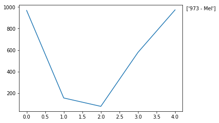
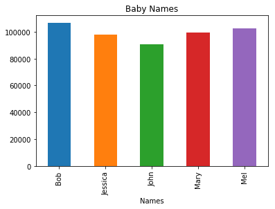

<h1>Table of Contents<span class="tocSkip"></span></h1>
<div class="toc"><ul class="toc-item"><li><span><a href="#Create-data" data-toc-modified-id="Create-data-1"><span class="toc-item-num">1&nbsp;&nbsp;</span>Create data</a></span></li><li><span><a href="#Data-prep" data-toc-modified-id="Data-prep-2"><span class="toc-item-num">2&nbsp;&nbsp;</span>Data prep</a></span></li><li><span><a href="#Analyze-the-data" data-toc-modified-id="Analyze-the-data-3"><span class="toc-item-num">3&nbsp;&nbsp;</span>Analyze the data</a></span></li><li><span><a href="#Plot-data" data-toc-modified-id="Plot-data-4"><span class="toc-item-num">4&nbsp;&nbsp;</span>Plot data</a></span></li><li><span><a href="#Create-data" data-toc-modified-id="Create-data-5"><span class="toc-item-num">5&nbsp;&nbsp;</span>Create data</a></span></li><li><span><a href="#Retrieve-data" data-toc-modified-id="Retrieve-data-6"><span class="toc-item-num">6&nbsp;&nbsp;</span>Retrieve data</a></span></li><li><span><a href="#Data-prep" data-toc-modified-id="Data-prep-7"><span class="toc-item-num">7&nbsp;&nbsp;</span>Data prep</a></span></li><li><span><a href="#Data-analysis" data-toc-modified-id="Data-analysis-8"><span class="toc-item-num">8&nbsp;&nbsp;</span>Data analysis</a></span></li><li><span><a href="#Plot-data" data-toc-modified-id="Plot-data-9"><span class="toc-item-num">9&nbsp;&nbsp;</span>Plot data</a></span></li></ul></div>

__File Info:__

Date: 20181119

Author: Stephanie Langeland 

File Name: 12_pandas_lesson_02.ipynb

Version: 01

Previous Version/File: None

Dependencies: None

Purpose: 02 - Pandas Lesson: - Reading from TXT - Exporting to TXT - Selecting top/bottom records - Descriptive statistics - Grouping/sorting data

Input File(s): None

Output File(s): births1880.txt

Required by: 
- A beginner's guide to Python.
- Tutorial: http://nbviewer.jupyter.org/urls/bitbucket.org/hrojas/learn-pandas/raw/master/lessons/02%20-%20Lesson.ipynb

Status: Complete

Machine: Dell Latitude - Windows 10

Python Version: Python 3


```python
## Import libraries

from pandas import DataFrame, read_csv ## import these functions from pandas

import matplotlib.pyplot as plt

import pandas as pd 

import sys ## to get python version number 

import matplotlib ## to get matplotlib version number 
```

Get Python, matplotlib, and pandas versions:


```python
print(
    "Python version " + sys.version
)

print(
    "Pandas version " + pd.__version__
)

print(
    "Matplotlib version " + matplotlib.__version__
)
```

    Python version 3.7.0 (default, Jun 28 2018, 08:04:48) [MSC v.1912 64 bit (AMD64)]
    Pandas version 0.23.4
    Matplotlib version 2.2.3
    

# Create data 

The data set will consist of 5 baby names and the number of births recorded for that year (1880).


```python
names = [
    "Bob",
    "Jessica",
    "Mary",
    "John",
    "Mel"
]

births = [
    968,
    155,
    77,
    578,
    973
]
```


```python
## merge names and births using the zip function
zip?
```


```python
BabyDataSet = list(
    zip(
        names,
        births
    )
)

BabyDataSet
```


    [('Bob', 968), ('Jessica', 155), ('Mary', 77), ('John', 578), ('Mel', 973)]


Convert the list to a data frame:


```python
pd.DataFrame?
```


```python
df = pd.DataFrame(
    data = BabyDataSet,
    columns = ["Names", "Births"]
)

df
```


<div>
<style scoped>
    .dataframe tbody tr th:only-of-type {
        vertical-align: middle;
    }

    .dataframe tbody tr th {
        vertical-align: top;
    }

    .dataframe thead th {
        text-align: right;
    }
</style>
<table border="1" class="dataframe">
  <thead>
    <tr style="text-align: right;">
      <th></th>
      <th>Names</th>
      <th>Births</th>
    </tr>
  </thead>
  <tbody>
    <tr>
      <th>0</th>
      <td>Bob</td>
      <td>968</td>
    </tr>
    <tr>
      <th>1</th>
      <td>Jessica</td>
      <td>155</td>
    </tr>
    <tr>
      <th>2</th>
      <td>Mary</td>
      <td>77</td>
    </tr>
    <tr>
      <th>3</th>
      <td>John</td>
      <td>578</td>
    </tr>
    <tr>
      <th>4</th>
      <td>Mel</td>
      <td>973</td>
    </tr>
  </tbody>
</table>
</div>


Export `df` to a csv file:


```python
df.to_csv?
```


```python
## change working directory:
import os
os.chdir("C:\\Users\\stephanie.langeland\\OneDrive - Slalom\\bit_bucket\\a_beginners_guide_to_python\\input_output_files")

## save csv to new working directory
df.to_csv(
    "births1880.csv",
    index = False, 
    header = False
)
```

Read the csv file:


```python
read_csv?
```


```python
## Notice the r before the string. Since the slashes are special characters, prefixing the string with a r will escape the whole string:
Location = r"C:\Users\stephanie.langeland\OneDrive - Slalom\bit_bucket\a_beginners_guide_to_python\input_output_files\births1880.csv"

df = pd.read_csv(
    Location,
    header = None, ## don't treat row #1 as the header,
    names = ["Names", "Births"] ## assign column names
)
```


```python
df
```


<div>
<style scoped>
    .dataframe tbody tr th:only-of-type {
        vertical-align: middle;
    }

    .dataframe tbody tr th {
        vertical-align: top;
    }

    .dataframe thead th {
        text-align: right;
    }
</style>
<table border="1" class="dataframe">
  <thead>
    <tr style="text-align: right;">
      <th></th>
      <th>Names</th>
      <th>Births</th>
    </tr>
  </thead>
  <tbody>
    <tr>
      <th>0</th>
      <td>Bob</td>
      <td>968</td>
    </tr>
    <tr>
      <th>1</th>
      <td>Jessica</td>
      <td>155</td>
    </tr>
    <tr>
      <th>2</th>
      <td>Mary</td>
      <td>77</td>
    </tr>
    <tr>
      <th>3</th>
      <td>John</td>
      <td>578</td>
    </tr>
    <tr>
      <th>4</th>
      <td>Mel</td>
      <td>973</td>
    </tr>
  </tbody>
</table>
</div>


```python
## To delete the csv file:
#os.remove(Location)
```

# Data prep

Check the of the columns:


```python
df.dtypes
```


    Names     object
    Births     int64
    dtype: object


```python
## check just he type of the Births column (useful when you have a lot of columns in a data frame):
df.dtypes.Births
```


    dtype('int64')


# Analyze the data

Find the most popular baby name:


```python
## Method #1 - sort names:
Sorted = df.sort_values(
    ["Births"],
    ascending = False
)

Sorted.head() ## the whole sorted data frame
```


<div>
<style scoped>
    .dataframe tbody tr th:only-of-type {
        vertical-align: middle;
    }

    .dataframe tbody tr th {
        vertical-align: top;
    }

    .dataframe thead th {
        text-align: right;
    }
</style>
<table border="1" class="dataframe">
  <thead>
    <tr style="text-align: right;">
      <th></th>
      <th>Names</th>
      <th>Births</th>
    </tr>
  </thead>
  <tbody>
    <tr>
      <th>4</th>
      <td>Mel</td>
      <td>973</td>
    </tr>
    <tr>
      <th>0</th>
      <td>Bob</td>
      <td>968</td>
    </tr>
    <tr>
      <th>3</th>
      <td>John</td>
      <td>578</td>
    </tr>
    <tr>
      <th>1</th>
      <td>Jessica</td>
      <td>155</td>
    </tr>
    <tr>
      <th>2</th>
      <td>Mary</td>
      <td>77</td>
    </tr>
  </tbody>
</table>
</div>


```python
Sorted.head(1) ## onyl view row 1 of the sorted data frame
```


<div>
<style scoped>
    .dataframe tbody tr th:only-of-type {
        vertical-align: middle;
    }

    .dataframe tbody tr th {
        vertical-align: top;
    }

    .dataframe thead th {
        text-align: right;
    }
</style>
<table border="1" class="dataframe">
  <thead>
    <tr style="text-align: right;">
      <th></th>
      <th>Names</th>
      <th>Births</th>
    </tr>
  </thead>
  <tbody>
    <tr>
      <th>4</th>
      <td>Mel</td>
      <td>973</td>
    </tr>
  </tbody>
</table>
</div>


```python
## Method #2 - get the max value of Births column:
df["Births"].max()
```


    973


# Plot data

Here we can plot the Births column and label the graph to show the end user the highest point on the graph. In conjunction with the table, the end user has a clear picture that Mel is the most popular baby name in the data set.


```python
## create graph:
df["Births"].plot()

## Max value in the df:
MaxValue = df["Births"].max()

## The name associated with MaxValue:
MaxName = df["Names"][df["Births"] == df["Births"].max()].values ## which nany name is associated with the max value inthe Births column

## Text to display in graph:
Text = str(MaxValue) + " - " + MaxName

## Add text to the graph:
plt.annotate(
    Text, 
    xy = (
        1, 
        MaxValue
    ),
    xytext = (8, 0),
    xycoords = (
        'axes fraction',
        'data'
    ),
    textcoords = 'offset points'
);

print("The most popular baby name was")
df[
    df["Births"] == df["Births"].max()
]
```

    The most popular baby name was
    


<div>
<style scoped>
    .dataframe tbody tr th:only-of-type {
        vertical-align: middle;
    }

    .dataframe tbody tr th {
        vertical-align: top;
    }

    .dataframe thead th {
        text-align: right;
    }
</style>
<table border="1" class="dataframe">
  <thead>
    <tr style="text-align: right;">
      <th></th>
      <th>Names</th>
      <th>Births</th>
    </tr>
  </thead>
  <tbody>
    <tr>
      <th>4</th>
      <td>Mel</td>
      <td>973</td>
    </tr>
  </tbody>
</table>
</div>





```python
import pandas as pd 

from numpy import random

import matplotlib.pyplot as plt

import matplotlib
```

# Create data


```python
names = [
    "Bob",
    "Jessica",
    "Mary",
    "John",
    "Mel"
]
```

To make a random list of 1,000 baby names using the five above we will do the following:

Generate a random number between 0 and 4.

To do this we will be using the functions seed, randint, len, range, and zip.


```python
random.seed?
```


```python
len?
```


```python
range?
```


```python
zip?
```


```python
random.seed(500)

random_names = [
    names[
        random.randint( ## generate a random integer btwn 0 and the length of "names"
            low = 0, 
            high = len(names)
        )
    ] for i in range(1000) ## do this 1000 times 
]


random_names
```


    ['Mary',
     'Jessica',
     'Jessica',
     'Bob',
     'Jessica',
     'Jessica',
     'Jessica',
     'Mary',
     'Mary',
     'Mary',
     'John',
     'Bob',
     'Bob',
     'Mary',
     'Mary',
     'John',
     'Mel',
     'Mary',
     'Mel',
     'John',
     'John',
     'Mel',
     'Jessica',
     'John',
     'Jessica',
     'Mary',
     'Mary',
     'John',
     'Jessica',
     'Bob',
     'John',
     'Jessica',
     'Jessica',
     'John',
     'Bob',
     'Mel',
     'Jessica',
     'Mel',
     'Mel',
     'Mary',
     'Jessica',
     'Mel',
     'Mel',
     'Mel',
     'Mel',
     'Bob',
     'John',
     'Jessica',
     'Jessica',
     'Bob',
     'John',
     'John',
     'Jessica',
     'Bob',
     'Bob',
     'John',
     'John',
     'John',
     'Mel',
     'Bob',
     'Mel',
     'Mel',
     'Jessica',
     'Mary',
     'John',
     'John',
     'Bob',
     'John',
     'Mary',
     'Bob',
     'John',
     'Mel',
     'John',
     'John',
     'Bob',
     'Mary',
     'Bob',
     'Jessica',
     'Mel',
     'Jessica',
     'Bob',
     'Mel',
     'Bob',
     'John',
     'Jessica',
     'Jessica',
     'John',
     'Bob',
     'Bob',
     'John',
     'Bob',
     'Jessica',
     'Mel',
     'John',
     'Jessica',
     'Mel',
     'Jessica',
     'Jessica',
     'Mary',
     'Mel',
     'John',
     'Mary',
     'John',
     'Bob',
     'Mary',
     'Jessica',
     'Jessica',
     'Mary',
     'Mary',
     'Jessica',
     'John',
     'Mel',
     'Jessica',
     'Bob',
     'Mel',
     'Jessica',
     'John',
     'John',
     'Mel',
     'Jessica',
     'Mel',
     'Jessica',
     'Bob',
     'Mel',
     'Jessica',
     'Jessica',
     'Bob',
     'Bob',
     'Mel',
     'Mel',
     'Mary',
     'John',
     'Mary',
     'Mary',
     'Jessica',
     'Mary',
     'Mary',
     'John',
     'Mel',
     'John',
     'John',
     'Mel',
     'Mel',
     'John',
     'Jessica',
     'Mel',
     'Mel',
     'John',
     'Jessica',
     'Jessica',
     'Mel',
     'Mel',
     'Mel',
     'Bob',
     'Jessica',
     'John',
     'Mel',
     'Mary',
     'Bob',
     'Jessica',
     'John',
     'Bob',
     'Mel',
     'Mel',
     'Bob',
     'John',
     'Jessica',
     'Bob',
     'Bob',
     'John',
     'Mary',
     'John',
     'Mel',
     'Jessica',
     'Mel',
     'John',
     'Bob',
     'Mary',
     'Mel',
     'Mary',
     'Mary',
     'Jessica',
     'Jessica',
     'John',
     'Mel',
     'Mary',
     'Mary',
     'John',
     'Mary',
     'Mel',
     'Mary',
     'Bob',
     'Mel',
     'Bob',
     'Mary',
     'Mel',
     'Mary',
     'Mary',
     'Mel',
     'Mary',
     'John',
     'Bob',
     'Mary',
     'Bob',
     'Mary',
     'Mel',
     'Mary',
     'Jessica',
     'Mary',
     'John',
     'Bob',
     'Jessica',
     'Mary',
     'Bob',
     'Mel',
     'Mary',
     'Bob',
     'Jessica',
     'Mel',
     'Bob',
     'Mary',
     'Mel',
     'Jessica',
     'Bob',
     'John',
     'Jessica',
     'Jessica',
     'Bob',
     'Jessica',
     'Bob',
     'John',
     'Bob',
     'Jessica',
     'Bob',
     'Mary',
     'Mary',
     'Mary',
     'John',
     'John',
     'Mel',
     'Mel',
     'Mary',
     'Bob',
     'John',
     'John',
     'Jessica',
     'Jessica',
     'Mel',
     'Mary',
     'Jessica',
     'John',
     'John',
     'Mel',
     'Jessica',
     'Jessica',
     'John',
     'Mary',
     'John',
     'Bob',
     'John',
     'Mel',
     'Mary',
     'Jessica',
     'Mel',
     'John',
     'Bob',
     'John',
     'Bob',
     'Mary',
     'Mary',
     'Bob',
     'Bob',
     'Mel',
     'John',
     'Bob',
     'Mary',
     'Mary',
     'John',
     'Bob',
     'Jessica',
     'John',
     'Bob',
     'Mary',
     'Mary',
     'Mary',
     'Mary',
     'Bob',
     'John',
     'Mary',
     'Jessica',
     'Jessica',
     'Jessica',
     'Bob',
     'John',
     'Jessica',
     'Mel',
     'John',
     'Mary',
     'Mel',
     'Bob',
     'Jessica',
     'Jessica',
     'Jessica',
     'Jessica',
     'Mary',
     'Mary',
     'Jessica',
     'Mel',
     'John',
     'Mary',
     'John',
     'John',
     'Mary',
     'Mary',
     'Mel',
     'Mel',
     'Mel',
     'John',
     'Jessica',
     'Mel',
     'Jessica',
     'Jessica',
     'Mary',
     'Jessica',
     'Bob',
     'Mary',
     'Mary',
     'Jessica',
     'Mary',
     'Jessica',
     'Mel',
     'John',
     'John',
     'Mel',
     'Mel',
     'Bob',
     'Mel',
     'John',
     'Mary',
     'Bob',
     'Mary',
     'Jessica',
     'Bob',
     'Mary',
     'Jessica',
     'Mel',
     'Bob',
     'Mel',
     'Bob',
     'Jessica',
     'Bob',
     'Jessica',
     'Bob',
     'John',
     'John',
     'Bob',
     'Mary',
     'Mary',
     'Mary',
     'John',
     'John',
     'John',
     'Bob',
     'Mel',
     'Mel',
     'Mel',
     'Mary',
     'Mel',
     'Mary',
     'Mary',
     'Bob',
     'Mel',
     'Mel',
     'Mary',
     'Jessica',
     'Bob',
     'Jessica',
     'Bob',
     'Mel',
     'Mel',
     'Mary',
     'Jessica',
     'Jessica',
     'Bob',
     'Bob',
     'Mel',
     'Jessica',
     'John',
     'Mary',
     'Mel',
     'Bob',
     'John',
     'Jessica',
     'John',
     'Bob',
     'Mary',
     'Bob',
     'Mary',
     'Mary',
     'Mel',
     'Bob',
     'Bob',
     'Mel',
     'Mel',
     'Mary',
     'Mel',
     'Bob',
     'Bob',
     'Mary',
     'Mel',
     'Jessica',
     'John',
     'John',
     'Mel',
     'Mary',
     'Mary',
     'Bob',
     'Mel',
     'Mary',
     'Mel',
     'Bob',
     'Bob',
     'Mel',
     'Mary',
     'John',
     'Jessica',
     'Bob',
     'Mary',
     'Bob',
     'Mary',
     'John',
     'Jessica',
     'Mel',
     'Bob',
     'Bob',
     'John',
     'Mel',
     'Jessica',
     'Jessica',
     'Mel',
     'John',
     'Bob',
     'Mel',
     'Bob',
     'Mary',
     'Jessica',
     'Mel',
     'Jessica',
     'Bob',
     'John',
     'Mel',
     'Bob',
     'Mary',
     'Mary',
     'Jessica',
     'Mel',
     'Bob',
     'Mary',
     'Mary',
     'Bob',
     'Jessica',
     'Bob',
     'Jessica',
     'Bob',
     'Mary',
     'Jessica',
     'Bob',
     'Mary',
     'Jessica',
     'Mary',
     'Mary',
     'Jessica',
     'John',
     'Jessica',
     'Jessica',
     'Mary',
     'Mary',
     'Mary',
     'John',
     'Jessica',
     'John',
     'Mary',
     'Jessica',
     'Mel',
     'Bob',
     'Mel',
     'John',
     'Mel',
     'Jessica',
     'John',
     'John',
     'Jessica',
     'Bob',
     'Mary',
     'Mel',
     'Mel',
     'Jessica',
     'Bob',
     'Jessica',
     'Mel',
     'Jessica',
     'Bob',
     'Jessica',
     'Mel',
     'Mary',
     'Mel',
     'Bob',
     'Bob',
     'John',
     'Jessica',
     'Mary',
     'Bob',
     'Mary',
     'Bob',
     'Mel',
     'Mel',
     'John',
     'Mary',
     'Mel',
     'John',
     'Mel',
     'Mary',
     'Jessica',
     'Bob',
     'Jessica',
     'Mel',
     'Jessica',
     'John',
     'Jessica',
     'Mary',
     'Mel',
     'Bob',
     'John',
     'Mary',
     'Mel',
     'Jessica',
     'John',
     'Mel',
     'Bob',
     'Mel',
     'Mel',
     'Mel',
     'Mel',
     'Bob',
     'Mel',
     'Mary',
     'Jessica',
     'Jessica',
     'Mary',
     'Mel',
     'Mel',
     'John',
     'Bob',
     'Mary',
     'John',
     'Jessica',
     'Bob',
     'Jessica',
     'Mary',
     'Mary',
     'Bob',
     'Mary',
     'Bob',
     'Jessica',
     'Mel',
     'Bob',
     'Mary',
     'John',
     'Jessica',
     'Mel',
     'Mary',
     'Mel',
     'Mary',
     'Mary',
     'Bob',
     'Bob',
     'Mary',
     'Jessica',
     'Bob',
     'Bob',
     'John',
     'John',
     'Bob',
     'Mary',
     'Jessica',
     'Jessica',
     'Mary',
     'Mary',
     'Mary',
     'Bob',
     'Mel',
     'Bob',
     'Mel',
     'Bob',
     'Mel',
     'John',
     'Jessica',
     'Bob',
     'Mary',
     'John',
     'Jessica',
     'John',
     'John',
     'Mary',
     'Jessica',
     'Jessica',
     'John',
     'Jessica',
     'Jessica',
     'Mel',
     'Mary',
     'Bob',
     'John',
     'Bob',
     'Mary',
     'Mary',
     'Bob',
     'Mary',
     'Jessica',
     'Mel',
     'John',
     'John',
     'Jessica',
     'Bob',
     'John',
     'Mary',
     'Jessica',
     'John',
     'Jessica',
     'Bob',
     'Jessica',
     'Mel',
     'Bob',
     'Mary',
     'Mel',
     'Mary',
     'Mary',
     'Mel',
     'Mel',
     'Mel',
     'John',
     'John',
     'Jessica',
     'Mary',
     'Bob',
     'Jessica',
     'John',
     'Mary',
     'John',
     'Mel',
     'Bob',
     'Bob',
     'Bob',
     'Jessica',
     'Jessica',
     'Bob',
     'Bob',
     'John',
     'John',
     'Mel',
     'Mel',
     'Bob',
     'Bob',
     'Mary',
     'Mel',
     'John',
     'Mary',
     'Jessica',
     'Jessica',
     'Mary',
     'Bob',
     'John',
     'Mel',
     'Bob',
     'John',
     'Mel',
     'Bob',
     'Bob',
     'Mary',
     'John',
     'Mel',
     'Bob',
     'Mel',
     'Jessica',
     'Mel',
     'Mel',
     'Mel',
     'Mel',
     'John',
     'John',
     'Mel',
     'Jessica',
     'Bob',
     'Bob',
     'John',
     'John',
     'Jessica',
     'John',
     'Jessica',
     'Mary',
     'Bob',
     'John',
     'Jessica',
     'Mary',
     'John',
     'Jessica',
     'Bob',
     'Jessica',
     'John',
     'Mary',
     'Mel',
     'Bob',
     'Mary',
     'Bob',
     'Bob',
     'Bob',
     'John',
     'Mel',
     'Mel',
     'Jessica',
     'Mel',
     'John',
     'Bob',
     'Bob',
     'Mary',
     'John',
     'Jessica',
     'Bob',
     'Bob',
     'Bob',
     'Bob',
     'Bob',
     'Mel',
     'Bob',
     'Mel',
     'Jessica',
     'Mel',
     'John',
     'Bob',
     'Mel',
     'Jessica',
     'John',
     'Jessica',
     'Bob',
     'Mel',
     'Bob',
     'Mary',
     'Mary',
     'John',
     'Mel',
     'John',
     'Jessica',
     'Bob',
     'Mel',
     'Jessica',
     'Jessica',
     'Jessica',
     'Bob',
     'Mel',
     'Jessica',
     'Jessica',
     'Mary',
     'John',
     'Bob',
     'John',
     'John',
     'Jessica',
     'Bob',
     'Mary',
     'Bob',
     'Mel',
     'John',
     'Bob',
     'Mary',
     'Mel',
     'Jessica',
     'Bob',
     'Mel',
     'John',
     'Bob',
     'Mary',
     'Mel',
     'Jessica',
     'Jessica',
     'Mary',
     'Bob',
     'John',
     'Mel',
     'John',
     'Mary',
     'Mary',
     'Mel',
     'Bob',
     'Bob',
     'Bob',
     'Bob',
     'Mel',
     'Jessica',
     'Jessica',
     'Mel',
     'Mel',
     'Mel',
     'Mel',
     'John',
     'Mary',
     'Bob',
     'John',
     'John',
     'Jessica',
     'Bob',
     'Bob',
     'Mel',
     'Mary',
     'Jessica',
     'John',
     'Mary',
     'Bob',
     'Jessica',
     'Mary',
     'Bob',
     'John',
     'Mel',
     'Mel',
     'Mary',
     'Jessica',
     'Mel',
     'Bob',
     'Jessica',
     'John',
     'Mary',
     'Bob',
     'Mel',
     'John',
     'John',
     'John',
     'Jessica',
     'John',
     'John',
     'Bob',
     'Jessica',
     'Bob',
     'Mary',
     'Mary',
     'Mary',
     'Bob',
     'Jessica',
     'Mel',
     'Bob',
     'Mary',
     'John',
     'John',
     'John',
     'Mary',
     'Bob',
     'Jessica',
     'Bob',
     'Bob',
     'Jessica',
     'Mary',
     'Mary',
     'Mel',
     'Bob',
     'John',
     'Jessica',
     'Mary',
     'Mary',
     'Jessica',
     'Mary',
     'Mel',
     'Bob',
     'Mary',
     'Bob',
     'John',
     'John',
     'John',
     'Jessica',
     'John',
     'Bob',
     'Jessica',
     'John',
     'John',
     'Mel',
     'Mary',
     'Mary',
     'Mary',
     'Mary',
     'Jessica',
     'Mary',
     'John',
     'Mel',
     'Mary',
     'Mel',
     'Jessica',
     'Bob',
     'Bob',
     'John',
     'Mary',
     'Mary',
     'Bob',
     'Bob',
     'Mel',
     'Mary',
     'Mel',
     'John',
     'John',
     'Bob',
     'John',
     'John',
     'Mel',
     'Mel',
     'John',
     'John',
     'Bob',
     'John',
     'Mel',
     'Jessica',
     'Mel',
     'John',
     'John',
     'Mel',
     'Bob',
     'Jessica',
     'Jessica',
     'Mel',
     'Jessica',
     'Jessica',
     'Mary',
     'Mel',
     'Mary',
     'Mary',
     'Mel',
     'John',
     'Mel',
     'John',
     'Mel',
     'Mel',
     'John',
     'John',
     'Jessica',
     'Mary',
     'John',
     'Jessica',
     'Jessica',
     'John',
     'Mel',
     'Mary',
     'Mary',
     'Mel',
     'Mary',
     'Mel',
     'Mel',
     'Jessica',
     'Mary',
     'Mel',
     'Bob',
     'Mary',
     'Jessica',
     'Jessica',
     'Mary',
     'Bob',
     'Bob',
     'Bob',
     'Bob',
     'Bob',
     'Bob',
     'John',
     'Mel',
     'Mary',
     'Mary',
     'John',
     'Jessica',
     'Jessica',
     'Jessica',
     'Mel',
     'Bob',
     'John',
     'Mary',
     'Bob',
     'John',
     'Mel',
     'Jessica',
     'John',
     'John',
     'Mel',
     'Mary',
     'Mel',
     'Mel',
     'Jessica',
     'John',
     'Mel',
     'Jessica',
     'John',
     'Bob',
     'Mel',
     'Jessica',
     'John',
     'Jessica',
     'John',
     'Jessica',
     'John']


Generate a random numbers between 0 and 1000:


```python
## The number of births per name for the year 1880:

births = [
    random.randint(
        low = 0,
        high = 1000
    ) for i in range(1000)
]


births[:10] ## get the first 10 
```


    [968, 155, 77, 578, 973, 124, 155, 403, 199, 191]


Merge the names and the births data set using the zip function:


```python
baby_data = list(
    zip(
        random_names,
        births
    )
)


baby_data
```


    [('Mary', 968),
     ('Jessica', 155),
     ('Jessica', 77),
     ('Bob', 578),
     ('Jessica', 973),
     ('Jessica', 124),
     ('Jessica', 155),
     ('Mary', 403),
     ('Mary', 199),
     ('Mary', 191),
     ('John', 769),
     ('Bob', 88),
     ('Bob', 43),
     ('Mary', 393),
     ('Mary', 164),
     ('John', 45),
     ('Mel', 148),
     ('Mary', 609),
     ('Mel', 134),
     ('John', 726),
     ('John', 106),
     ('Mel', 355),
     ('Jessica', 774),
     ('John', 214),
     ('Jessica', 732),
     ('Mary', 362),
     ('Mary', 682),
     ('John', 141),
     ('Jessica', 433),
     ('Bob', 892),
     ('John', 328),
     ('Jessica', 151),
     ('Jessica', 737),
     ('John', 200),
     ('Bob', 626),
     ('Mel', 679),
     ('Jessica', 812),
     ('Mel', 481),
     ('Mel', 723),
     ('Mary', 98),
     ('Jessica', 76),
     ('Mel', 911),
     ('Mel', 948),
     ('Mel', 698),
     ('Mel', 539),
     ('Bob', 806),
     ('John', 885),
     ('Jessica', 785),
     ('Jessica', 750),
     ('Bob', 233),
     ('John', 442),
     ('John', 170),
     ('Jessica', 363),
     ('Bob', 913),
     ('Bob', 186),
     ('John', 510),
     ('John', 998),
     ('John', 12),
     ('Mel', 804),
     ('Bob', 705),
     ('Mel', 900),
     ('Mel', 727),
     ('Jessica', 643),
     ('Mary', 34),
     ('John', 580),
     ('John', 287),
     ('Bob', 382),
     ('John', 5),
     ('Mary', 204),
     ('Bob', 392),
     ('John', 982),
     ('Mel', 809),
     ('John', 62),
     ('John', 220),
     ('Bob', 458),
     ('Mary', 738),
     ('Bob', 502),
     ('Jessica', 352),
     ('Mel', 956),
     ('Jessica', 326),
     ('Bob', 791),
     ('Mel', 724),
     ('Bob', 414),
     ('John', 51),
     ('Jessica', 295),
     ('Jessica', 463),
     ('John', 922),
     ('Bob', 693),
     ('Bob', 353),
     ('John', 378),
     ('Bob', 836),
     ('Jessica', 10),
     ('Mel', 279),
     ('John', 778),
     ('Jessica', 10),
     ('Mel', 370),
     ('Jessica', 739),
     ('Jessica', 682),
     ('Mary', 469),
     ('Mel', 324),
     ('John', 612),
     ('Mary', 721),
     ('John', 410),
     ('Bob', 474),
     ('Mary', 294),
     ('Jessica', 128),
     ('Jessica', 622),
     ('Mary', 588),
     ('Mary', 708),
     ('Jessica', 286),
     ('John', 740),
     ('Mel', 112),
     ('Jessica', 128),
     ('Bob', 195),
     ('Mel', 458),
     ('Jessica', 828),
     ('John', 576),
     ('John', 726),
     ('Mel', 744),
     ('Jessica', 449),
     ('Mel', 814),
     ('Jessica', 678),
     ('Bob', 327),
     ('Mel', 837),
     ('Jessica', 904),
     ('Jessica', 592),
     ('Bob', 923),
     ('Bob', 245),
     ('Mel', 476),
     ('Mel', 120),
     ('Mary', 656),
     ('John', 511),
     ('Mary', 398),
     ('Mary', 716),
     ('Jessica', 657),
     ('Mary', 358),
     ('Mary', 510),
     ('John', 129),
     ('Mel', 944),
     ('John', 490),
     ('John', 811),
     ('Mel', 734),
     ('Mel', 371),
     ('John', 37),
     ('Jessica', 900),
     ('Mel', 723),
     ('Mel', 274),
     ('John', 291),
     ('Jessica', 309),
     ('Jessica', 143),
     ('Mel', 277),
     ('Mel', 116),
     ('Mel', 11),
     ('Bob', 49),
     ('Jessica', 809),
     ('John', 28),
     ('Mel', 407),
     ('Mary', 937),
     ('Bob', 781),
     ('Jessica', 236),
     ('John', 925),
     ('Bob', 423),
     ('Mel', 927),
     ('Mel', 925),
     ('Bob', 648),
     ('John', 481),
     ('Jessica', 160),
     ('Bob', 375),
     ('Bob', 494),
     ('John', 623),
     ('Mary', 221),
     ('John', 378),
     ('Mel', 951),
     ('Jessica', 556),
     ('Mel', 185),
     ('John', 434),
     ('Bob', 340),
     ('Mary', 474),
     ('Mel', 189),
     ('Mary', 606),
     ('Mary', 606),
     ('Jessica', 331),
     ('Jessica', 666),
     ('John', 105),
     ('Mel', 182),
     ('Mary', 137),
     ('Mary', 543),
     ('John', 860),
     ('Mary', 701),
     ('Mel', 564),
     ('Mary', 903),
     ('Bob', 471),
     ('Mel', 350),
     ('Bob', 797),
     ('Mary', 945),
     ('Mel', 912),
     ('Mary', 992),
     ('Mary', 203),
     ('Mel', 93),
     ('Mary', 18),
     ('John', 787),
     ('Bob', 543),
     ('Mary', 599),
     ('Bob', 616),
     ('Mary', 290),
     ('Mel', 388),
     ('Mary', 541),
     ('Jessica', 906),
     ('Mary', 239),
     ('John', 269),
     ('Bob', 621),
     ('Jessica', 607),
     ('Mary', 336),
     ('Bob', 775),
     ('Mel', 242),
     ('Mary', 962),
     ('Bob', 51),
     ('Jessica', 24),
     ('Mel', 124),
     ('Bob', 976),
     ('Mary', 973),
     ('Mel', 988),
     ('Jessica', 722),
     ('Bob', 969),
     ('John', 785),
     ('Jessica', 446),
     ('Jessica', 480),
     ('Bob', 616),
     ('Jessica', 221),
     ('Bob', 578),
     ('John', 143),
     ('Bob', 74),
     ('Jessica', 21),
     ('Bob', 994),
     ('Mary', 178),
     ('Mary', 946),
     ('Mary', 622),
     ('John', 978),
     ('John', 982),
     ('Mel', 651),
     ('Mel', 729),
     ('Mary', 836),
     ('Bob', 762),
     ('John', 860),
     ('John', 928),
     ('Jessica', 363),
     ('Jessica', 594),
     ('Mel', 752),
     ('Mary', 328),
     ('Jessica', 934),
     ('John', 636),
     ('John', 921),
     ('Mel', 591),
     ('Jessica', 583),
     ('Jessica', 587),
     ('John', 30),
     ('Mary', 378),
     ('John', 562),
     ('Bob', 814),
     ('John', 623),
     ('Mel', 169),
     ('Mary', 959),
     ('Jessica', 99),
     ('Mel', 629),
     ('John', 223),
     ('Bob', 353),
     ('John', 157),
     ('Bob', 915),
     ('Mary', 351),
     ('Mary', 206),
     ('Bob', 292),
     ('Bob', 401),
     ('Mel', 296),
     ('John', 693),
     ('Bob', 556),
     ('Mary', 905),
     ('Mary', 931),
     ('John', 825),
     ('Bob', 936),
     ('Jessica', 366),
     ('John', 618),
     ('Bob', 394),
     ('Mary', 901),
     ('Mary', 355),
     ('Mary', 204),
     ('Mary', 34),
     ('Bob', 785),
     ('John', 551),
     ('Mary', 937),
     ('Jessica', 210),
     ('Jessica', 163),
     ('Jessica', 175),
     ('Bob', 82),
     ('John', 855),
     ('Jessica', 29),
     ('Mel', 70),
     ('John', 308),
     ('Mary', 745),
     ('Mel', 628),
     ('Bob', 271),
     ('Jessica', 506),
     ('Jessica', 599),
     ('Jessica', 317),
     ('Jessica', 934),
     ('Mary', 626),
     ('Mary', 706),
     ('Jessica', 615),
     ('Mel', 688),
     ('John', 794),
     ('Mary', 71),
     ('John', 569),
     ('John', 981),
     ('Mary', 567),
     ('Mary', 285),
     ('Mel', 958),
     ('Mel', 859),
     ('Mel', 495),
     ('John', 119),
     ('Jessica', 562),
     ('Mel', 279),
     ('Jessica', 424),
     ('Jessica', 330),
     ('Mary', 595),
     ('Jessica', 187),
     ('Bob', 327),
     ('Mary', 186),
     ('Mary', 827),
     ('Jessica', 708),
     ('Mary', 349),
     ('Jessica', 39),
     ('Mel', 114),
     ('John', 647),
     ('John', 858),
     ('Mel', 645),
     ('Mel', 491),
     ('Bob', 447),
     ('Mel', 43),
     ('John', 449),
     ('Mary', 843),
     ('Bob', 416),
     ('Mary', 624),
     ('Jessica', 101),
     ('Bob', 710),
     ('Mary', 451),
     ('Jessica', 725),
     ('Mel', 814),
     ('Bob', 88),
     ('Mel', 250),
     ('Bob', 853),
     ('Jessica', 373),
     ('Bob', 868),
     ('Jessica', 419),
     ('Bob', 244),
     ('John', 137),
     ('John', 169),
     ('Bob', 24),
     ('Mary', 693),
     ('Mary', 910),
     ('Mary', 685),
     ('John', 319),
     ('John', 915),
     ('John', 645),
     ('Bob', 305),
     ('Mel', 495),
     ('Mel', 35),
     ('Mel', 26),
     ('Mary', 293),
     ('Mel', 476),
     ('Mary', 676),
     ('Mary', 517),
     ('Bob', 428),
     ('Mel', 729),
     ('Mel', 326),
     ('Mary', 18),
     ('Jessica', 38),
     ('Bob', 661),
     ('Jessica', 474),
     ('Bob', 697),
     ('Mel', 718),
     ('Mel', 96),
     ('Mary', 864),
     ('Jessica', 217),
     ('Jessica', 894),
     ('Bob', 922),
     ('Bob', 454),
     ('Mel', 390),
     ('Jessica', 609),
     ('John', 761),
     ('Mary', 490),
     ('Mel', 480),
     ('Bob', 278),
     ('John', 71),
     ('Jessica', 369),
     ('John', 176),
     ('Bob', 155),
     ('Mary', 58),
     ('Bob', 286),
     ('Mary', 347),
     ('Mary', 876),
     ('Mel', 532),
     ('Bob', 659),
     ('Bob', 779),
     ('Mel', 460),
     ('Mel', 543),
     ('Mary', 156),
     ('Mel', 142),
     ('Bob', 675),
     ('Bob', 992),
     ('Mary', 678),
     ('Mel', 10),
     ('Jessica', 143),
     ('John', 311),
     ('John', 118),
     ('Mel', 67),
     ('Mary', 321),
     ('Mary', 262),
     ('Bob', 632),
     ('Mel', 4),
     ('Mary', 22),
     ('Mel', 551),
     ('Bob', 181),
     ('Bob', 664),
     ('Mel', 239),
     ('Mary', 601),
     ('John', 495),
     ('Jessica', 482),
     ('Bob', 3),
     ('Mary', 363),
     ('Bob', 355),
     ('Mary', 983),
     ('John', 281),
     ('Jessica', 236),
     ('Mel', 63),
     ('Bob', 97),
     ('Bob', 385),
     ('John', 276),
     ('Mel', 425),
     ('Jessica', 539),
     ('Jessica', 818),
     ('Mel', 46),
     ('John', 341),
     ('Bob', 461),
     ('Mel', 657),
     ('Bob', 511),
     ('Mary', 459),
     ('Jessica', 246),
     ('Mel', 529),
     ('Jessica', 685),
     ('Bob', 933),
     ('John', 901),
     ('Mel', 246),
     ('Bob', 953),
     ('Mary', 324),
     ('Mary', 122),
     ('Jessica', 320),
     ('Mel', 500),
     ('Bob', 652),
     ('Mary', 382),
     ('Mary', 819),
     ('Bob', 967),
     ('Jessica', 778),
     ('Bob', 781),
     ('Jessica', 991),
     ('Bob', 694),
     ('Mary', 784),
     ('Jessica', 632),
     ('Bob', 329),
     ('Mary', 881),
     ('Jessica', 887),
     ('Mary', 412),
     ('Mary', 870),
     ('Jessica', 715),
     ('John', 971),
     ('Jessica', 372),
     ('Jessica', 241),
     ('Mary', 421),
     ('Mary', 363),
     ('Mary', 407),
     ('John', 50),
     ('Jessica', 415),
     ('John', 349),
     ('Mary', 657),
     ('Jessica', 496),
     ('Mel', 817),
     ('Bob', 330),
     ('Mel', 393),
     ('John', 302),
     ('Mel', 392),
     ('Jessica', 851),
     ('John', 615),
     ('John', 72),
     ('Jessica', 404),
     ('Bob', 668),
     ('Mary', 91),
     ('Mel', 405),
     ('Mel', 805),
     ('Jessica', 211),
     ('Bob', 552),
     ('Jessica', 973),
     ('Mel', 467),
     ('Jessica', 554),
     ('Bob', 533),
     ('Jessica', 866),
     ('Mel', 233),
     ('Mary', 890),
     ('Mel', 844),
     ('Bob', 67),
     ('Bob', 762),
     ('John', 610),
     ('Jessica', 196),
     ('Mary', 433),
     ('Bob', 254),
     ('Mary', 638),
     ('Bob', 775),
     ('Mel', 984),
     ('Mel', 466),
     ('John', 306),
     ('Mary', 450),
     ('Mel', 158),
     ('John', 378),
     ('Mel', 345),
     ('Mary', 741),
     ('Jessica', 440),
     ('Bob', 724),
     ('Jessica', 637),
     ('Mel', 505),
     ('Jessica', 922),
     ('John', 560),
     ('Jessica', 540),
     ('Mary', 964),
     ('Mel', 988),
     ('Bob', 381),
     ('John', 483),
     ('Mary', 989),
     ('Mel', 42),
     ('Jessica', 952),
     ('John', 658),
     ('Mel', 167),
     ('Bob', 654),
     ('Mel', 684),
     ('Mel', 403),
     ('Mel', 399),
     ('Mel', 576),
     ('Bob', 540),
     ('Mel', 498),
     ('Mary', 661),
     ('Jessica', 802),
     ('Jessica', 364),
     ('Mary', 491),
     ('Mel', 953),
     ('Mel', 785),
     ('John', 558),
     ('Bob', 210),
     ('Mary', 744),
     ('John', 50),
     ('Jessica', 616),
     ('Bob', 476),
     ('Jessica', 276),
     ('Mary', 290),
     ('Mary', 778),
     ('Bob', 921),
     ('Mary', 224),
     ('Bob', 791),
     ('Jessica', 393),
     ('Mel', 721),
     ('Bob', 274),
     ('Mary', 671),
     ('John', 520),
     ('Jessica', 283),
     ('Mel', 715),
     ('Mary', 521),
     ('Mel', 729),
     ('Mary', 223),
     ('Mary', 141),
     ('Bob', 670),
     ('Bob', 20),
     ('Mary', 488),
     ('Jessica', 958),
     ('Bob', 348),
     ('Bob', 883),
     ('John', 592),
     ('John', 341),
     ('Bob', 753),
     ('Mary', 541),
     ('Jessica', 463),
     ('Jessica', 905),
     ('Mary', 93),
     ('Mary', 217),
     ('Mary', 147),
     ('Bob', 317),
     ('Mel', 369),
     ('Bob', 468),
     ('Mel', 99),
     ('Bob', 506),
     ('Mel', 92),
     ('John', 245),
     ('Jessica', 658),
     ('Bob', 47),
     ('Mary', 72),
     ('John', 610),
     ('Jessica', 23),
     ('John', 449),
     ('John', 561),
     ('Mary', 500),
     ('Jessica', 442),
     ('Jessica', 547),
     ('John', 169),
     ('Jessica', 913),
     ('Jessica', 795),
     ('Mel', 249),
     ('Mary', 484),
     ('Bob', 480),
     ('John', 926),
     ('Bob', 357),
     ('Mary', 270),
     ('Mary', 606),
     ('Bob', 487),
     ('Mary', 201),
     ('Jessica', 331),
     ('Mel', 840),
     ('John', 196),
     ('John', 515),
     ('Jessica', 677),
     ('Bob', 860),
     ('John', 396),
     ('Mary', 647),
     ('Jessica', 634),
     ('John', 677),
     ('Jessica', 762),
     ('Bob', 977),
     ('Jessica', 36),
     ('Mel', 84),
     ('Bob', 52),
     ('Mary', 532),
     ('Mel', 980),
     ('Mary', 226),
     ('Mary', 72),
     ('Mel', 124),
     ('Mel', 659),
     ('Mel', 430),
     ('John', 749),
     ('John', 334),
     ('Jessica', 850),
     ('Mary', 397),
     ('Bob', 579),
     ('Jessica', 725),
     ('John', 695),
     ('Mary', 369),
     ('John', 318),
     ('Mel', 731),
     ('Bob', 329),
     ('Bob', 128),
     ('Bob', 282),
     ('Jessica', 613),
     ('Jessica', 785),
     ('Bob', 647),
     ('Bob', 513),
     ('John', 215),
     ('John', 227),
     ('Mel', 389),
     ('Mel', 561),
     ('Bob', 862),
     ('Bob', 783),
     ('Mary', 863),
     ('Mel', 330),
     ('John', 12),
     ('Mary', 160),
     ('Jessica', 208),
     ('Jessica', 117),
     ('Mary', 737),
     ('Bob', 912),
     ('John', 538),
     ('Mel', 696),
     ('Bob', 214),
     ('John', 618),
     ('Mel', 833),
     ('Bob', 570),
     ('Bob', 28),
     ('Mary', 279),
     ('John', 140),
     ('Mel', 586),
     ('Bob', 987),
     ('Mel', 108),
     ('Jessica', 317),
     ('Mel', 455),
     ('Mel', 256),
     ('Mel', 817),
     ('Mel', 59),
     ('John', 92),
     ('John', 257),
     ('Mel', 582),
     ('Jessica', 490),
     ('Bob', 702),
     ('Bob', 382),
     ('John', 257),
     ('John', 756),
     ('Jessica', 927),
     ('John', 142),
     ('Jessica', 177),
     ('Mary', 497),
     ('Bob', 514),
     ('John', 166),
     ('Jessica', 625),
     ('Mary', 19),
     ('John', 373),
     ('Jessica', 471),
     ('Bob', 506),
     ('Jessica', 520),
     ('John', 781),
     ('Mary', 494),
     ('Mel', 441),
     ('Bob', 380),
     ('Mary', 723),
     ('Bob', 428),
     ('Bob', 172),
     ('Bob', 586),
     ('John', 568),
     ('Mel', 742),
     ('Mel', 940),
     ('Jessica', 677),
     ('Mel', 926),
     ('John', 438),
     ('Bob', 642),
     ('Bob', 747),
     ('Mary', 266),
     ('John', 993),
     ('Jessica', 726),
     ('Bob', 650),
     ('Bob', 530),
     ('Bob', 910),
     ('Bob', 246),
     ('Bob', 316),
     ('Mel', 175),
     ('Bob', 429),
     ('Mel', 490),
     ('Jessica', 875),
     ('Mel', 260),
     ('John', 576),
     ('Bob', 696),
     ('Mel', 148),
     ('Jessica', 914),
     ('John', 506),
     ('Jessica', 703),
     ('Bob', 908),
     ('Mel', 921),
     ('Bob', 260),
     ('Mary', 61),
     ('Mary', 874),
     ('John', 159),
     ('Mel', 504),
     ('John', 756),
     ('Jessica', 964),
     ('Bob', 355),
     ('Mel', 326),
     ('Jessica', 494),
     ('Jessica', 448),
     ('Jessica', 997),
     ('Bob', 141),
     ('Mel', 704),
     ('Jessica', 39),
     ('Jessica', 347),
     ('Mary', 346),
     ('John', 185),
     ('Bob', 254),
     ('John', 73),
     ('John', 946),
     ('Jessica', 955),
     ('Bob', 751),
     ('Mary', 950),
     ('Bob', 478),
     ('Mel', 911),
     ('John', 989),
     ('Bob', 642),
     ('Mary', 223),
     ('Mel', 166),
     ('Jessica', 166),
     ('Bob', 699),
     ('Mel', 548),
     ('John', 796),
     ('Bob', 182),
     ('Mary', 871),
     ('Mel', 643),
     ('Jessica', 682),
     ('Jessica', 276),
     ('Mary', 883),
     ('Bob', 77),
     ('John', 2),
     ('Mel', 604),
     ('John', 918),
     ('Mary', 517),
     ('Mary', 694),
     ('Mel', 799),
     ('Bob', 32),
     ('Bob', 978),
     ('Bob', 574),
     ('Bob', 279),
     ('Mel', 400),
     ('Jessica', 688),
     ('Jessica', 805),
     ('Mel', 617),
     ('Mel', 153),
     ('Mel', 139),
     ('Mel', 119),
     ('John', 44),
     ('Mary', 718),
     ('Bob', 421),
     ('John', 350),
     ('John', 552),
     ('Jessica', 297),
     ('Bob', 328),
     ('Bob', 904),
     ('Mel', 186),
     ('Mary', 876),
     ('Jessica', 367),
     ('John', 683),
     ('Mary', 11),
     ('Bob', 886),
     ('Jessica', 493),
     ('Mary', 730),
     ('Bob', 412),
     ('John', 485),
     ('Mel', 794),
     ('Mel', 888),
     ('Mary', 487),
     ('Jessica', 335),
     ('Mel', 504),
     ('Bob', 895),
     ('Jessica', 629),
     ('John', 587),
     ('Mary', 874),
     ('Bob', 983),
     ('Mel', 820),
     ('John', 481),
     ('John', 136),
     ('John', 164),
     ('Jessica', 67),
     ('John', 353),
     ('John', 242),
     ('Bob', 647),
     ('Jessica', 202),
     ('Bob', 98),
     ('Mary', 846),
     ('Mary', 522),
     ('Mary', 188),
     ('Bob', 53),
     ('Jessica', 193),
     ('Mel', 338),
     ('Bob', 101),
     ('Mary', 795),
     ('John', 652),
     ('John', 321),
     ('John', 104),
     ('Mary', 961),
     ('Bob', 860),
     ('Jessica', 70),
     ('Bob', 425),
     ('Bob', 633),
     ('Jessica', 883),
     ('Mary', 687),
     ('Mary', 348),
     ('Mel', 452),
     ('Bob', 758),
     ('John', 432),
     ('Jessica', 458),
     ('Mary', 923),
     ('Mary', 129),
     ('Jessica', 790),
     ('Mary', 215),
     ('Mel', 784),
     ('Bob', 738),
     ('Mary', 840),
     ('Bob', 874),
     ('John', 991),
     ('John', 218),
     ('John', 819),
     ('Jessica', 556),
     ('John', 987),
     ('Bob', 916),
     ('Jessica', 304),
     ('John', 200),
     ('John', 494),
     ('Mel', 455),
     ('Mary', 637),
     ('Mary', 608),
     ('Mary', 939),
     ('Mary', 909),
     ('Jessica', 142),
     ('Mary', 778),
     ('John', 194),
     ('Mel', 3),
     ('Mary', 40),
     ('Mel', 888),
     ('Jessica', 403),
     ('Bob', 430),
     ('Bob', 114),
     ('John', 624),
     ('Mary', 148),
     ('Mary', 160),
     ('Bob', 411),
     ('Bob', 552),
     ('Mel', 569),
     ('Mary', 311),
     ('Mel', 978),
     ('John', 423),
     ('John', 790),
     ('Bob', 712),
     ('John', 738),
     ('John', 403),
     ('Mel', 686),
     ('Mel', 542),
     ('John', 152),
     ('John', 721),
     ('Bob', 96),
     ('John', 896),
     ('Mel', 496),
     ('Jessica', 644),
     ('Mel', 121),
     ('John', 614),
     ('John', 357),
     ('Mel', 252),
     ('Bob', 429),
     ('Jessica', 969),
     ('Jessica', 1),
     ('Mel', 354),
     ('Jessica', 107),
     ('Jessica', 615),
     ('Mary', 591),
     ('Mel', 517),
     ('Mary', 671),
     ('Mary', 758),
     ('Mel', 991),
     ('John', 565),
     ('Mel', 113),
     ('John', 564),
     ('Mel', 787),
     ('Mel', 562),
     ('John', 210),
     ('John', 207),
     ('Jessica', 689),
     ('Mary', 66),
     ('John', 894),
     ('Jessica', 348),
     ('Jessica', 219),
     ('John', 928),
     ('Mel', 956),
     ('Mary', 227),
     ('Mary', 129),
     ('Mel', 608),
     ('Mary', 475),
     ('Mel', 973),
     ('Mel', 931),
     ('Jessica', 16),
     ('Mary', 137),
     ('Mel', 271),
     ('Bob', 201),
     ('Mary', 124),
     ('Jessica', 821),
     ('Jessica', 29),
     ('Mary', 656),
     ('Bob', 959),
     ('Bob', 311),
     ('Bob', 834),
     ('Bob', 407),
     ('Bob', 879),
     ('Bob', 341),
     ('John', 813),
     ('Mel', 545),
     ('Mary', 505),
     ('Mary', 310),
     ('John', 222),
     ('Jessica', 572),
     ('Jessica', 639),
     ('Jessica', 566),
     ('Mel', 739),
     ('Bob', 78),
     ('John', 150),
     ('Mary', 463),
     ('Bob', 715),
     ('John', 118),
     ('Mel', 122),
     ('Jessica', 276),
     ('John', 54),
     ('John', 32),
     ('Mel', 931),
     ('Mary', 38),
     ('Mel', 353),
     ('Mel', 610),
     ('Jessica', 954),
     ('John', 38),
     ('Mel', 161),
     ('Jessica', 691),
     ('John', 865),
     ('Bob', 326),
     ('Mel', 677),
     ('Jessica', 706),
     ('John', 151),
     ('Jessica', 511),
     ('John', 756),
     ('Jessica', 294),
     ('John', 152)]


Convert to data frame:


```python
df = pd.DataFrame(
    baby_data,
    index = None,
    columns = ["Names", "Births"]
)
```


```python
df.head()
```


<div>
<style scoped>
    .dataframe tbody tr th:only-of-type {
        vertical-align: middle;
    }

    .dataframe tbody tr th {
        vertical-align: top;
    }

    .dataframe thead th {
        text-align: right;
    }
</style>
<table border="1" class="dataframe">
  <thead>
    <tr style="text-align: right;">
      <th></th>
      <th>Names</th>
      <th>Births</th>
    </tr>
  </thead>
  <tbody>
    <tr>
      <th>0</th>
      <td>Mary</td>
      <td>968</td>
    </tr>
    <tr>
      <th>1</th>
      <td>Jessica</td>
      <td>155</td>
    </tr>
    <tr>
      <th>2</th>
      <td>Jessica</td>
      <td>77</td>
    </tr>
    <tr>
      <th>3</th>
      <td>Bob</td>
      <td>578</td>
    </tr>
    <tr>
      <th>4</th>
      <td>Jessica</td>
      <td>973</td>
    </tr>
  </tbody>
</table>
</div>


Export the dataframe to a text file. We can name the file births1880.txt. The function to_csv will be used to export. The file will be saved in the same location of the notebook unless specified otherwise:


```python
import os

os.chdir("C:\\Users\\stephanie.langeland\\OneDrive - Slalom\\bit_bucket\\a_beginners_guide_to_python\\input_output_files")

df.to_csv(
    "births1880.txt",
    index = False, ## no row numbers 
    header = False ## no column names
)
```

# Retrieve data


```python
Location = r"C:\Users\stephanie.langeland\OneDrive - Slalom\bit_bucket\a_beginners_guide_to_python\input_output_files\births1880.txt"

df = pd.read_csv(
    Location,
    names = ["Names", "Births"]
)
```


```python
df.info()
```

    <class 'pandas.core.frame.DataFrame'>
    RangeIndex: 1000 entries, 0 to 999
    Data columns (total 2 columns):
    Names     1000 non-null object
    Births    1000 non-null int64
    dtypes: int64(1), object(1)
    memory usage: 15.7+ KB
    


```python
df[:5]
```


<div>
<style scoped>
    .dataframe tbody tr th:only-of-type {
        vertical-align: middle;
    }

    .dataframe tbody tr th {
        vertical-align: top;
    }

    .dataframe thead th {
        text-align: right;
    }
</style>
<table border="1" class="dataframe">
  <thead>
    <tr style="text-align: right;">
      <th></th>
      <th>Names</th>
      <th>Births</th>
    </tr>
  </thead>
  <tbody>
    <tr>
      <th>0</th>
      <td>Mary</td>
      <td>968</td>
    </tr>
    <tr>
      <th>1</th>
      <td>Jessica</td>
      <td>155</td>
    </tr>
    <tr>
      <th>2</th>
      <td>Jessica</td>
      <td>77</td>
    </tr>
    <tr>
      <th>3</th>
      <td>Bob</td>
      <td>578</td>
    </tr>
    <tr>
      <th>4</th>
      <td>Jessica</td>
      <td>973</td>
    </tr>
  </tbody>
</table>
</div>


# Data prep

Verify that there are only 5 baby names:


```python
df["Names"].unique()
```


    array(['Mary', 'Jessica', 'Bob', 'John', 'Mel'], dtype=object)


How many times does each baby name appear?


```python
df.groupby?
```


```python
names_agg = df.groupby("Names")
```


```python
names_agg_df = names_agg.sum()

names_agg_df
```


<div>
<style scoped>
    .dataframe tbody tr th:only-of-type {
        vertical-align: middle;
    }

    .dataframe tbody tr th {
        vertical-align: top;
    }

    .dataframe thead th {
        text-align: right;
    }
</style>
<table border="1" class="dataframe">
  <thead>
    <tr style="text-align: right;">
      <th></th>
      <th>Births</th>
    </tr>
    <tr>
      <th>Names</th>
      <th></th>
    </tr>
  </thead>
  <tbody>
    <tr>
      <th>Bob</th>
      <td>106817</td>
    </tr>
    <tr>
      <th>Jessica</th>
      <td>97826</td>
    </tr>
    <tr>
      <th>John</th>
      <td>90705</td>
    </tr>
    <tr>
      <th>Mary</th>
      <td>99438</td>
    </tr>
    <tr>
      <th>Mel</th>
      <td>102319</td>
    </tr>
  </tbody>
</table>
</div>


# Data analysis

Most popular baby name:


```python
## Method #1:
names_agg_df.sort_values(
    ["Births"],
    ascending = False
)
```


<div>
<style scoped>
    .dataframe tbody tr th:only-of-type {
        vertical-align: middle;
    }

    .dataframe tbody tr th {
        vertical-align: top;
    }

    .dataframe thead th {
        text-align: right;
    }
</style>
<table border="1" class="dataframe">
  <thead>
    <tr style="text-align: right;">
      <th></th>
      <th>Births</th>
    </tr>
    <tr>
      <th>Names</th>
      <th></th>
    </tr>
  </thead>
  <tbody>
    <tr>
      <th>Bob</th>
      <td>106817</td>
    </tr>
    <tr>
      <th>Mel</th>
      <td>102319</td>
    </tr>
    <tr>
      <th>Mary</th>
      <td>99438</td>
    </tr>
    <tr>
      <th>Jessica</th>
      <td>97826</td>
    </tr>
    <tr>
      <th>John</th>
      <td>90705</td>
    </tr>
  </tbody>
</table>
</div>


```python
## Method #2:
names_agg_df["Births"].max()
```


    106817


# Plot data


```python
## Create graph:
names_agg_df["Births"].plot.bar();

plt.title("Baby Names");

names_agg_df.sort_values(
    by = "Births",
    ascending = False
)
```


<div>
<style scoped>
    .dataframe tbody tr th:only-of-type {
        vertical-align: middle;
    }

    .dataframe tbody tr th {
        vertical-align: top;
    }

    .dataframe thead th {
        text-align: right;
    }
</style>
<table border="1" class="dataframe">
  <thead>
    <tr style="text-align: right;">
      <th></th>
      <th>Births</th>
    </tr>
    <tr>
      <th>Names</th>
      <th></th>
    </tr>
  </thead>
  <tbody>
    <tr>
      <th>Bob</th>
      <td>106817</td>
    </tr>
    <tr>
      <th>Mel</th>
      <td>102319</td>
    </tr>
    <tr>
      <th>Mary</th>
      <td>99438</td>
    </tr>
    <tr>
      <th>Jessica</th>
      <td>97826</td>
    </tr>
    <tr>
      <th>John</th>
      <td>90705</td>
    </tr>
  </tbody>
</table>
</div>




