<h1>Table of Contents<span class="tocSkip"></span></h1>
<div class="toc"><ul class="toc-item"><li><span><a href="#Create-data" data-toc-modified-id="Create-data-1"><span class="toc-item-num">1&nbsp;&nbsp;</span>Create data</a></span></li><li><span><a href="#Data-prep" data-toc-modified-id="Data-prep-2"><span class="toc-item-num">2&nbsp;&nbsp;</span>Data prep</a></span></li><li><span><a href="#Plot-data" data-toc-modified-id="Plot-data-3"><span class="toc-item-num">3&nbsp;&nbsp;</span>Plot data</a></span></li></ul></div>

__File Info:__

Date: 20181119

Author: Stephanie Langeland 

File Name: 13_pandas_lesson_03.ipynb

Version: 01

Previous Version/File: None

Dependencies: None

Purpose: 03 - Pandas Lesson: - Creating functions - Reading from EXCEL - Exporting to EXCEL - Outliers - Lambda functions - Slice and dice data

Input File(s): None

Output File(s):
- lesson_03.xlsx

Required by: 
- A beginner's guide to Python.
- Tutorial: http://nbviewer.jupyter.org/urls/bitbucket.org/hrojas/learn-pandas/raw/master/lessons/03%20-%20Lesson.ipynb

Status: Complete

Machine: Dell Latitude - Windows 10

Python Version: Python 3


```python
import pandas as pd

import matplotlib.pyplot as plt 

import numpy.random as np 

import matplotlib
```

# Create data 

Our data set will consist of an Excel file containing customer counts per date. We will learn how to read in the excel file for processing.


```python
np.seed(111)

## Function to generate test data:
def CreateDataSet(Number = 1):
    
    Output = []
    
    for i in range(Number):
        
        ## Create a weekly (Mondays) date range:
        rng = pd.date_range(
            start = '1/1/2009',
            end = '12/31/2012',
            freq = 'W-MON'
        )
        
        ## Create random data:
        data = np.randint(
            low = 25,
            high = 1000,
            size = len(rng)
        )
        
        ## Status pool:
        status = [1, 2, 3]
        
        ## Make a random list of statuses:
        random_status = [
            status[
                np.randint(
                    low = 0,
                    high = len(status)
                )
            ] for i in range(len(rng))
        ]
        
        ## State pool:
        states = [
            'GA',
            'FL',
            'fl',
            'NY',
            'NJ',
            'TX'
        ]
        
        ## Make a random list of states:
        random_states = [
            states[
                np.randint(
                    low = 0, 
                    high = len(states)
                )
            ] for i in range(len(rng))
        ]
        
        ## Merge the data sets created above:
        Output.extend(
            zip(
                random_states,
                random_status,
                data,
                rng
            )
        )
        
    return Output
```


```python
dataset = CreateDataSet(4)

dataset[:5]
```


    [('GA', 1, 877, Timestamp('2009-01-05 00:00:00', freq='W-MON')),
     ('FL', 1, 901, Timestamp('2009-01-12 00:00:00', freq='W-MON')),
     ('fl', 3, 749, Timestamp('2009-01-19 00:00:00', freq='W-MON')),
     ('FL', 3, 111, Timestamp('2009-01-26 00:00:00', freq='W-MON')),
     ('GA', 1, 300, Timestamp('2009-02-02 00:00:00', freq='W-MON'))]


```python
## Convert to data frame:
df = pd.DataFrame(
    dataset,
    columns = [
        "state",
        "status",
        "customer_count",
        "status_date"
    ]
)


df.info()
```

    <class 'pandas.core.frame.DataFrame'>
    RangeIndex: 836 entries, 0 to 835
    Data columns (total 4 columns):
    state             836 non-null object
    status            836 non-null int64
    customer_count    836 non-null int64
    status_date       836 non-null datetime64[ns]
    dtypes: datetime64[ns](1), int64(2), object(1)
    memory usage: 26.2+ KB
    


```python
df.head()
```


<div>
<style scoped>
    .dataframe tbody tr th:only-of-type {
        vertical-align: middle;
    }

    .dataframe tbody tr th {
        vertical-align: top;
    }

    .dataframe thead th {
        text-align: right;
    }
</style>
<table border="1" class="dataframe">
  <thead>
    <tr style="text-align: right;">
      <th></th>
      <th>state</th>
      <th>status</th>
      <th>customer_count</th>
      <th>status_date</th>
    </tr>
  </thead>
  <tbody>
    <tr>
      <th>0</th>
      <td>GA</td>
      <td>1</td>
      <td>877</td>
      <td>2009-01-05</td>
    </tr>
    <tr>
      <th>1</th>
      <td>FL</td>
      <td>1</td>
      <td>901</td>
      <td>2009-01-12</td>
    </tr>
    <tr>
      <th>2</th>
      <td>fl</td>
      <td>3</td>
      <td>749</td>
      <td>2009-01-19</td>
    </tr>
    <tr>
      <th>3</th>
      <td>FL</td>
      <td>3</td>
      <td>111</td>
      <td>2009-01-26</td>
    </tr>
    <tr>
      <th>4</th>
      <td>GA</td>
      <td>1</td>
      <td>300</td>
      <td>2009-02-02</td>
    </tr>
  </tbody>
</table>
</div>


Save data set to an Excel file:


```python
import os

os.chdir("C:\\Users\\stephanie.langeland\\OneDrive - Slalom\\bit_bucket\\a_beginners_guide_to_python\\input_output_files")

df.to_excel(
    "lesson_03.xlsx",
    index = False
)
```

Read data from Excel file:


```python
Location = r"C:\Users\stephanie.langeland\OneDrive - Slalom\bit_bucket\a_beginners_guide_to_python\input_output_files\lesson_03.xlsx"

df = pd.read_excel(
    Location, 
    index_col = "status_date"
)


df.dtypes
```


    state             object
    status             int64
    customer_count     int64
    dtype: object


```python
df.head()
```


<div>
<style scoped>
    .dataframe tbody tr th:only-of-type {
        vertical-align: middle;
    }

    .dataframe tbody tr th {
        vertical-align: top;
    }

    .dataframe thead th {
        text-align: right;
    }
</style>
<table border="1" class="dataframe">
  <thead>
    <tr style="text-align: right;">
      <th></th>
      <th>state</th>
      <th>status</th>
      <th>customer_count</th>
    </tr>
    <tr>
      <th>status_date</th>
      <th></th>
      <th></th>
      <th></th>
    </tr>
  </thead>
  <tbody>
    <tr>
      <th>2009-01-05</th>
      <td>GA</td>
      <td>1</td>
      <td>877</td>
    </tr>
    <tr>
      <th>2009-01-12</th>
      <td>FL</td>
      <td>1</td>
      <td>901</td>
    </tr>
    <tr>
      <th>2009-01-19</th>
      <td>fl</td>
      <td>3</td>
      <td>749</td>
    </tr>
    <tr>
      <th>2009-01-26</th>
      <td>FL</td>
      <td>3</td>
      <td>111</td>
    </tr>
    <tr>
      <th>2009-02-02</th>
      <td>GA</td>
      <td>1</td>
      <td>300</td>
    </tr>
  </tbody>
</table>
</div>


```python
df.index
```


    DatetimeIndex(['2009-01-05', '2009-01-12', '2009-01-19', '2009-01-26',
                   '2009-02-02', '2009-02-09', '2009-02-16', '2009-02-23',
                   '2009-03-02', '2009-03-09',
                   ...
                   '2012-10-29', '2012-11-05', '2012-11-12', '2012-11-19',
                   '2012-11-26', '2012-12-03', '2012-12-10', '2012-12-17',
                   '2012-12-24', '2012-12-31'],
                  dtype='datetime64[ns]', name='status_date', length=836, freq=None)


# Data prep

This section attempts to clean up the data for analysis.

1. Make sure the state column is all in upper case
2. Only select records where the account status is equal to "1"
3. Merge (NJ and NY) to NY in the state column
4. Remove any outliers (any odd results in the data set

Lets take a quick look on how some of the State values are upper case and some are lower case:


```python
df["state"].unique()
```


    array(['GA', 'FL', 'fl', 'TX', 'NY', 'NJ'], dtype=object)


To convert all the State values to upper case we will use the upper() function and the dataframe's apply attribute. The lambda function simply will apply the upper function to each value in the State column:


```python
df["state"] = df.state.apply(
    lambda x: x.upper()
)
```


```python
df["state"].unique()
```


    array(['GA', 'FL', 'TX', 'NY', 'NJ'], dtype=object)


Extract rows where status = 1:


```python
mask = df["status"] == 1

df = df[mask]
```


```python
df.head()
```


<div>
<style scoped>
    .dataframe tbody tr th:only-of-type {
        vertical-align: middle;
    }

    .dataframe tbody tr th {
        vertical-align: top;
    }

    .dataframe thead th {
        text-align: right;
    }
</style>
<table border="1" class="dataframe">
  <thead>
    <tr style="text-align: right;">
      <th></th>
      <th>state</th>
      <th>status</th>
      <th>customer_count</th>
    </tr>
    <tr>
      <th>status_date</th>
      <th></th>
      <th></th>
      <th></th>
    </tr>
  </thead>
  <tbody>
    <tr>
      <th>2009-01-05</th>
      <td>GA</td>
      <td>1</td>
      <td>877</td>
    </tr>
    <tr>
      <th>2009-01-12</th>
      <td>FL</td>
      <td>1</td>
      <td>901</td>
    </tr>
    <tr>
      <th>2009-02-02</th>
      <td>GA</td>
      <td>1</td>
      <td>300</td>
    </tr>
    <tr>
      <th>2009-03-09</th>
      <td>NY</td>
      <td>1</td>
      <td>992</td>
    </tr>
    <tr>
      <th>2009-04-06</th>
      <td>FL</td>
      <td>1</td>
      <td>291</td>
    </tr>
  </tbody>
</table>
</div>


Convert NJ to NY:


```python
mask = df.state == "NJ"

df["state"][mask] = "NY"
```


```python
df["state"].unique()
```


    array(['GA', 'FL', 'NY', 'TX'], dtype=object)


At this point we may want to graph the data to check for any outliers or inconsistencies in the data. We will be using the plot() attribute of the dataframe:


```python
df["customer_count"].plot(figsize = (15, 5));
```


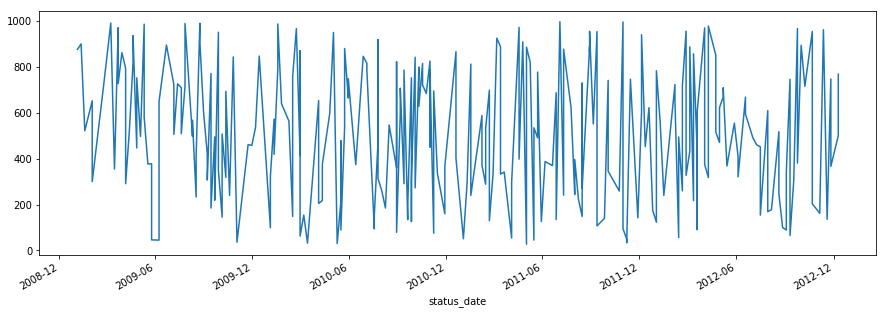


If we take a look at the data, we begin to realize that there are multiple values for the same State, StatusDate, and Status combination. It is possible that this means the data you are working with is dirty/bad/inaccurate, but we will assume otherwise. We can assume this data set is a subset of a bigger data set and if we simply add the values in the CustomerCount column per State, StatusDate, and Status we will get the Total Customer Count per day:


```python
sort_df = df[
    df[
        "state"
    ] == "NY"
].sort_index(axis = 0)


sort_df.head()
```


<div>
<style scoped>
    .dataframe tbody tr th:only-of-type {
        vertical-align: middle;
    }

    .dataframe tbody tr th {
        vertical-align: top;
    }

    .dataframe thead th {
        text-align: right;
    }
</style>
<table border="1" class="dataframe">
  <thead>
    <tr style="text-align: right;">
      <th></th>
      <th>state</th>
      <th>status</th>
      <th>customer_count</th>
    </tr>
    <tr>
      <th>status_date</th>
      <th></th>
      <th></th>
      <th></th>
    </tr>
  </thead>
  <tbody>
    <tr>
      <th>2009-01-19</th>
      <td>NY</td>
      <td>1</td>
      <td>522</td>
    </tr>
    <tr>
      <th>2009-02-23</th>
      <td>NY</td>
      <td>1</td>
      <td>710</td>
    </tr>
    <tr>
      <th>2009-03-09</th>
      <td>NY</td>
      <td>1</td>
      <td>992</td>
    </tr>
    <tr>
      <th>2009-03-16</th>
      <td>NY</td>
      <td>1</td>
      <td>355</td>
    </tr>
    <tr>
      <th>2009-03-23</th>
      <td>NY</td>
      <td>1</td>
      <td>728</td>
    </tr>
  </tbody>
</table>
</div>


Our task is now to create a new dataframe that compresses the data so we have daily customer counts per State and StatusDate. We can ignore the Status column since all the values in this column are of value 1. To accomplish this we will use the dataframe's functions groupby and sum().

Note that we had to use reset_index . If we did not, we would not have been able to group by both the State and the StatusDate since the groupby function expects only columns as inputs. The reset_index function will bring the index StatusDate back to a column in the dataframe.


```python
## Group by state and status_date:
daily = df.reset_index().groupby(
    ["state", "status_date"]
).sum()


daily
```


<div>
<style scoped>
    .dataframe tbody tr th:only-of-type {
        vertical-align: middle;
    }

    .dataframe tbody tr th {
        vertical-align: top;
    }

    .dataframe thead th {
        text-align: right;
    }
</style>
<table border="1" class="dataframe">
  <thead>
    <tr style="text-align: right;">
      <th></th>
      <th></th>
      <th>status</th>
      <th>customer_count</th>
    </tr>
    <tr>
      <th>state</th>
      <th>status_date</th>
      <th></th>
      <th></th>
    </tr>
  </thead>
  <tbody>
    <tr>
      <th rowspan="30" valign="top">FL</th>
      <th>2009-01-12</th>
      <td>1</td>
      <td>901</td>
    </tr>
    <tr>
      <th>2009-02-02</th>
      <td>1</td>
      <td>653</td>
    </tr>
    <tr>
      <th>2009-03-23</th>
      <td>1</td>
      <td>752</td>
    </tr>
    <tr>
      <th>2009-04-06</th>
      <td>2</td>
      <td>1086</td>
    </tr>
    <tr>
      <th>2009-06-08</th>
      <td>1</td>
      <td>649</td>
    </tr>
    <tr>
      <th>2009-07-06</th>
      <td>1</td>
      <td>723</td>
    </tr>
    <tr>
      <th>2009-07-13</th>
      <td>1</td>
      <td>727</td>
    </tr>
    <tr>
      <th>2009-07-20</th>
      <td>1</td>
      <td>710</td>
    </tr>
    <tr>
      <th>2009-08-10</th>
      <td>1</td>
      <td>498</td>
    </tr>
    <tr>
      <th>2009-08-24</th>
      <td>2</td>
      <td>1902</td>
    </tr>
    <tr>
      <th>2009-09-07</th>
      <td>1</td>
      <td>307</td>
    </tr>
    <tr>
      <th>2009-09-14</th>
      <td>1</td>
      <td>185</td>
    </tr>
    <tr>
      <th>2009-09-21</th>
      <td>1</td>
      <td>495</td>
    </tr>
    <tr>
      <th>2009-09-28</th>
      <td>1</td>
      <td>952</td>
    </tr>
    <tr>
      <th>2009-10-05</th>
      <td>2</td>
      <td>653</td>
    </tr>
    <tr>
      <th>2009-11-02</th>
      <td>1</td>
      <td>36</td>
    </tr>
    <tr>
      <th>2009-12-07</th>
      <td>1</td>
      <td>537</td>
    </tr>
    <tr>
      <th>2010-01-04</th>
      <td>1</td>
      <td>99</td>
    </tr>
    <tr>
      <th>2010-01-11</th>
      <td>2</td>
      <td>992</td>
    </tr>
    <tr>
      <th>2010-02-08</th>
      <td>1</td>
      <td>564</td>
    </tr>
    <tr>
      <th>2010-02-15</th>
      <td>1</td>
      <td>758</td>
    </tr>
    <tr>
      <th>2010-02-22</th>
      <td>1</td>
      <td>968</td>
    </tr>
    <tr>
      <th>2010-03-01</th>
      <td>1</td>
      <td>871</td>
    </tr>
    <tr>
      <th>2010-03-08</th>
      <td>1</td>
      <td>154</td>
    </tr>
    <tr>
      <th>2010-03-15</th>
      <td>1</td>
      <td>32</td>
    </tr>
    <tr>
      <th>2010-04-26</th>
      <td>1</td>
      <td>599</td>
    </tr>
    <tr>
      <th>2010-05-10</th>
      <td>1</td>
      <td>30</td>
    </tr>
    <tr>
      <th>2010-05-24</th>
      <td>1</td>
      <td>881</td>
    </tr>
    <tr>
      <th>2010-05-31</th>
      <td>1</td>
      <td>665</td>
    </tr>
    <tr>
      <th>2010-06-28</th>
      <td>1</td>
      <td>847</td>
    </tr>
    <tr>
      <th>...</th>
      <th>...</th>
      <td>...</td>
      <td>...</td>
    </tr>
    <tr>
      <th rowspan="30" valign="top">TX</th>
      <th>2009-06-22</th>
      <td>1</td>
      <td>896</td>
    </tr>
    <tr>
      <th>2010-02-15</th>
      <td>1</td>
      <td>148</td>
    </tr>
    <tr>
      <th>2010-03-01</th>
      <td>1</td>
      <td>414</td>
    </tr>
    <tr>
      <th>2010-04-05</th>
      <td>1</td>
      <td>654</td>
    </tr>
    <tr>
      <th>2010-05-03</th>
      <td>1</td>
      <td>951</td>
    </tr>
    <tr>
      <th>2010-05-31</th>
      <td>1</td>
      <td>749</td>
    </tr>
    <tr>
      <th>2010-07-19</th>
      <td>1</td>
      <td>94</td>
    </tr>
    <tr>
      <th>2010-08-09</th>
      <td>1</td>
      <td>185</td>
    </tr>
    <tr>
      <th>2010-08-16</th>
      <td>1</td>
      <td>547</td>
    </tr>
    <tr>
      <th>2010-09-13</th>
      <td>1</td>
      <td>787</td>
    </tr>
    <tr>
      <th>2011-02-14</th>
      <td>1</td>
      <td>289</td>
    </tr>
    <tr>
      <th>2011-03-14</th>
      <td>1</td>
      <td>889</td>
    </tr>
    <tr>
      <th>2011-05-02</th>
      <td>1</td>
      <td>887</td>
    </tr>
    <tr>
      <th>2011-05-30</th>
      <td>1</td>
      <td>126</td>
    </tr>
    <tr>
      <th>2011-08-15</th>
      <td>1</td>
      <td>271</td>
    </tr>
    <tr>
      <th>2011-09-12</th>
      <td>1</td>
      <td>955</td>
    </tr>
    <tr>
      <th>2011-10-03</th>
      <td>1</td>
      <td>346</td>
    </tr>
    <tr>
      <th>2011-11-07</th>
      <td>1</td>
      <td>49</td>
    </tr>
    <tr>
      <th>2011-12-26</th>
      <td>1</td>
      <td>175</td>
    </tr>
    <tr>
      <th>2012-01-02</th>
      <td>1</td>
      <td>123</td>
    </tr>
    <tr>
      <th>2012-01-09</th>
      <td>1</td>
      <td>564</td>
    </tr>
    <tr>
      <th>2012-02-27</th>
      <td>1</td>
      <td>957</td>
    </tr>
    <tr>
      <th>2012-03-12</th>
      <td>1</td>
      <td>217</td>
    </tr>
    <tr>
      <th>2012-04-23</th>
      <td>1</td>
      <td>516</td>
    </tr>
    <tr>
      <th>2012-04-30</th>
      <td>1</td>
      <td>471</td>
    </tr>
    <tr>
      <th>2012-08-06</th>
      <td>1</td>
      <td>178</td>
    </tr>
    <tr>
      <th>2012-08-20</th>
      <td>1</td>
      <td>248</td>
    </tr>
    <tr>
      <th>2012-08-27</th>
      <td>1</td>
      <td>100</td>
    </tr>
    <tr>
      <th>2012-09-03</th>
      <td>1</td>
      <td>89</td>
    </tr>
    <tr>
      <th>2012-10-29</th>
      <td>1</td>
      <td>183</td>
    </tr>
  </tbody>
</table>
<p>239 rows × 2 columns</p>
</div>


The State and StatusDate columns are automatically placed in the index of the Daily dataframe. You can think of the index as the primary key of a database table but without the constraint of having unique values. Columns in the index as you will see allow us to easily select, plot, and perform calculations on the data.

Below we delete the Status column since it is all equal to one and no longer necessary:


```python
del daily["status"]

daily.head()
```


<div>
<style scoped>
    .dataframe tbody tr th:only-of-type {
        vertical-align: middle;
    }

    .dataframe tbody tr th {
        vertical-align: top;
    }

    .dataframe thead th {
        text-align: right;
    }
</style>
<table border="1" class="dataframe">
  <thead>
    <tr style="text-align: right;">
      <th></th>
      <th></th>
      <th>customer_count</th>
    </tr>
    <tr>
      <th>state</th>
      <th>status_date</th>
      <th></th>
    </tr>
  </thead>
  <tbody>
    <tr>
      <th rowspan="5" valign="top">FL</th>
      <th>2009-01-12</th>
      <td>901</td>
    </tr>
    <tr>
      <th>2009-02-02</th>
      <td>653</td>
    </tr>
    <tr>
      <th>2009-03-23</th>
      <td>752</td>
    </tr>
    <tr>
      <th>2009-04-06</th>
      <td>1086</td>
    </tr>
    <tr>
      <th>2009-06-08</th>
      <td>649</td>
    </tr>
  </tbody>
</table>
</div>


```python
daily.index
```


    MultiIndex(levels=[['FL', 'GA', 'NY', 'TX'], [2009-01-05 00:00:00, 2009-01-12 00:00:00, 2009-01-19 00:00:00, 2009-02-02 00:00:00, 2009-02-23 00:00:00, 2009-03-09 00:00:00, 2009-03-16 00:00:00, 2009-03-23 00:00:00, 2009-03-30 00:00:00, 2009-04-06 00:00:00, 2009-04-13 00:00:00, 2009-04-20 00:00:00, 2009-04-27 00:00:00, 2009-05-04 00:00:00, 2009-05-11 00:00:00, 2009-05-18 00:00:00, 2009-05-25 00:00:00, 2009-06-08 00:00:00, 2009-06-22 00:00:00, 2009-07-06 00:00:00, 2009-07-13 00:00:00, 2009-07-20 00:00:00, 2009-07-27 00:00:00, 2009-08-10 00:00:00, 2009-08-17 00:00:00, 2009-08-24 00:00:00, 2009-08-31 00:00:00, 2009-09-07 00:00:00, 2009-09-14 00:00:00, 2009-09-21 00:00:00, 2009-09-28 00:00:00, 2009-10-05 00:00:00, 2009-10-12 00:00:00, 2009-10-19 00:00:00, 2009-10-26 00:00:00, 2009-11-02 00:00:00, 2009-11-23 00:00:00, 2009-11-30 00:00:00, 2009-12-07 00:00:00, 2009-12-14 00:00:00, 2010-01-04 00:00:00, 2010-01-11 00:00:00, 2010-01-18 00:00:00, 2010-01-25 00:00:00, 2010-02-08 00:00:00, 2010-02-15 00:00:00, 2010-02-22 00:00:00, 2010-03-01 00:00:00, 2010-03-08 00:00:00, 2010-03-15 00:00:00, 2010-04-05 00:00:00, 2010-04-12 00:00:00, 2010-04-26 00:00:00, 2010-05-03 00:00:00, 2010-05-10 00:00:00, 2010-05-17 00:00:00, 2010-05-24 00:00:00, 2010-05-31 00:00:00, 2010-06-14 00:00:00, 2010-06-28 00:00:00, 2010-07-05 00:00:00, 2010-07-19 00:00:00, 2010-07-26 00:00:00, 2010-08-02 00:00:00, 2010-08-09 00:00:00, 2010-08-16 00:00:00, 2010-08-30 00:00:00, 2010-09-06 00:00:00, 2010-09-13 00:00:00, 2010-09-20 00:00:00, 2010-09-27 00:00:00, 2010-10-04 00:00:00, 2010-10-11 00:00:00, 2010-10-18 00:00:00, 2010-10-25 00:00:00, 2010-11-01 00:00:00, 2010-11-08 00:00:00, 2010-11-15 00:00:00, 2010-11-29 00:00:00, 2010-12-20 00:00:00, 2011-01-03 00:00:00, 2011-01-10 00:00:00, 2011-01-17 00:00:00, 2011-02-07 00:00:00, 2011-02-14 00:00:00, 2011-02-21 00:00:00, 2011-02-28 00:00:00, 2011-03-07 00:00:00, 2011-03-14 00:00:00, 2011-03-21 00:00:00, 2011-03-28 00:00:00, 2011-04-04 00:00:00, 2011-04-18 00:00:00, 2011-04-25 00:00:00, 2011-05-02 00:00:00, 2011-05-09 00:00:00, 2011-05-16 00:00:00, 2011-05-23 00:00:00, 2011-05-30 00:00:00, 2011-06-06 00:00:00, 2011-06-20 00:00:00, 2011-06-27 00:00:00, 2011-07-04 00:00:00, 2011-07-11 00:00:00, 2011-07-25 00:00:00, 2011-08-01 00:00:00, 2011-08-08 00:00:00, 2011-08-15 00:00:00, 2011-08-29 00:00:00, 2011-09-05 00:00:00, 2011-09-12 00:00:00, 2011-09-26 00:00:00, 2011-10-03 00:00:00, 2011-10-24 00:00:00, 2011-10-31 00:00:00, 2011-11-07 00:00:00, 2011-11-14 00:00:00, 2011-11-28 00:00:00, 2011-12-05 00:00:00, 2011-12-12 00:00:00, 2011-12-19 00:00:00, 2011-12-26 00:00:00, 2012-01-02 00:00:00, 2012-01-09 00:00:00, 2012-01-16 00:00:00, 2012-02-06 00:00:00, 2012-02-13 00:00:00, 2012-02-20 00:00:00, 2012-02-27 00:00:00, 2012-03-05 00:00:00, 2012-03-12 00:00:00, 2012-03-19 00:00:00, 2012-04-02 00:00:00, 2012-04-09 00:00:00, 2012-04-23 00:00:00, 2012-04-30 00:00:00, 2012-05-07 00:00:00, 2012-05-14 00:00:00, 2012-05-28 00:00:00, 2012-06-04 00:00:00, 2012-06-18 00:00:00, 2012-07-02 00:00:00, 2012-07-09 00:00:00, 2012-07-16 00:00:00, 2012-07-30 00:00:00, 2012-08-06 00:00:00, 2012-08-20 00:00:00, 2012-08-27 00:00:00, 2012-09-03 00:00:00, 2012-09-10 00:00:00, 2012-09-17 00:00:00, 2012-09-24 00:00:00, 2012-10-01 00:00:00, 2012-10-08 00:00:00, 2012-10-22 00:00:00, 2012-10-29 00:00:00, 2012-11-05 00:00:00, 2012-11-12 00:00:00, 2012-11-19 00:00:00, 2012-11-26 00:00:00, 2012-12-10 00:00:00]],
               labels=[[0, 0, 0, 0, 0, 0, 0, 0, 0, 0, 0, 0, 0, 0, 0, 0, 0, 0, 0, 0, 0, 0, 0, 0, 0, 0, 0, 0, 0, 0, 0, 0, 0, 0, 0, 0, 0, 0, 0, 0, 0, 0, 0, 0, 0, 0, 0, 0, 0, 0, 0, 0, 0, 0, 0, 0, 0, 0, 0, 0, 0, 0, 0, 0, 0, 0, 0, 0, 0, 0, 0, 0, 0, 0, 0, 0, 0, 0, 0, 0, 0, 0, 1, 1, 1, 1, 1, 1, 1, 1, 1, 1, 1, 1, 1, 1, 1, 1, 1, 1, 1, 1, 1, 1, 1, 1, 1, 1, 1, 1, 1, 1, 1, 1, 1, 1, 1, 1, 1, 1, 1, 1, 1, 1, 1, 1, 1, 2, 2, 2, 2, 2, 2, 2, 2, 2, 2, 2, 2, 2, 2, 2, 2, 2, 2, 2, 2, 2, 2, 2, 2, 2, 2, 2, 2, 2, 2, 2, 2, 2, 2, 2, 2, 2, 2, 2, 2, 2, 2, 2, 2, 2, 2, 2, 2, 2, 2, 2, 2, 2, 2, 2, 2, 2, 2, 2, 2, 2, 2, 2, 2, 2, 2, 2, 2, 2, 2, 2, 2, 2, 2, 2, 2, 2, 2, 2, 3, 3, 3, 3, 3, 3, 3, 3, 3, 3, 3, 3, 3, 3, 3, 3, 3, 3, 3, 3, 3, 3, 3, 3, 3, 3, 3, 3, 3, 3, 3, 3, 3], [1, 3, 7, 9, 17, 19, 20, 21, 23, 25, 27, 28, 29, 30, 31, 35, 38, 40, 41, 44, 45, 46, 47, 48, 49, 52, 54, 56, 57, 59, 60, 62, 66, 68, 69, 70, 71, 72, 75, 76, 77, 78, 79, 85, 88, 89, 92, 96, 97, 99, 100, 101, 103, 104, 105, 108, 109, 110, 112, 114, 115, 117, 118, 119, 125, 126, 127, 128, 129, 131, 133, 134, 135, 136, 137, 140, 146, 150, 151, 152, 153, 157, 0, 3, 7, 22, 23, 24, 27, 28, 34, 37, 42, 47, 50, 55, 58, 66, 67, 69, 71, 73, 74, 75, 79, 82, 83, 84, 85, 91, 93, 95, 97, 106, 110, 120, 124, 125, 126, 127, 132, 133, 139, 143, 158, 159, 160, 2, 4, 5, 6, 7, 8, 10, 11, 12, 13, 14, 16, 19, 21, 22, 24, 26, 28, 29, 30, 31, 32, 33, 36, 39, 40, 42, 43, 51, 56, 61, 62, 63, 66, 67, 70, 71, 72, 73, 75, 78, 80, 81, 82, 83, 86, 87, 90, 91, 92, 94, 101, 102, 103, 105, 107, 108, 111, 113, 116, 118, 122, 125, 129, 130, 131, 132, 138, 139, 141, 142, 143, 144, 148, 149, 154, 156, 159, 160, 15, 16, 17, 18, 45, 47, 50, 53, 57, 61, 64, 65, 68, 84, 88, 94, 98, 107, 110, 112, 115, 121, 122, 123, 128, 130, 134, 135, 145, 146, 147, 148, 155]],
               names=['state', 'status_date'])


```python
daily.index.levels[0]
```


    Index(['FL', 'GA', 'NY', 'TX'], dtype='object', name='state')


```python
daily.index.levels[1]
```


    DatetimeIndex(['2009-01-05', '2009-01-12', '2009-01-19', '2009-02-02',
                   '2009-02-23', '2009-03-09', '2009-03-16', '2009-03-23',
                   '2009-03-30', '2009-04-06',
                   ...
                   '2012-09-24', '2012-10-01', '2012-10-08', '2012-10-22',
                   '2012-10-29', '2012-11-05', '2012-11-12', '2012-11-19',
                   '2012-11-26', '2012-12-10'],
                  dtype='datetime64[ns]', name='status_date', length=161, freq=None)


```python
daily.loc["FL"].plot();
plt.title("FL");

daily.loc["GA"].plot();
plt.title("GA");

daily.loc["NY"].plot();
plt.title("NY");

daily.loc["TX"].plot();
plt.title("TX");
```


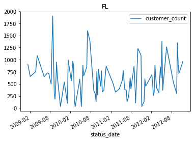


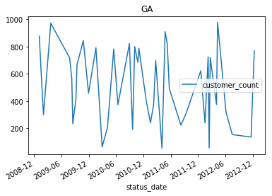


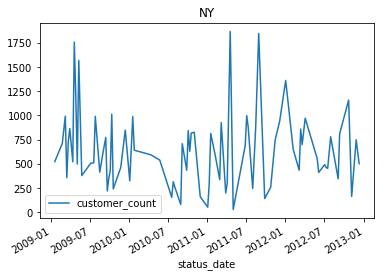


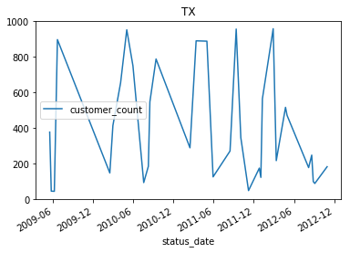


We can also just plot the data on a specific date, like 2012. We can now clearly see that the data for these states is all over the place. since the data consist of weekly customer counts, the variability of the data seems suspect. For this tutorial we will assume bad data and proceed:


```python
daily.loc["FL"]["2012":].plot();
plt.title("FL in 2012");

daily.loc["GA"]["2012":].plot();
plt.title("GA in 2012");

daily.loc["NY"]["2012":].plot();
plt.title("NY in 2012");

daily.loc["TX"]["2012":].plot();
plt.title("TX in 2012");
```


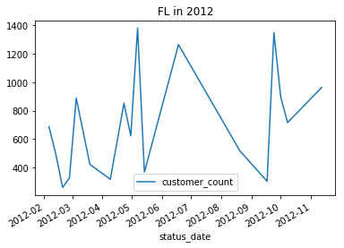


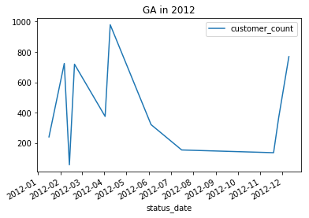


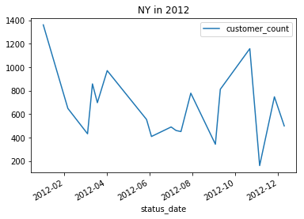


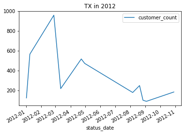


Remove outliers:


```python
## Calculate outliers:
state_yr_mo = daily.groupby(
    [
        daily.index.get_level_values(0),
        daily.index.get_level_values(1).year,
        daily.index.get_level_values(1).month
    ]
)


daily["lower"] = state_yr_mo["customer_count"].transform(
    lambda x: x.quantile(q = 0.25) - (1.5 * x.quantile(q = 0.75) - x.quantile(q = 0.25))
)


daily["upper"] = state_yr_mo["customer_count"].transform(
    lambda x: x.quantile(q = 0.75) + (1.5 * x.quantile(q = 0.75) - x.quantile(q = 0.25))
)


daily["outlier"] = (
    daily["customer_count"] < daily["lower"]
) | (
    daily["customer_count"] > daily["upper"]
)


## Remove outliers:
daily = daily[
    daily["outlier"] == False
]
```

The dataframe named Daily will hold customer counts that have been aggregated per day. The original data (df) has multiple records per day. We are left with a data set that is indexed by both the state and the StatusDate. The Outlier column should be equal to False signifying that the record is not an outlier.


```python
daily.head()
```


<div>
<style scoped>
    .dataframe tbody tr th:only-of-type {
        vertical-align: middle;
    }

    .dataframe tbody tr th {
        vertical-align: top;
    }

    .dataframe thead th {
        text-align: right;
    }
</style>
<table border="1" class="dataframe">
  <thead>
    <tr style="text-align: right;">
      <th></th>
      <th></th>
      <th>customer_count</th>
      <th>lower</th>
      <th>upper</th>
      <th>outlier</th>
    </tr>
    <tr>
      <th>state</th>
      <th>status_date</th>
      <th></th>
      <th></th>
      <th></th>
      <th></th>
    </tr>
  </thead>
  <tbody>
    <tr>
      <th rowspan="5" valign="top">FL</th>
      <th>2009-01-12</th>
      <td>901</td>
      <td>450.5</td>
      <td>1351.5</td>
      <td>False</td>
    </tr>
    <tr>
      <th>2009-02-02</th>
      <td>653</td>
      <td>326.5</td>
      <td>979.5</td>
      <td>False</td>
    </tr>
    <tr>
      <th>2009-03-23</th>
      <td>752</td>
      <td>376.0</td>
      <td>1128.0</td>
      <td>False</td>
    </tr>
    <tr>
      <th>2009-04-06</th>
      <td>1086</td>
      <td>543.0</td>
      <td>1629.0</td>
      <td>False</td>
    </tr>
    <tr>
      <th>2009-06-08</th>
      <td>649</td>
      <td>324.5</td>
      <td>973.5</td>
      <td>False</td>
    </tr>
  </tbody>
</table>
</div>


Create a data frame which groups the Daily dataframe by status_date. We are essentially getting rid of the State column. The Max column represents the maximum customer count per month. The Max column is used to smooth out the graph:


```python
## Combine all markets:


## Get max by customer date:
df_all = pd.DataFrame(
    daily["customer_count"].groupby(
        daily.index.get_level_values(1)
    ).sum()
)

df_all.columns = ["customer_count"] ## rename columns


## Group by year and month:
yr_mo = df_all.groupby(
    [
        lambda x: x.year,
        lambda x: x.month
    ]
)


## What is the max customer count per year and month?
df_all["Max"] = yr_mo["customer_count"].transform(lambda x: x.max())

df_all.head()
```


<div>
<style scoped>
    .dataframe tbody tr th:only-of-type {
        vertical-align: middle;
    }

    .dataframe tbody tr th {
        vertical-align: top;
    }

    .dataframe thead th {
        text-align: right;
    }
</style>
<table border="1" class="dataframe">
  <thead>
    <tr style="text-align: right;">
      <th></th>
      <th>customer_count</th>
      <th>Max</th>
    </tr>
    <tr>
      <th>status_date</th>
      <th></th>
      <th></th>
    </tr>
  </thead>
  <tbody>
    <tr>
      <th>2009-01-05</th>
      <td>877</td>
      <td>901</td>
    </tr>
    <tr>
      <th>2009-01-12</th>
      <td>901</td>
      <td>901</td>
    </tr>
    <tr>
      <th>2009-01-19</th>
      <td>522</td>
      <td>901</td>
    </tr>
    <tr>
      <th>2009-02-02</th>
      <td>953</td>
      <td>953</td>
    </tr>
    <tr>
      <th>2009-02-23</th>
      <td>710</td>
      <td>953</td>
    </tr>
  </tbody>
</table>
</div>


    In Jan 2009, the max customer count was 901.

There is also an interest to gauge if the current customer counts were reaching certain goals the company had established. The task here is to visually show if the current customer counts are meeting the goals listed below.

- 12/31/2011 - 1,000 customers

- 12/31/2012 - 2,000 customers

- 12/31/2013 - 3,000 customers

We will be using the date_range function to create our dates.

Definition: date_range(start=None, end=None, periods=None, freq='D', tz=None, normalize=False, name=None, closed=None)

Docstring: Return a fixed frequency datetime index, with day (calendar) as the default frequency

By choosing the frequency to be A or annual we will be able to get the three target dates from above.


```python
## Create goals data frame:
data = [
    1000,
    2000,
    3000
]


idx = pd.date_range(
    start = "1/1/2011",
    end = "12/31/2013",
    freq = "A"
)


goals = pd.DataFrame(
    data, 
    index = idx,
    columns = ["goals"]
)

goals
```


<div>
<style scoped>
    .dataframe tbody tr th:only-of-type {
        vertical-align: middle;
    }

    .dataframe tbody tr th {
        vertical-align: top;
    }

    .dataframe thead th {
        text-align: right;
    }
</style>
<table border="1" class="dataframe">
  <thead>
    <tr style="text-align: right;">
      <th></th>
      <th>goals</th>
    </tr>
  </thead>
  <tbody>
    <tr>
      <th>2011-12-31</th>
      <td>1000</td>
    </tr>
    <tr>
      <th>2012-12-31</th>
      <td>2000</td>
    </tr>
    <tr>
      <th>2013-12-31</th>
      <td>3000</td>
    </tr>
  </tbody>
</table>
</div>


Merge df_all and goals:


```python
combined = pd.concat(
    [df_all, goals],
    axis = 0 ## use 0 when appending row wise
)

combined = combined.sort_index(axis = 0)

combined.tail()
```

    C:\Users\stephanie.langeland\AppData\Local\Continuum\anaconda3\lib\site-packages\ipykernel_launcher.py:3: FutureWarning: Sorting because non-concatenation axis is not aligned. A future version
    of pandas will change to not sort by default.
    
    To accept the future behavior, pass 'sort=False'.
    
    To retain the current behavior and silence the warning, pass 'sort=True'.
    
      This is separate from the ipykernel package so we can avoid doing imports until
    


<div>
<style scoped>
    .dataframe tbody tr th:only-of-type {
        vertical-align: middle;
    }

    .dataframe tbody tr th {
        vertical-align: top;
    }

    .dataframe thead th {
        text-align: right;
    }
</style>
<table border="1" class="dataframe">
  <thead>
    <tr style="text-align: right;">
      <th></th>
      <th>Max</th>
      <th>customer_count</th>
      <th>goals</th>
    </tr>
  </thead>
  <tbody>
    <tr>
      <th>2012-11-19</th>
      <td>1115.0</td>
      <td>136.0</td>
      <td>NaN</td>
    </tr>
    <tr>
      <th>2012-11-26</th>
      <td>1115.0</td>
      <td>1115.0</td>
      <td>NaN</td>
    </tr>
    <tr>
      <th>2012-12-10</th>
      <td>1269.0</td>
      <td>1269.0</td>
      <td>NaN</td>
    </tr>
    <tr>
      <th>2012-12-31</th>
      <td>NaN</td>
      <td>NaN</td>
      <td>2000.0</td>
    </tr>
    <tr>
      <th>2013-12-31</th>
      <td>NaN</td>
      <td>NaN</td>
      <td>3000.0</td>
    </tr>
  </tbody>
</table>
</div>


```python
fig, axes = plt.subplots(
    figsize = (12, 7)
)


combined["goals"].fillna(
    method = "pad"
).plot(
    color = "green",
    label = "goals"
);


combined["Max"].plot(
    color = "blue",
    label = "All Markets"
);


plt.legend(loc = "best");
```


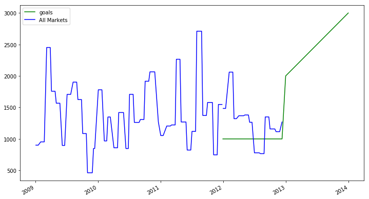


There was also a need to forecast next year's customer count and we can do this in a couple of simple steps. We will first group the combined dataframe by Year and place the maximum customer count for that year. This will give us one row per Year.


```python
## Group by year then get the max value per year:
year = combined.groupby(
    lambda x: x.year
).max()


year
```


<div>
<style scoped>
    .dataframe tbody tr th:only-of-type {
        vertical-align: middle;
    }

    .dataframe tbody tr th {
        vertical-align: top;
    }

    .dataframe thead th {
        text-align: right;
    }
</style>
<table border="1" class="dataframe">
  <thead>
    <tr style="text-align: right;">
      <th></th>
      <th>Max</th>
      <th>customer_count</th>
      <th>goals</th>
    </tr>
  </thead>
  <tbody>
    <tr>
      <th>2009</th>
      <td>2452.0</td>
      <td>2452.0</td>
      <td>NaN</td>
    </tr>
    <tr>
      <th>2010</th>
      <td>2065.0</td>
      <td>2065.0</td>
      <td>NaN</td>
    </tr>
    <tr>
      <th>2011</th>
      <td>2711.0</td>
      <td>2711.0</td>
      <td>1000.0</td>
    </tr>
    <tr>
      <th>2012</th>
      <td>2061.0</td>
      <td>2061.0</td>
      <td>2000.0</td>
    </tr>
    <tr>
      <th>2013</th>
      <td>NaN</td>
      <td>NaN</td>
      <td>3000.0</td>
    </tr>
  </tbody>
</table>
</div>


```python
## Add a column representing the percent change per year:
year["yr_pct_change"] = year["Max"].pct_change(periods = 1)

year
```


<div>
<style scoped>
    .dataframe tbody tr th:only-of-type {
        vertical-align: middle;
    }

    .dataframe tbody tr th {
        vertical-align: top;
    }

    .dataframe thead th {
        text-align: right;
    }
</style>
<table border="1" class="dataframe">
  <thead>
    <tr style="text-align: right;">
      <th></th>
      <th>Max</th>
      <th>customer_count</th>
      <th>goals</th>
      <th>yr_pct_change</th>
    </tr>
  </thead>
  <tbody>
    <tr>
      <th>2009</th>
      <td>2452.0</td>
      <td>2452.0</td>
      <td>NaN</td>
      <td>NaN</td>
    </tr>
    <tr>
      <th>2010</th>
      <td>2065.0</td>
      <td>2065.0</td>
      <td>NaN</td>
      <td>-0.157830</td>
    </tr>
    <tr>
      <th>2011</th>
      <td>2711.0</td>
      <td>2711.0</td>
      <td>1000.0</td>
      <td>0.312833</td>
    </tr>
    <tr>
      <th>2012</th>
      <td>2061.0</td>
      <td>2061.0</td>
      <td>2000.0</td>
      <td>-0.239764</td>
    </tr>
    <tr>
      <th>2013</th>
      <td>NaN</td>
      <td>NaN</td>
      <td>3000.0</td>
      <td>0.000000</td>
    </tr>
  </tbody>
</table>
</div>


To get next year's end customer count we will assume our current growth rate remains constant. We then will increase this years customer count by that amount and that will be our forecast for next year.


```python
(1 + year.loc[2012, 'yr_pct_change']) * year.loc[2012, 'Max']
```


    1566.8465510881595


# Plot data


```python
df_all['Max'].plot(
    figsize = (10, 5)
);

plt.title('ALL Markets');

# Last four Graphs
fig, axes = plt.subplots(
    nrows = 2, 
    ncols = 2, 
    figsize = (20, 10)
)

fig.subplots_adjust(hspace = 1.0) ## Create space between plots

daily.loc['FL']['customer_count']['2012':].fillna(method = 'pad').plot(ax = axes[0, 0])
daily.loc['GA']['customer_count']['2012':].fillna(method = 'pad').plot(ax = axes[0, 1]) 
daily.loc['TX']['customer_count']['2012':].fillna(method = 'pad').plot(ax = axes[1, 0]) 
daily.loc['NY']['customer_count']['2012':].fillna(method = 'pad').plot(ax = axes[1, 1]) 

# Add titles
axes[0, 0].set_title('Florida')
axes[0, 1].set_title('Georgia')
axes[1, 0].set_title('Texas')
axes[1, 1].set_title('North East');
```


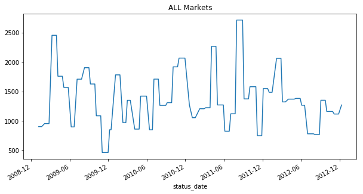


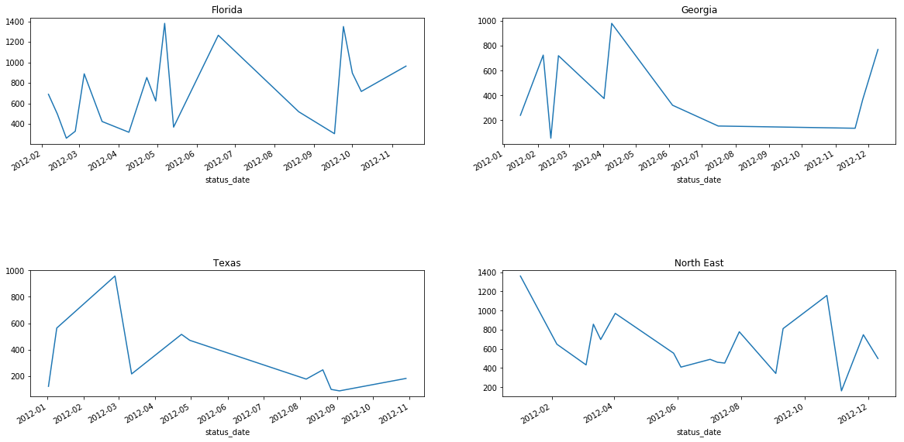

